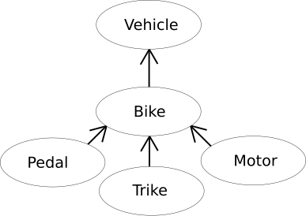
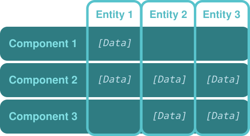
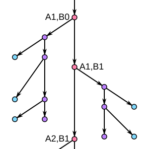
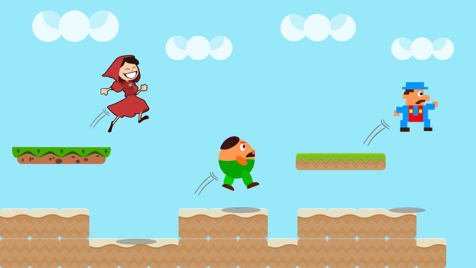
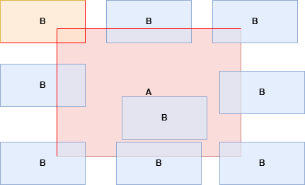

Gemini assisted with writing this script.
# Render Engine vs Framework vs Game Engine
## What is a Render Engine?
A **Render Engine is a software component responsible for generating images from a model** (or models) in a 2D or 3D scene. It takes input data, such as geometry, textures, lighting, and camera information, and produces a rendered image. Render engines focus primarily on the visual output, handling tasks like:

* **Rasterization or Ray Tracing:** Converting 3D models into 2D images.
* **Shading and Texturing:** Applying materials and textures to surfaces.
* **Lighting and Shadows:** Simulating light sources and their effects.
* **Depth Testing and Visibility:** Determining which objects are visible and which are obscured.
* **Post-Processing Effects:** Applying effects like blur, color correction, and anti-aliasing.

Render engines are often used in:

* 3D modeling and animation software.
* Visual effects (VFX) in film and television.
* Scientific visualization.
* Game development (as a component of a game engine).

Examples include:

* Cycles (Blender)
* V-Ray
* Arnold
* Redshift

## What is a Framework?
A Framework is a reusable, foundational software environment that **provides a structure for building applications**. It offers a set of pre-written code, libraries, and tools that developers can use to streamline the development process. Frameworks typically **handle common tasks**, allowing developers to focus on the unique aspects of their application.

Key characteristics of a framework:

* **Inversion of Control:** The framework calls the developer's code, rather than the other way around.
* **Provides Structure:** Enforces a specific architecture and design patterns.
* **Offers Libraries and Tools:** Provides pre-built components for common tasks.
* **Reduces Boilerplate Code:** Simplifies development by handling repetitive tasks.

Frameworks are used in:

* Web development (e.g., React, Angular, Vue.js, Django, Ruby on Rails).
* Mobile app development (e.g., React Native, Flutter).
* Desktop application development (e.g., Qt, .NET Framework).

In a gaming context, a **framework might handle input, window management, or basic rendering**, but it typically **doesn't provide a complete game creation environment**.

## What is a Game Engine?
A **Game Engine is a comprehensive software development environment** designed specifically for creating video games. It integrates various tools and functionalities, including:

* **Rendering Engine:** For displaying graphics.
* **Physics Engine:** For simulating realistic physics.
* **Audio Engine:** For handling sound and music.
* **Input Handling:** For managing player input.
* **Scripting System:** For defining game logic.
* **Asset Management:** For organizing and managing game assets.
* **Level Editor:** For designing game environments.

Game engines provide a **complete toolset** that enables developers to **create**, **test**, and **deploy** games efficiently. They handle many of the technical complexities, allowing developers to focus on gameplay and creativity.

Examples include:

* Unity
* Unreal Engine
* Godot.

## Key Differences and Use Cases

| Feature          | Render Engine                                 | Framework                                     | Game Engine                                        |
| --------------- | -------------------------------------------- | -------------------------------------------- | ------------------------------------------------- |
| Primary Focus | Visual output (image generation)              | Providing a structured environment for apps | Complete game development environment             |
| Scope | Graphics rendering                            | General application development                | Game creation, from graphics to gameplay logic    |
| Components | Rasterizer, ray tracer, shaders, textures     | Libraries, tools, and architecture             | Rendering engine, physics engine, audio engine, etc. |
| Use Cases | 3D modeling, VFX, scientific visualization | Web apps, mobile apps, desktop apps           | Video game development                            |
| Abstraction | High abstraction of rendering processes.   | Medium abstraction of application structure. | Very high abstraction of game creation processes. |
| Level of Completion | A single component within a larger system | A foundational structure for applications. | A fully integrated development environment. |

**Key Differences:**

* A **Render Engine is a specialized tool for creating images**.
* A **Framework  provides a structure for building applications**, but it doesn't necessarily include a rendering component.
* A **Game Engine integrates a render engine and other tools to provide a complete game development environment**.

**Use Cases:**

* Use a **Render Engine** when you need high-quality images or animations, but you **don't need a full game development environment**.
* Use a **Framework** when you want to build a **specific type of application** (e.g., a web app) and you need a structured environment.
* Use a **Game Engine** when you want to create a video game and you **need a comprehensive toolset**.

# Game Engine Architecture
## Object-Oriented
Object-Oriented Programming (OOP) is a **traditional approach to game engine architecture**. It organizes code around objects, which are instances of classes. Each class encapsulates data (attributes) and behavior (methods).

### Benefits of Object-Oriented Design
* **Encapsulation:** Data and behavior are bundled together, improving code organization and preventing unintended modifications.
* **Inheritance:** Classes can inherit properties and methods from parent classes, promoting code reuse and establishing hierarchies.
* **Polymorphism:** Objects of different classes can be treated as objects of a common type, enabling flexible and extensible code.
* **Modularity:** Code is divided into manageable modules, making it easier to develop, debug, and maintain.



### Common Pitfalls in Object-Oriented Game Development
* **Deep Inheritance Hierarchies:** Can lead to complex and rigid code, making it difficult to modify or extend.
* **Tight Coupling:** Objects may become too dependent on each other, reducing flexibility and increasing the risk of cascading changes.
* **Performance Overhead:** Frequent object creation and destruction can impact performance, especially in performance-critical sections of the game.
* **Component Logic Distribution:** Game logic may become spread across numerous classes, making it difficult to track and manage.

## Entity-Component System (ECS)
Entity-Component System (ECS) is a data-oriented **architectural pattern that decomposes game objects into entities, components, and systems**. 

Entity Component System (ECS) promotes **.composition over inheritance**., allowing for **flexible and dynamic game object** behaviors by assembling components rather than relying on rigid class hierarchies.

* **Entities:** Simple identifiers that represent game objects.
* **Components:** Data containers that define the properties of an entity (e.g., position, velocity, rendering data).
* **Systems:** Logic processors that operate on entities with specific components (e.g., movement system, rendering system).



### Benefits of ECS
* **Data-Driven Design:** Focuses on data organization and processing, leading to better performance and cache utilization.
* **Decoupling:** Entities, components, and systems are loosely coupled, allowing for greater flexibility and maintainability.
* **Composition Over Inheritance:** Entities can be composed of any combination of components, enabling flexible and dynamic behavior.
* **Scalability:** The architecture scales well with large numbers of entities and complex game logic.

### ECS in Modern Game Development
ECS is **increasingly popular in modern game development** due to its **performance benefits and flexibility**. Many game engines and frameworks now incorporate or support ECS patterns.

## Mixed-Approach
A mixed-approach **combines elements of OOP and ECS** to leverage the strengths of both patterns.

### Combining OOP and ECS
* Use OOP for high-level game structure and management.
* Use ECS for data-intensive and performance-critical systems.
* Encapsulate ECS within OOP classes or modules.

### When to Use a Hybrid Model
* When you need the **flexibility of ECS for specific game systems** while maintaining the organization and structure of OOP.
* When **migrating from an OOP-based architecture** to an ECS-based architecture.
* When a team is more familiar with OOP, but wants to **gain performance improvements from an ECS**.

## Scene-Graph System
A scene-graph system is a **hierarchical data structure** used to **organize and manage objects in a 2D or 3D scene**. It acts as a tree where each **node represents an object** (e.g., sprites, UI elements, particle systems) and defines their spatial relationships, transformations, and rendering order. In PixiJS, the scene graph simplifies rendering logic by **grouping objects into parent-child hierarchies**, enabling efficient updates and transformations.



## Custom-Approach
A custom-approach involves designing a game engine **architecture tailored to the specific needs** of a project. 

### Tailoring an Architecture for Specific Needs
* Identify the core requirements and constraints of the game.
* Design an architecture that optimizes for performance, flexibility, and maintainability.
* Consider the specific features and gameplay mechanics of the game.

### Performance Considerations
* Custom architectures allow for very deep optimizations.
* Careful design of data structures and algorithms is essential.
* Profiling and benchmarking are crucial for identifying performance bottlenecks.

## Update Loop
The update loop is the **core of a game engine**, **responsible for updating the game state** each frame.

### Fixed vs Variable Time Steps
* **Fixed Time Steps:** The game logic is updated at a constant rate, regardless of the frame rate. Provides consistent physics and gameplay.
* **Variable Time Steps:** The game logic is updated based on the elapsed time between frames. Provides smoother rendering but can lead to inconsistent physics.

### Managing Game Logic in the Update Loop
* **Organize** game logic into **distinct phases** (e.g., input processing, physics simulation, game logic, rendering).
* Use a **component-based or event-driven approach to decouple game logic**.
* Optimize performance by **minimizing unnecessary calculations and memory allocations**.

### Handling Delta Time for Smooth Gameplay
* **Delta time** (the time elapsed between frames) is used to **scale game logic and animations**, ensuring **smooth and consistent behavior across different frame rates**.
* Proper use of delta time is essential for variable time step systems.
* **Avoid frame rate dependency** by always using **delta time for time-based calculations**.

# 2D Game Development Fundamentals
## Game Loop
### Core Concepts of the Game Loop
The game loop is the **core of every game**. It is a **continuous loop that updates** and renders all aspects of the game.
#### Main Phases
- **Input Handling:** Capturing user interactions (keyboard, mouse, touch).
- **Update Logic:** Updating the game state (movement, logic, physics).
- **Rendering:** Drawing the current game state to the screen.    
- **Sleep/Delay:** Pausing to achieve the desired frame rate.

``` javascript
while (gameRunning) {
    handleInput();
    updateGameLogic();
    render();
    delayForDesiredFrameRate();
}
```

### Managing Frame Rate and Performance
#### Variable vs. Fixed Time Steps
##### Variable 
Updates based on the actual time between frames (deltaTime). Can lead to inconsistent behavior if the frame rate fluctuates.

##### Fixed
Updates occur at fixed intervals. Ensures consistent behavior but may require interpolation for smooth rendering.

#### Frame Rate (FPS) Control
Use `sleep()` or similar functions to limit the frame rate. Adjust game mechanics to reduce CPU and GPU load.

#### Performance Optimization
- **Profiling:** Identifying bottlenecks and slow code sections. 
- **Batching:** Combining draw calls to reduce GPU commands.
- **Caching:** Storing computed values to avoid repeated calculations.
- **Object Pooling:** Reusing objects instead of constantly creating new ones.
- **Reducing Draw Calls:** Minimizing the number of GPU draw calls.

## Sprites and Textures
### What are Sprites?
**2D images** used in games to **represent objects**, characters, or backgrounds.
**Formats:** PNG, JPEG, GIF, etc.
**Applications:** Player characters, enemies, projectiles, UI elements.

#### Features
Can be **animated to depict movement** or actions. Often **used with transformations** (position, rotation, scale).

### Using Texture Atlases
A single large image **containing multiple smaller sprites** is commonly known as a **sprite sheet** or **texture atlas**. This technique is a fundamental optimization strategy in 2D game development and web graphics, significantly improving performance and resource management. 

Instead of loading and managing numerous individual image files for each sprite in a game or application, a **single, larger image is created** that packs all the required sprites. This single image, the sprite sheet or texture atlas, is then **loaded into memory**.

#### Advantages
- Reduces texture switches and draw calls, improving performance.
- Simplifies sprite management.

#### Implementation
Create a texture atlas using tools like **TexturePacker**. Use metadata to define sprite positions within the atlas.

### Managing Memory Efficiently with Spritesheets
**Spritesheets** are the type of texture atlas **often used for animated sprites**.

#### Optimization Techniques:
- **Compression:** Use lossless or lossy compression to reduce file size.
- **Power of Two Textures:** Textures with dimensions that are powers of two are processed more efficiently by GPUs.
- **Mipmapping:** Create smaller texture versions to reduce aliasing and improve performance for distant objects.
- **Reducing Color Depth:** Lower the number of colors in textures when possible.
- **Avoiding Unnecessary Transparency:** Transparency increases computational overhead.

## Tilemaps and Level Design
### Introduction to Tilemaps
 A method for creating 2D game levels by arranging small, reusable images (tiles) in a grid.

#### Advantages
- Simplifies creation of large, detailed levels.    
- Efficient memory usage through tile reuse.     
 - Easy level editing and customization.

### Tiled vs Procedural Generation
#### Tiled
- Manual level creation using a tilemap editor (e.g., Tiled).    
- Offers precise control over level design.  
- Ideal for levels with specific layouts and challenges.

#### Procedural Generation
- Automatic level creation via algorithms.
- Enables large, diverse levels.
- Ideal for roguelikes, sandbox games, and infinite worlds.

**Hybrid Approaches:** Combine Tiled and procedural generation for the best of both.



### Optimizing Tilemap Performance
- **Chunking:** Split tilemaps into smaller sections (chunks) to render only visible parts.
- **Culling:** Hide tiles outside the visible area.
- **Batching:** Group tiles with the same material to reduce draw calls.
- **Optimized Tile Sets:** Use small, efficient tile sets.
- **Indexing:** Reference tiles via indices instead of storing full image data.

## Physics and Collision Handling
### Distance based Collision
Distance-based collision detection, often used for circular or spherical colliders, is a straightforward and computationally efficient method for determining if two objects are overlapping.

The fundamental principle is to calculate the distance between the centers of two objects and compare it to the sum of their radii. If the distance is less than the combined radii, the objects are considered to be colliding.

### Axis-Aligned Bounding Box (AABB) Collision
AABB collisions, or Axis-Aligned Bounding Box collisions, are a **fast and simple** way to check if two rectangles are overlapping. Because the rectangles' **sides are always parallel** to the axes, the collision check is just a few simple comparisons, making it very efficient for games and real-time applications.

#### Visual Explanation
Imagine two rectangles `A` and `B`.

**No collision** occurs if:
- `A` is **entirely to the left** of `B`, or
- `A` is **entirely to the right** of `B`, or
- `A` is **entirely above** `B`, or
- `A` is **entirely below** `B`.

**Collision** occurs **only if none** of these are true.



The code **inverts these "no collision" conditions** to detect overlap.

``` javascript
 if (
    rect1.x < rect2.x + rect2.w &&
    rect1.x + rect1.w > rect2.x &&
    rect1.y < rect2.y + rect2.h &&
    rect1.y + rect1.h > rect2.y
  ) {
    // Collision detected!
    }
```
#### What is an AABB?
- **Bounding Box:** Imagine drawing a rectangle around an object. This rectangle is the "bounding box."  
- **Axis-Aligned:** "Axis-aligned" means that the sides of the rectangle are parallel to the coordinate axes (the X and Y axes in 2D, or X, Y, and Z in 3D). This is crucial because it simplifies the calculations.
#### Why Use AABBs?
- **Simplicity:** AABB collision detection is computationally inexpensive. This makes it ideal for real-time applications like video games.
- **Efficiency:** It's a quick way to filter out many potential collisions. If two AABBs don't overlap, then the objects inside them definitely don't collide.  

#### How AABB Collision Works
The basic principle is to check if the bounding boxes overlap along each axis. In 2D:

**X-axis Check:** If the right edge of box A is to the left of the left edge of box B, or if the right edge of box B is to the left of the left edge of box A, then there's no collision.
**Y-axis Check:** If the top edge of box A is below the bottom edge of box B, or if the top edge of box B is below the bottom edge of box A, then there's no collision.
**Collision:** If _both_ the X-axis and Y-axis checks indicate an overlap, then the AABBs are colliding.
#### Advantages
- Easy to implement and fast. 
- Suitable for simple collision detection.
#### Disadvantages
- Not suitable for rotated or complex objects.    

### Pixel-Perfect Collision Detection
Pixel-perfect collision detection is the **most precise method** for determining if two images or objects have collided. Unlike simpler methods like AABB (Axis-Aligned Bounding Box) collision, which treats objects as simple rectangles, **pixel-perfect collision checks the actual pixels** of the images **to see if they overlap**.

#### How it Works
2. **Transparency:** Pixel-perfect collision detection relies on the concept of transparency. Each image or object has an associated alpha channel, which defines the transparency of each pixel. 1 
3. **Pixel-by-Pixel Comparison:** The algorithm compares the alpha values of corresponding pixels in the two images. If both pixels are opaque (not transparent) at the same location, a collision is detected.
4. **Masks:** Often, instead of directly using the image's alpha channel, a "collision mask" is created. This mask is a simplified black-and-white image where white pixels represent the shape of the object, and black pixels represent transparency. This can be more efficient for collision detection.
5. **Offset and Transformation:** Before comparing pixels, the algorithm takes into account the positions and any transformations (rotation, scaling) of the objects.

#### Advantages
- Highly accurate.
- Suitable for complex shapes and animations.

#### Disadvantages
- Computationally intensive, especially for large/detailed objects.

### Using Physics Engines (Matter.js)
A physics engine is a piece of software that **simulates physical systems**. Essentially, it uses mathematical calculations to **mimic how objects interact** with each other and their environment

- **Collision detection:** Determining when objects collide.
- **Collision response:** Calculating how objects react when they collide (e.g., bouncing, sliding).
- **Dynamics:** Simulating forces like gravity, friction, and velocity.

### What Matter.js Does
 Matter.js is a 2D physics engine specifically **designed for web browsers**. It allows developers to add realistic physics to their web-based games and applications.  

- **Rigid body dynamics:** Simulating the movement and interaction of solid objects.  
- **Compound bodies:** Allowing for the creation of complex shapes by combining multiple simpler shapes.  
- **Constraints:** Enabling the creation of connections between objects, such as springs and chains.  
- **Collision detection and response:** Handling collisions between objects.  
- **Gravity and other forces:** Simulating realistic physical forces.  
- **Rendering:** Provides tools to render the physics world to a canvas.

#### Advantages
- Simplifies complex physics simulations. 
- Offers optimized algorithms.   
- Saves development time.

#### Disadvantages
- May cause performance issues if misused.    
- Increases project complexity.

#### Matter.js (JavaScript)
- Flexible 2D physics engine for JavaScript.
- Features include bodies, constraints, and collisions.
- Ideal for web and JavaScript-based games.

# Rendering Optimizations
## Using Sprite Sheets for Performance
**Combining multiple small images** into a **single large texture**, often called a "texture atlas" or "sprite sheet," is a common optimization technique in game development and web graphics. It significantly improves performance by reducing the number of draw calls and texture swaps.

#### Techniques
- Create sprite sheets with tools like TexturePacker.
- Use metadata (e.g., JSON, XML) to define sprite positions.
- Access sprites via coordinates within the sheet.

**Example (Pseudocode)**
``` javascript
spriteData = {
    "player": { "x": 0, "y": 0, "width": 32, "height": 32 },
    "enemy": { "x": 32, "y": 0, "width": 32, "height": 32 }
};


// Render player
renderSprite(spriteSheet, spriteData["player"].x, spriteData["player"].y,
             spriteData["player"].width, spriteData["player"].height,
             playerX, playerY);
```

## Reducing Draw Calls
 Minimize the number of GPU draw calls.
 
#### Techniques
- **Batching:** Group draw calls for objects with the same material.
- **Instancing:** Draw multiple instances of an object with one call.
- **Optimize Pipelines:** Reduce state changes (e.g., texture swaps).

**Example (Pseudocode)**
```javascript
// Tile batching
batch = [];
for each tile in visibleTiles:
    if tile.texture == currentTexture:
        batch.add(tile);
    else:
        renderBatch(batch, currentTexture);
        batch = [tile];
        currentTexture = tile.texture;
renderBatch(batch, currentTexture);
```

## Caching for Better Performance
Cache rendered graphics to avoid repeated computations.

#### Techniques
-**Render Textures:** Draw objects into a texture and reuse it.
- **Animation Caching:** Precompute and store animation frames.
- **Static Elements:** Cache static backgrounds or UI elements as textures.
        
**Example (Pseudocode)**
```javascript
// Render background into a texture
if backgroundTexture == null:
    backgroundTexture = createRenderTexture(backgroundWidth, backgroundHeight);
    renderToTexture(backgroundTexture, background);

// Render the texture
renderTexture(backgroundTexture, 0, 0);
```

# Camera and Parallax Scrolling
## Implementing a 2D Camera System
When we talk about creating a "virtual camera" in game development, we're essentially **defining how the player views the game world**. It's a fundamental concept that **dictates what** portion of the game environment **is rendered on the screen**.

#### Techniques
- Apply transformations (position, scale) to simulate camera movement.    
- Limit camera bounds to prevent leaving the game world.    
- Track the player or key objects.

 **Example (Pseudocode):**
```javascript
cameraX = playerX - screenWidth / 2;
cameraY = playerY - screenHeight / 2;

// Clamp camera bounds
cameraX = clamp(cameraX, 0, worldWidth - screenWidth);
cameraY = clamp(cameraY, 0, worldHeight - screenHeight);

// Apply camera transform
applyCameraTransform(-cameraX, -cameraY);
```
## Parallax Scrolling for Depth Effect
This technique, known as **parallax scrolling**, is a classic way to **create a sense of depth** and immersion in 2D games and other graphical applications. By **moving background layers at different speeds** relative to the foreground, you can simulate the effect of distance and create a more dynamic and engaging visual experience.

[](https://www.youtube.com/embed/2z4OTRFuLP8?si=2QOXovyinn-UT5gJ)

#### Techniques
- Use multiple layers with varying scroll speeds.   
- Calculate speed based on the layer's distance from the camera.

**Example (Pseudocode)**
```javascript
// Scroll speed based on distance
background1X = cameraX * 0.5; // Close layer
background2X = cameraX * 0.25; // Middle layer
background3X = cameraX * 0.1; // Distant layer

// Render layers
renderBackground(background1, background1X, 0);
renderBackground(background2, background2X, 0);
renderBackground(background3, background3X, 0);
```

## Smooth Camera Movement and Constraints
Achieve smooth motion and limit camera movement.
    
#### Techniques
- **Lerping:** Linear interpolation for smooth transitions. 
- **Damping:** Slow down camera movement to avoid jitter.    
- **Constraints:** Restrict camera bounds.

**Example (Pseudocode):**

```javascript
// Lerp for smooth movement
targetCameraX = playerX - screenWidth / 2;
cameraX = lerp(cameraX, targetCameraX, 0.1);

// Damping
cameraVelocityX *= 0.9;
cameraX += cameraVelocityX;
```

# UI and HUD (Heads-Up Display)
## Designing a Simple UI
Creating a user-friendly interface (UI) for **displaying game information** is crucial for player engagement and a positive gaming experience. 


#### Techniques
- Use textures and sprites for UI elements.    
- Arrange elements on-screen.    
- Use fonts for text display. 

## Handling Multiple Resolutions
Adapting a user interface (UI) to **different screen resolutions** is crucial for ensuring a consistent and enjoyable experience across a wide range of devices. This process, often referred to as **responsive UI design**, involves making the UI flexible and adaptable to varying screen sizes and aspect ratios. Here's a comprehensive breakdown:

#### Techniques
- **Anchors:** Position elements relative to screen edges.       
- **Scaling:** Scale elements based on resolution.
- **Canvas Scaling:** Use canvas scaling for responsive UI.

## Creating Dynamic UI Elements (Health Bars, Score, etc.)
Creating UI elements that **dynamically reflect game state changes** is essential for providing players with **real-time feedback** and **enhancing their immersion**. This involves connecting the game's logic to the UI, ensuring that visual elements update in response to changes in the game world. 

#### Techniques
- Use progress bars for health or mana.    
- Display scores or numeric values.
- Use animations to highlight elements.

# Audio in 2D Games
## Adding Sound Effects and Background Music
Integrate sound effects and music into the game.

#### Techniques
- Use audio libraries or engines.
- Load and play audio files (WAV, MP3, OGG).
- Adjust volume and panning settings.

## Synchronizing Audio with Game Events
Play sounds at specific game moments. 

#### Techniques
- Trigger sounds on events (collisions, jumps).
- Sync music with game phases or events.

## Audio Optimization for Web and Mobile Games
Optimize audio playback for web and mobile.

#### Techniques
- Use compressed formats (OGG, MP3).
- Limit simultaneous audio sources.
- Use audio pooling for performance.    

# PixiJS
## Introduction to PixiJS
Look at these tutorials to get a better understanding on how PixiJs actually works. [Tutorials](https://pixijs.com/8.x/tutorials)

### What is PixiJS?
PixiJS is a **powerful and versatile 2D rendering engine** that has become a staple in web game development and interactive web graphics. Its core strength lies in its **ability to leverage WebGL for hardware-accelerated rendering**, while seamlessly falling back to Canvas when WebGL isn't available.

### Key Features
- High performance.    
- Simple API for 2D graphics.
- Support for sprites, textures, text, and shapes. 
- Scene graph system.
- Cross-platform compatibility.

### When to Use PixiJS in a Project?
- **High Performance Needs:** Ideal for smooth animations and high frame rates.
- **Complex 2D Graphics:** Suitable for projects with many sprites or effects.
- **Web-Based Games:** Perfect for browser-based 2D games.
- **Interactive Apps:** Great for visualizations and animations.
- **Data Visualization:** Efficiently render large datasets.

### How to Create a PixiJS Project with npm?
6. **Prerequisites:** Install Node.js and npm.
7. **Create Project Folder**

```bash
mkdir my-pixi-project
cd my-pixi-project
```

8. **Initialize npm**
```bash
npm init -y
```

9. **Install PixiJS**
```bash
npm install pixi.js
```

10. **Create HTML File (index.html)**
```html
<!DOCTYPE html>
<html>
<head>
    <title>My PixiJS Project</title>
    <style>body { margin: 0; }</style>
</head>
<body>
    <script src="node_modules/pixi.js/dist/browser/pixi.min.js"></script>
    <script src="script.js"></script>
</body>
</html>
```

11. **Create JavaScript File (script.js)**
``` javascript
const app = new PIXI.Application({ width: 800, height: 600 });
document.body.appendChild(app.view);
const sprite = PIXI.Sprite.from('https://pixijs.com/assets/bunny.png');
app.stage.addChild(sprite);
sprite.x = app.renderer.width / 2;
sprite.y = app.renderer.height / 2;
sprite.anchor.set(0.5);
```

## Screen Setup (Creating and Managing the Screen)

``` JavaScript
const app = new PIXI.Application({
    width: 1280,
    height: 720,
    backgroundColor: 0x1099bb,
    antialias: true
});
document.body.appendChild(app.view);
```

- **`PIXI.Application`:** This is the core PixiJS class that sets up the rendering context (WebGL or Canvas), the stage, and the ticker.
- **`width` and `height`:** These define the initial dimensions of the rendering canvas.
- **`backgroundColor`:** Sets the background color of the canvas. 0x1099bb is a hexadecimal color code.
- **`antialias`:** Enables antialiasing, which smooths out jagged edges.
- **`document.body.appendChild(app.view)`:** This line appends the PixiJS canvas element (`app.view`) to the HTML document's body, making it visible on the page.

###  Handling Different Resolutions and Aspect Ratios

```JavaScript
function resize() {
    const ratio = Math.min(window.innerWidth / 1280, window.innerHeight / 720);
    app.stage.scale.set(ratio);
    app.renderer.resize(1280 * ratio, 720 * ratio);
}
window.addEventListener('resize', resize);
resize();
```

- **`resize()` function:** This function dynamically adjusts the PixiJS application's scale and renderer size to fit the browser window.
- **`ratio` calculation:** It calculates the scaling ratio by comparing the browser window's dimensions to the application's base resolution (1280x720). `Math.min()` ensures that the application scales down to fit the smaller dimension.
- **`app.stage.scale.set(ratio)`:** This scales the entire stage (the root container for all display objects), maintaining the aspect ratio.
- **`app.renderer.resize(1280 * ratio, 720 * ratio)`:** This resizes the rendering canvas itself.
- **`window.addEventListener('resize', resize)`:** This sets up an event listener to call the `resize()` function whenever the browser window is resized.
- **`resize()` call:** The initial `resize()` call ensures that the application is scaled correctly when the page loads.

### Create a Scene (Setting Up a Basic Scene)
``` JavaScript
const container = new PIXI.Container();
app.stage.addChild(container);
const sprite = PIXI.Sprite.from('sprite.png');
container.addChild(sprite);
```

- **`PIXI.Container`:** This is a basic display object that can hold other display objects. It's used to group related objects.
- **`app.stage.addChild(container)`:** This adds the container to the stage, making it part of the scene.
- **`PIXI.Sprite.from('sprite.png')`:** This creates a sprite object from an image file.
- **`container.addChild(sprite)`:** This adds the sprite to the container.

### Managing Multiple Scenes
``` JavaScript
const scene1 = new PIXI.Container();
const scene2 = new PIXI.Container();
app.stage.addChild(scene1);
function switchToScene2() {
    app.stage.removeChild(scene1);
    app.stage.addChild(scene2);
}
```

- **Multiple `PIXI.Container` instances:** Each container represents a different scene.
- **`app.stage.addChild()` and `app.stage.removeChild()`:** These methods are used to switch between scenes by adding and removing containers from the stage.
- **`switchToScene2()` function:** This function demonstrates how to switch from `scene1` to `scene2`.

### Update Loop (Implementing the Game Loop in PixiJS)
``` JavaScript
app.ticker.add((delta) => {
    update(delta);
});
function update(dt) {
    // Game logic here
}
```

- **`app.ticker.add()`:** This method adds a function to the PixiJS ticker, which is responsible for updating the application at a consistent frame rate.
- **`delta` parameter:** This parameter represents the time elapsed since the last frame, which is useful for frame-rate-independent animations and physics.
- **`update(dt)` function:** This function contains the game logic that is executed every frame.
- **Game logic placeholder:** The comment `// Game logic here` indicates where you would add your game's update code.

### Optimizing Performance in the Update Loop
- **Minimize Calculations:** Avoid redundant computations.
- **Object Pooling:** Reuse objects to reduce garbage collection.
- **Batch Draw Calls:** Use sprite sheets and batching.

## Transforming Objects
### Understanding PixiJS Transformations
#### Properties
- **`x` and `y`:** These properties define the object's position within its parent container. Pixi uses the top left corner as reference point for transformations.
- **`scale`:** This property controls the object's scaling along the X and Y axes. You can set `scale.x` and `scale.y` independently or use `scale.set(value)` for uniform scaling.
- **`rotation`:** This property defines the object's rotation in radians.
- **`anchor`:** This property defines the object's pivot point. By default, the anchor is at the top-left corner (0, 0). Setting the anchor to (0.5, 0.5) centers the object.

#### Scene Graph
PixiJS uses a scene graph, which is a hierarchical structure of display objects. Transformations applied to a parent container affect all its children. This allows for complex and efficient transformations.

### Scaling Objects
#### Maintaining Aspect Ratios While Scaling
``` javascript
function scaleToWidth(sprite, targetWidth) {
    const ratio = sprite.width / sprite.height;
    sprite.width = targetWidth;
    sprite.height = targetWidth / ratio;
}
```

#### Performance Considerations for Scaling
- **Texture Scaling:** Avoid excessive scaling to prevent quality loss.
- **Caching:** Cache scaled versions for frequent use.

### Moving Objects
#### Basic Movement
``` javascript
function update(dt) {
sprite.x += speedX * deltaTime;
sprite.y += speedY * deltaTime;
}
```

### Rotating Objects
#### Rotation Around an Anchor Point
``` javascript
// Set the anchor to the center of the object,
// to rotate around this point.
sprite.anchor.set(0.5);
sprite.rotation += 0.1 * deltaTime;
```

#### Using Matrices for Advanced Rotations
``` javascript
const matrix = new PIXI.Matrix();
matrix.translate(-pivotX, -pivotY);
matrix.rotate(rotation);
matrix.translate(pivotX, pivotY);
sprite.transform.setFromMatrix(matrix);
```

## Animation
PixiJS offers several ways to **bring your 2D graphics to life** through animations, ranging from simple sprite sheet animations to more complex tweening and custom animation logic.

### Sprite Sheet Animations:
The most common approach for **frame-by-frame animation** is using sprite sheets. A sprite sheet is a single image containing multiple frames of an animation. PixiJS efficiently handles these.

1. **Loading the Sprite Sheet:** You first load the sprite sheet image using the PixiJS loader.
2. **Creating Textures:** Then, you define the individual frames by creating `PIXI.Texture` objects that specify the rectangular area of each frame within the sprite sheet.
3. **Animated Sprite:** Finally, you create a `PIXI.AnimatedSprite` object, passing an array of these textures. The `AnimatedSprite` handles the sequential display of frames.
4. **Playback Control:** You can control the animation's playback using methods like `play()`, `stop()`, and `gotoAndPlay()`. You can also adjust the animation speed using the `animationSpeed` property.

This method is ideal for **character animations**, **environmental effects**, and any sequence of images that create a visual narrative.

## Spawning Objects
### Creating Objects Dynamically (Spawning)
```JavaScript
function spawnBullet(x, y) {
    const bullet = PIXI.Sprite.from('bullet.png');
    bullet.position.set(x, y);
    app.stage.addChild(bullet);
    bullets.push(bullet);
}
```

- **`spawnBullet(x, y)` Function:**
- This function encapsulates the logic for creating a new bullet object. It takes `x` and `y` coordinates as input, determining where the bullet will be spawned.
- **`PIXI.Sprite.from('bullet.png')`:** This creates a new sprite object using the image 'bullet.png'. This assumes 'bullet.png' has already been loaded via the PixiJS loader.
- **`bullet.position.set(x, y)`:** This sets the initial position of the bullet sprite to the provided `x` and `y` coordinates.
- **`app.stage.addChild(bullet)`:** This adds the newly created bullet sprite to the PixiJS stage, making it visible on the screen.
- **`bullets.push(bullet)`:** This adds the bullet sprite to an array called `bullets`. This array is used to keep track of all active bullet objects, which is essential for managing their lifecycle and behavior.

**Expanding on Spawning:**

- **Object Pooling:** For performance reasons, especially when spawning many objects, consider using object pooling. Instead of creating new objects every time, you can reuse existing objects from a pool.
- **Different Object Types:** You can create functions for spawning different types of objects, such as enemies, power-ups, or particles.
- **Randomization:** You can add randomization to the spawning process, such as randomizing the position, speed, or type of objects.
- **Timers:** You can use timers to control the rate at which objects are spawned.
- **Spawn Locations:** create arrays of spawn point data, so that objects spawn at predefined locations.

### Managing Object Lifecycles
``` JavaScript
bullets.forEach((bullet, index) => {
    if (bullet.y < 0) {
        app.stage.removeChild(bullet);
        bullets.splice(index, 1);
    }
});
```

- **`bullets.forEach(...)`:** This loop iterates through the `bullets` array, processing each bullet object.
- **`if (bullet.y < 0)`:** This condition checks if the bullet's `y` coordinate is less than 0, which might indicate that the bullet has moved off the top of the screen.
- **`app.stage.removeChild(bullet)`:** If the condition is true, this removes the bullet sprite from the PixiJS stage, making it disappear from the screen.
- **`bullets.splice(index, 1)`:** This removes the bullet object from the `bullets` array, freeing up memory and preventing the array from growing indefinitely.

**Expanding on Lifecycle Management:**

- **Collision Detection:** You can add collision detection to determine when objects should be removed, such as when a bullet collides with an enemy.
- **Timers:** You can use timers to automatically remove objects after a certain period of time.
- **Object States:** You can use object states to manage different phases of an object's lifecycle, such as spawning, active, and destroyed.
- **Cleanup:** When an object is removed, make sure to clean up any associated resources, such as event listeners or timers.
- **Object recycling:** Instead of destroying the object, send it back into an object pool.
- **Out of bounds checks:** check for all sides of the screen, and not just one.
- **More complex removal logic:** Objects might be removed due to health being zero, or other game state changes.

## Recycling Resources
### Object Pooling for Performance Optimization
Object pooling is a **powerful optimization technique** used in game development and other performance-sensitive applications to **reduce the overhead** of object creation and destruction. Instead of constantly creating and destroying objects, a pool of pre-allocated objects is maintained, and objects are reused when needed.

``` javascript
const bulletPool = [];
function getBullet() {
    return bulletPool.length ? bulletPool.pop() : PIXI.Sprite.from('bullet.png');
}
function returnBullet(bullet) {
    bulletPool.push(bullet);
}
```

### Memory Management Best Practices
- **Unload Textures:** Free unused textures.
- **Remove References:** Set objects to `null` to aid garbage collection.

## Handling Input
As this script was created for a specific task in which handling input is done over SignalR, this section is very short.

### Keyboard Input
``` javascript
document.addEventListener('keydown', (e) => {
    if (e.code === 'ArrowRight'){}
    }
);
```

# Repository
Handling **large texture files within version control** repositories, like Git, presents unique challenges. Here's a section outlining best practices and strategies:

**Challenges of Large Texture Files:**

- **Repository Size:** Large textures significantly increase repository size, leading to slower cloning, fetching, and pushing operations.
- **Bandwidth Consumption:** Transferring large files consumes considerable bandwidth, especially for teams working remotely.
- **Storage Costs:** Hosting large repositories can increase storage costs, particularly on cloud-based platforms.
- **Version Control Limitations:** Git, for example, is optimized for tracking changes in text-based files, not large binary files. Frequent changes to large textures can bloat the repository's history.
- **Collaboration Issues:** Large files can create bottlenecks when multiple team members are working on the same project.

## Strategies for Handling Large Textures

#### Git Large File Storage (Git LFS):**
Git LFS is an extension that **replaces large files** in your repository with **text pointers**. The actual file content is stored on a separate server, reducing the size of your Git repository. This allows for efficient versioning of large files without impacting Git's performance. Git LFS is **highly recommended for projects with large textures**.

#### External Storage
Store textures in an external storage service, such as Amazon S3, Google Cloud Storage, or Azure Blob Storage. Use a **script or tool to download the textures when needed** during the build process. This keeps your repository lean and avoids versioning large files altogether.

#### Texture Optimization
Compress textures using appropriate formats (e.g., JPEG for non-alpha textures, PNG for textures with alpha). Reduce **texture resolution to the minimum** required for the target platform. Use **texture atlases or sprite sheets** to combine multiple smaller textures into a single larger image. Use texture compression formats that the target platforms graphic cards can utilize directly.

#### Repository Structure
**Organize textures into separate directories** based on their type or usage. This makes it easier to manage and track changes.  Consider using a `.gitignore` file to **exclude unnecessary files**, such as temporary or build-generated textures.

#### Partial Clones (Git)
Git partial clones allow you to **download only the necessary parts** of a repository, reducing the initial clone time. This can be useful for projects with very large repositories.

#### Content Delivery Networks (CDNs)
If your textures are used in a web application or online game, consider **using a CDN to distribute** them. CDNs cache content on servers around the world, reducing latency and improving download speeds.

#### Dedicated Asset Management Systems
For large-scale projects, consider using a **dedicated asset management system** that is specifically designed for handling large binary files. These systems often provide features for versioning, asset tracking, and collaboration.

#### Team Communication
Establish **clear guidelines for handling large textures** within your team. Communicate any changes to large textures to avoid conflicts and ensure smooth collaboration.

# Multiplayer Architecture and Challenges

This section explores the fundamental concepts behind multiplayer game development, focusing on server-client architecture, client-side prediction, and related challenges.

## Server-Client Architecture
The cornerstone of most online multiplayer games is the **server-client architecture**. In this model, a dedicated server acts as the **central authority**, **managing the game state** and **facilitating communication** between multiple clients, which represent individual players. 

**Clients send their input**, such as movement commands or actions, to the server. The server then **processes these inputs**, **updates the game state**, and **sends back the updated information** to all connected clients. This centralized approach offers several advantages, including ensuring a consistent game world and preventing cheating by maintaining an **authoritative version of the game**. However, it also introduces **challenges**, primarily **latency**, **bandwidth limitations**, and the potential for server overload when handling a large number of players.

## Client-Side Prediction
To mitigate the impact of latency, multiplayer games often employ client-side prediction. This technique allows clients to **predict the outcome of their actions locally**, before receiving confirmation from the server. By simulating game events based on their input, players **experience immediate feedback**, resulting in a more responsive and fluid gameplay experience. 

### Reconciliation
However, since these **predictions are based on assumptions**, they can sometimes be **inaccurate**. To address this, a process called **reconciliation** is used. When the server’s authoritative state arrives, the client compares it to its prediction. If there are discrepancies, the **client corrects its simulation** to match the server’s version, minimizing visual glitches and inconsistencies. Successfully implementing client-side prediction requires careful design and optimization to balance responsiveness and accuracy.

## Interpolation and Extrapolation
Latency can also cause **visual inconsistencies**, such as **choppy movement** or **teleporting characters**. To smooth out these issues, multiplayer games use interpolation and extrapolation. 

### Interpolation
Interpolation involves **filling in the gaps between received server updates**, creating a smoother and more fluid animation. By **blending the game state** between server packets, interpolation minimizes the visual impact of latency. 

### Extrapolation
Extrapolation, on the other hand, attempts to **predict the game state beyond the last received server update**. While this can further reduce perceived latency, it is inherently risky, as incorrect predictions can lead to significant visual errors. Therefore, interpolation is generally preferred for its reliability, while extrapolation is used sparingly and with caution.

## Key Challenges in Multiplayer Development
Multiplayer game development presents a unique set of technical challenges. One of the most significant is **latency management**, which involves minimizing the impact of network delays on gameplay. Techniques like **client-side prediction and interpolation** are crucial for achieving this. 

Another critical challenge is **state synchronization**, ensuring that all clients have a **consistent view of the game world**. This requires careful management of game state updates and efficient network protocols. 

### Anti-cheat
**Anti-cheat** measures are also essential to prevent players from gaining unfair advantages, often involving **server-side validation** and anti-cheat software. **Authoritative physics**, where the server calculates physics events, is crucial for preventing clients from manipulating physics to gain an advantage. 

### Networking
Finally, selecting and implementing the appropriate network protocol, whether UDP, TCP, or a hybrid approach, is vital for balancing speed and reliability. UDP provides faster communication but is unreliable, while TCP offers reliable delivery but at the cost of increased latency. Therefore, the choice of protocol depends on the specific requirements of the game.

## Local Multiplayer
Local multiplayer, often referred to as **couch co-op** or versus, offers a distinct gameplay experience compared to its online counterpart. It revolves around **players sharing a physical space** and **a single display device**, fostering a sense of immediate, tangible interaction. While online multiplayer connects players across vast distances, local multiplayer thrives on proximity and **direct social engagement**.

### Two Controllers one Screen one Scene
**Shared-screen multiplayer** allows multiple players to use distinct controllers while **viewing a single, undivided game world**. This is commonly seen in cooperative games where players **collaborate to solve puzzles** within a unified, often static, environment.

### The smartphone as Controller
This input method utilizes **smartphones as wireless controllers**, transmitting player inputs to a server. The server then **translates these inputs** and integrates them into a game session, **displayed via a web browser**. This architecture supports **multiple concurrent games** and **facilitates local multiplayer interactions**.

# Licenses
This information is provided for **general guidance and educational purposes only**, and I am **not liable** for any consequences arising from its use.

When using textures in your projects, especially in game development, it's crucial to understand the implications of open-source licenses. These licenses dictate **how you can use, modify, and distribute the textures**. Here's a breakdown of key considerations:  

**Understanding Open-Source Licenses for Textures:**
- **Copyright:** Textures, like any other creative work, are protected by copyright. The copyright holder has exclusive rights to control how the texture is used.  
- **Licenses:** Licenses grant specific permissions to use copyrighted material. Open-source licenses provide these permissions freely, but often with certain conditions.  
- **Attribution:** Many open-source licenses require attribution, meaning you must give credit to the original creator.  
- **Modification and Distribution:** Licenses vary in their terms regarding modification and distribution. Some licenses allow you to modify the texture and distribute it freely, while others have restrictions.  
- **Commercial Use:** Some licenses allow commercial use, while others restrict it to non-commercial projects.  

## Common Open-Source Licenses for Textures
### Creative Commons (CC) Licenses
- Creative Commons offers a range of licenses that allow creators to share their work while retaining some rights.  
- **CC0 (Creative Commons Zero):** This license effectively places the work in the public domain, meaning you can use it without any restrictions.  
- **CC BY (Creative Commons Attribution):** This license requires you to give credit to the original creator.  
- **CC BY-SA (Creative Commons Attribution-ShareAlike):** This license requires you to give credit to the original creator and to distribute any derivative works under the same license.  
- **CC BY-NC (Creative Commons Attribution-NonCommercial):** This license restricts the use of the texture to non-commercial projects.  
- **CC BY-NC-SA (Creative Commons Attribution-NonCommercial-ShareAlike):** Combines the NonCommercial and ShareAlike clauses.  
- **GPL (GNU General Public License):**
    - While primarily used for software, the GPL can also apply to textures.
    - It's a "copyleft" license, meaning that any derivative works must also be distributed under the GPL.  
- **MIT License:**
    - This is a permissive license that allows you to use, modify, and distribute the texture freely, even for commercial purposes.
- **Public Domain:**
    - Textures in the public domain are not protected by copyright and can be used without any restrictions.  

### Best Practices
- **Read the License:** Always carefully read the license associated with any texture you use.
- **Provide Attribution:** If the license requires attribution, provide clear and visible credit to the original creator.
- **Keep Records:** Maintain records of the licenses and attributions for all textures used in your project.
- **Use Reputable Sources:** Download textures from reputable sources that clearly indicate the license terms.
- **Consider Commercial Use:** If you plan to use textures in a commercial project, ensure that the license allows commercial use.
- **Understand Derivative Works:** If you modify a texture, understand the implications of the license regarding derivative works.
- **Texture Packs:** Be very careful when using texture packs, verify the license of each texture inside of the pack.
- **When in doubt, contact the creator:** If you are unsure about the license terms, contact the creator for clarification.

**Example Attribution:**
"Texture 'Grass' by [Creator Name] is licensed under CC BY 4.0."

By adhering to these guidelines, you can ensure that you are using textures legally and ethically, while also supporting the creators who make them available.