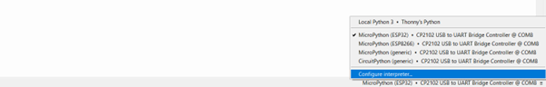
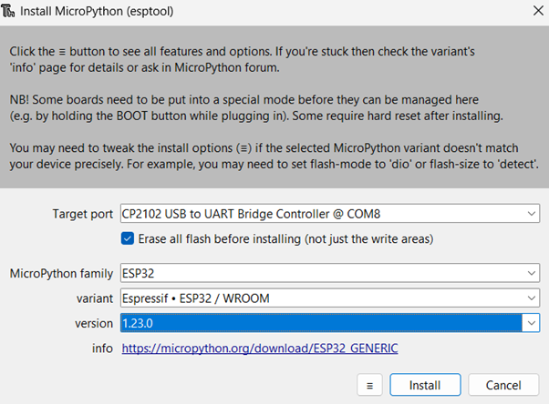
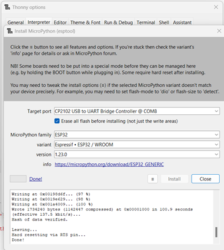

Google's Gemini assisted with the development of this script.
# Learning Objectives
**Knowledge and Understanding:**

- **Microcontroller Basics:** Students will have a basic understanding of microcontrollers, including their architecture, peripherals, and programming models.
- **Hardware Interfacing with MicroPython:** Students will understand how to interface with various hardware components (e.g., sensors, actuators, displays) using MicroPython libraries and APIs.
- **MicroPython Fundamentals:** Students will understand the core concepts of MicroPython, including its syntax, data types, control flow, and modules.
- **MicroPython for Embedded Systems:** Students will understand the unique aspects of using MicroPython in embedded systems, such as memory constraints, performance considerations, and hardware limitations. They can develop arguments for the use of C or Micropython.

**Skills and Abilities:**

- **MicroPython Programming:** Students will be able to write, debug, and optimize MicroPython code for embedded systems.
- **Hardware Interfacing with MicroPython:** Students will be able to interface with various hardware components (e.g., sensors, actuators, displays) using MicroPython libraries and APIs.
- **Real-Time Programming with MicroPython:** Students will be able to design and implement real-time applications using MicroPython, considering factors such as task scheduling, deadlines, and synchronization.
- **Debugging and Troubleshooting MicroPython Code:** Students will be able to identify and resolve issues in MicroPython code, using debugging tools and techniques.
- **Embedded System Design with MicroPython:** Students will be able to design embedded systems using MicroPython, considering factors such as hardware selection, software architecture, and power consumption.

# Introduction

**Embedded systems** are specialized computer systems designed to perform specific tasks within a larger system. Unlike general-purpose computers, they are often smaller, less powerful, and have limited resources. Embedded systems can be found in a wide range of devices, from smartphones and appliances to cars and industrial machinery.  

**Key Characteristics of Embedded Systems:**
- **Specialized Tasks:** Embedded systems are designed to perform specific tasks, such as controlling a motor, processing sensor data, or managing communication.
- **Limited Resources:** They often have limited processing power, memory, and storage compared to general-purpose computers.
- **Real-Time Requirements:** Many embedded systems must meet strict real-time constraints, meaning they must respond to events within a specific time frame.
- **Integration with Hardware:** Embedded systems are tightly integrated with hardware components, such as sensors, actuators, and communication interfaces.

**Examples of Embedded Systems:**
- **Consumer Electronics:** Smartphones, tablets, televisions, gaming consoles, digital cameras
- **Automotive:** Engine control units, anti-lock brake systems, infotainment systems
- **Industrial Automation:** Programmable logic controllers (PLCs), robotics, factory automation systems
- **Medical Devices:** Pacemakers, defibrillators, medical imaging equipment
- **Internet of Things (IoT):** Smart home devices, wearable technology, industrial IoT

**Programming Embedded Systems:**
Programming embedded systems requires a deep understanding of hardware and software interactions. Common programming languages for embedded systems include:
- **C:** A widely used language for embedded systems due to its efficiency and low-level control.
- **C++:** Object-oriented programming language that can be used for more complex embedded systems.
- **Assembly Language:** Provides direct control over hardware but is more complex to program.
- **Specialized Embedded Languages:** Some embedded systems use specialized languages like LabVIEW or PLC programming languages.

**Challenges in Embedded Systems Development:**
- **Resource Constraints:** Limited memory, processing power, and energy consumption can make development challenging.
- **Real-Time Requirements:** Ensuring that the system responds to events within strict time constraints can be difficult.
- **Hardware Integration:** Interfacing with various hardware components can be complex and requires a deep understanding of hardware principles.
- **Debugging and Testing:** Debugging embedded systems can be challenging due to limited debugging tools and the need for specialized hardware.

**In this course, we will explore the fundamentals of embedded systems and the general principles of programming for embedded devices. We will learn how to interface with hardware components, develop real-time applications, and optimize code for resource-constrained environments.**
# Getting started
## 1. Install the correct USB-Driver
As shown here [https://www.az-delivery.de/en/blogs/azdelivery-blog-fur-arduino-und-raspberry-pi/projekte-mit-micropython-und-dem-esp8266-esp32-teil-1](https://www.az-delivery.de/en/blogs/azdelivery-blog-fur-arduino-und-raspberry-pi/projekte-mit-micropython-und-dem-esp8266-esp32-teil-1) we need to install the correct USB driver (CP2102 - Driver).
## 2. Install IDE
Download Thonny from [https://thonny.org/](https://thonny.org/) and install it.
## 3. Flashing MicroPython
Open Thonny and go to the right bottom corner of the program and select configure interpreter. (Make sure that the correct COM is selected)



Next click on install or update MicroPython.


Now press and hold down the boot/flash button on the board and click install.



After the process has started you may release the button.
Now you may close the dialogs, and select the correct device, if it is not selected already.



If you see the error `13 - Access Denied`, make sure that no other extension, etc. tries to connect to the device. (e.g. VS Code pymakr)
# Embedded Systems
"Embedded systems are a combination of hardware and software parts, as well as other components that we bring together into products such as a cell phone, a music player, a network router, or an aircraft guidance system." (Peckol, 2019, p. xxxvii)

**Embedded systems** and **general-purpose computers** share the core functionality of executing instructions and processing data. However, they differ significantly in their design, purpose, and capabilities. **Embedded systems** are optimized for specific tasks, often with limited resources and real-time constraints. They are typically smaller, less powerful, and more energy-efficient than **general-purpose computers**. **General-purpose computers** are designed to be versatile and can handle a wide range of tasks. They are typically larger, more powerful, and have more resources than **embedded systems**. In essence, **embedded systems** are specialized computers tailored for specific applications, while **general-purpose computers** are designed to be flexible and adaptable for various uses.
## General-Purpose Computers vs. Microcontrollers
**General-purpose computers** and **microcontrollers** are both types of computing devices, but they serve different purposes and have distinct characteristics.
### General-Purpose Computers
- **Versatility:** Designed to perform a wide range of tasks, from word processing to gaming and scientific simulations.
- **Powerful Processors:** Equipped with powerful central processing units (CPUs) capable of handling complex computations.
- **Abundant Resources:** Have ample memory, storage, and peripherals for various applications.
- **Operating Systems:** Typically run operating systems like Windows, macOS, or Linux.
### Microcontrollers
- **Specialized Tasks:** Designed for specific, often embedded, applications like controlling appliances, sensors, or industrial equipment.
- **Limited Resources:** Have less processing power, memory, and storage compared to general-purpose computers.
- **Energy Efficiency:** Optimized for low power consumption, making them suitable for battery-powered devices.
- **Real-time Capabilities:** Often designed to meet strict real-time requirements, ensuring timely responses to events.
- **Microcontroller Units (MCUs):** The core component of a microcontroller, responsible for executing instructions.

**Key Differences:**

| Feature                | General-Purpose Computer | Microcontroller                |
| ---------------------- | ------------------------ | ------------------------------ |
| Purpose                | Versatile                | Specialized                    |
| Processing Power       | High                     | Lower                          |
| Resources              | Abundant                 | Limited                        |
| Operating System       | Yes                      | Often no, or a simplified RTOS |
| Energy Consumption     | Higher                   | Lower                          |
| Real-Time Capabilities | May have, but not always | Often designed for real-time   |

In summary, **general-purpose computers** are designed for versatility and power, while **microcontrollers** are optimized for specific tasks, energy efficiency, and real-time performance. The choice between the two depends on the specific requirements of the application. 
## C / C++ vs Micropython
**C**
- **Compiled language:** Requires source code to be compiled into machine code before execution.
- **Low-level control:** Offers direct access to hardware and memory, providing fine-grained control over system resources.
- **Efficiency:** Known for its speed and efficiency, making it suitable for performance-critical applications.
- **Complexity:** Can be more complex to learn and use due to its lower-level nature and manual memory management.
- **Widely supported:** Supported by a vast ecosystem of tools, libraries, and compilers.

**MicroPython**
- **Interpreted language:** Executes code directly from its source form, without requiring compilation.
- **High-level abstraction:** Provides a simplified programming experience with automatic memory management and a Python-like syntax.
- **Rapid development:** Enables faster prototyping and development cycles due to its interactive nature.
- **Limited performance:** May be slightly slower than C for computationally intensive tasks due to the overhead of interpretation.
- **Growing ecosystem:** While still developing, MicroPython has a growing community and ecosystem of libraries and tools.

**Key Differences**

|Feature|C|MicroPython|
|---|---|---|
|Compilation|Required|Not required|
|Level of Control|Low-level|High-level|
|Efficiency|High|Lower|
|Complexity|Higher|Lower|
|Development Speed|Slower|Faster|

**Use Cases**

- **C:**
    - Embedded systems with limited resources and strict performance requirements.
    - Operating systems, device drivers, and firmware.
    - Performance-critical applications like scientific computing and game engines.
- **MicroPython:**
    - Rapid prototyping and experimentation with embedded systems.
    - Educational and hobbyist projects.
    - IoT devices and automation tasks.
    - Applications where ease of development and rapid iteration are prioritized over maximum performance.

**Choosing the Right Language**

The best language for your project depends on factors such as:

- **Performance requirements:** If your application demands maximum speed and efficiency, C might be the better choice.
- **Development time:** If rapid prototyping and iteration are important, MicroPython can be a good option.
- **Hardware constraints:** MicroPython's smaller footprint and lower memory requirements can be advantageous for resource-constrained devices.
- **Developer familiarity:** If you have experience with C, it might be easier to use for your project. However, MicroPython's Python-like syntax can be more accessible for those with a Python background.

Ultimately, the decision between C and MicroPython should be based on a careful evaluation of your project's specific needs and constraints.
# Python
"In MicroPython, `print()` is a built-in function that allows you to display information on the console or serial monitor. It's a crucial tool for debugging and understanding the behavior of your code." (Murugesh, Vasudevan, &#38; Pulari, 2024, 1.2 What is Python? section)
## Print
In Python (MicroPython), `print()` is a built-in function that allows you to display information on the console or serial monitor. It's a crucial tool for debugging and understanding the behavior of your code.
## Variables
To create a variable in Python, you simply assign a value to it using the equal sign (`=`). The variable name goes on the left side of the equal sign, and the value goes on the right.
### Data Types

Python has several built-in data types:

- **Numbers:**
    - `int`: Integers (e.g., 10, -5)
    - `float`: Floating-point numbers (e.g., 3.14, 2.5)
- **Strings:** Text enclosed in quotes (e.g., "Hello", 'World')
- **Boolean:** True or False values
- **Lists:** Ordered collections of items (e.g., [1, 2, 3])
- **Tuples:** Immutable ordered collections of items (e.g., (1, 2, 3))
- **Dictionaries:** Unordered collections of key-value pairs (e.g., {'name': 'Alice', 'age': 30})

You can convert values between different data types using built-in functions like `int()`, `float()`, `str()`, `list()`, etc.
## Lists
**Lists** are one of the most versatile data structures in Python. They are ordered collections of items, where each item can be of any data type. Lists are mutable, meaning you can change their elements after they are created.
### Creating Lists
To create a list, enclose a sequence of items within square brackets `[]`.
```
# Creating a list of integers
numbers = [1, 2, 3, 4, 5]

# Creating a list of strings
fruits = ["apple", "banana", "cherry"]

# Creating a list of mixed data types   1. codeverge.com codeverge.com
mixed_list = [10, "Hello", 3.14, True]
```
### Accessing List Elements
You can access individual elements of a list using their index, which starts from 0.
```
# Accessing the first element
first_number = numbers[0]  # Output: 1

# Accessing the last element
last_fruit = fruits[-1]  # Output: cherry
```
### Slicing Lists
You can extract a portion of a list using slicing.
```
# Extracting elements from index 1 to 3 (exclusive)
sublist = numbers[1:4]  # Output: [2, 3, 4]

# Extracting elements from the beginning to index 2 (exclusive)
first_two = numbers[:2]  # Output: [1, 2]

# Extracting elements from index 2 to the end
last_three = numbers[2:]  # Output: [3, 4, 5]
```
### Modifying Lists
You can modify existing elements in a list or add new elements.
```
# Changing an element
numbers[2] = 100

# Adding an element to the end
fruits.append("orange")

# Inserting an element at a specific index
numbers.insert(1, 20)
```
### Removing Elements
You can remove elements from a list using various methods.
```
# Removing an element by its value
fruits.remove("banana")

# Removing an element by its index
del numbers[3]

# Removing all elements from the list
numbers.clear()
```
### List Operations
Lists support various operations, such as:
- **Concatenation:** Joining two lists using the `+` operator.
- **Repetition:** Repeating a list using the `*` operator.
- **Membership testing:** Checking if an element is in the list using the `in` keyword.
- **Length:** Finding the number of elements in a list using the `len()` function.
- **Sum**: Finding the sum of the elements in a list using the `sum()` function.
- **Max. Element**: Finding the greatest element in a list using the `max()` function.
- **Min. Element**: Finding the smallest element in a list using the `min()` function.
### Nested Lists
Lists can contain other lists, creating nested structures.
```
matrix = [[1, 2, 3], [4, 5, 6], [7, 8, 9]]
```
## Loops
Loops are essential programming constructs that allow you to repeatedly execute a block of code until a certain condition is met. Python provides two main types of loops: `for` loops and `while` loops.
### `for` Loops
`for` loops are used to iterate over a sequence of values, such as a list, tuple, or string.
```
# Iterating over a list
fruits = ["apple", "banana", "cherry"]
for fruit in fruits:
    print(fruit)

# Iterating over a range of numbers
for i in range(5):   1. github.com github.com
    print(i)
```
The `range()` function generates a sequence of numbers. You can specify the starting point, ending point (exclusive), and step size.
### `while` Loops
`while` loops execute a block of code as long as a specified condition is true.
```
count = 0
while count < 5:
    print(count)
    count += 1
```
### `break` and `continue` Statements
- **`break`:** Exits the loop immediately, regardless of whether the condition is met.
- **`continue`:** Skips the current iteration and proceeds to the next one.
```
for i in range(10):
    if i == 5:
        break
    print(i)

for i in range(10):
    if i % 2 == 0:
        continue
    print(i)
```
### Nested Loops
You can have loops within loops, known as nested loops.
```
for row in range(3):
    for col in range(3):
        print(row, col)
```

**Common Use Cases:**
- Iterating over lists, tuples, and strings.
- Performing repetitive tasks.
- Implementing algorithms like searching and sorting.
- Creating patterns and shapes.

**Best Practices:**
- Indent the code within the loop consistently.
- Use meaningful variable names.
- Avoid infinite loops by ensuring the loop condition eventually becomes false.
- Consider using `break` and `continue` statements judiciously.

By understanding and effectively using loops, you can write more efficient and concise Python code.
## Functions
**Functions** are reusable blocks of code that perform specific tasks. They help you organize your code, make it more readable, and avoid code duplication.
### Defining Functions
To define a function in Python, you use the `def` keyword followed by the function name, parentheses `()`, and a colon `:`. The code block that defines the function's behavior is indented.
```
def greet(name):
    print("Hello, " + name + "!")

greet("Alice")  # Output: Hello, Alice!
```
### Parameters and Arguments
- **Parameters:** Variables defined within the parentheses of a function.
- **Arguments:** Values passed to a function when it's called.
```
def add(x, y):
    result = x + y
    return result

sum = add(3, 5)  # Output: 8
```
### Return Values
Functions can return values using the `return` statement. If a function doesn't have a `return` statement, it implicitly returns `None`.
```
def square(x):
    return x * x

result = square(4)  # Output: 16
```
### Default Arguments
You can provide default values for parameters. If an argument isn't provided when the function is called, the default value is used.
```
def greet(name, greeting="Hello"):
    print(greeting + ", " + name + "!")

greet("Bob")  # Output: Hello, Bob!
greet("Charlie", "Hi")  # Output: Hi, Charlie!
```
### Keyword Arguments
You can pass arguments to a function using keyword arguments, where the argument names are specified explicitly.
```
def greet(name, greeting="Hello"):
    print(greeting + ", " + name + "!")

greet(greeting="Hi", name="David")  # Output: Hi, David!
```
### Variable-Length Arguments
You can use `*args` to pass a variable number of positional arguments to a function.
```
def add(*numbers):
    result = 0
    for num in numbers:
        result += num
    return result

sum = add(1, 2, 3, 4)  # Output: 10
```
### Docstrings
Docstrings are strings that describe the purpose, parameters, and return value of a function. They are enclosed in triple quotes.
```
def greet(name):
    """Greets a person by name.

    Args:
        name: The name of the person to greet.
    """
    print("Hello, " + name + "!")
```
**Key Points:**
- Functions promote code organization and reusability.
- Parameters and arguments allow you to pass data to functions.
- Return values enable functions to produce results.
- Default arguments and keyword arguments provide flexibility.
- Variable-length arguments handle an arbitrary number of arguments.
- Docstrings improve code readability and maintainability.

By effectively using functions, you can write more modular, efficient, and maintainable Python code.
## REPL: Read-Eval-Print Loop
A REPL (Read-Eval-Print Loop) is an interactive computing environment where you can enter expressions or statements, have them evaluated, and then see the results printed. It's a common tool for programming languages and is often used for testing code snippets, experimenting with language features, and debugging.

**How it works:**
1. **Read:** The REPL reads an input expression or statement from the user.
2. **Evaluate:** It evaluates the input, executing the code and calculating the result.
3. **Print:** The REPL prints the result of the evaluation to the console.
4. **Loop:** The process then repeats, allowing you to enter another expression or statement.

**Common uses of REPLs:**
- **Testing code snippets:** Quickly try out different code fragments and see the results.
- **Experimenting with language features:** Explore new language constructs or libraries.
- **Debugging:** Identify and fix errors in your code.
- **Interactive learning:** Learn a programming language or explore its capabilities.

**Examples of REPLs:**
- Python's interactive shell
- JavaScript's Node.js REPL
- Ruby's IRB (Interactive Ruby)
- Many other programming languages have their own REPLs.

REPLs are valuable tools for programmers of all levels, providing a convenient and interactive way to work with code.
## Time & Sleep
- **`time.time()`:** Returns the current time in seconds since the epoch (January 1, 1970).
- **`time.sleep(seconds)`:** Suspends the execution of the current thread for the specified number of seconds.
```
import time

# Get the current time
current_time = time.time()
print("Current time:", current_time)

# Pause execution for 5 seconds
time.sleep(5)

# Get the current time again
current_time_after_sleep = time.time()
print("Time after sleep:", current_time_after_sleep)
```
**Note:** The `time.sleep()` function can be used to create delays, implement timers, or control the pace of execution in your Python programs.

**Additional Considerations:**
- For more precise timekeeping, you might consider using the `datetime` module.
- If you need to schedule tasks at specific times, explore libraries like `schedule` or `APScheduler`.

By effectively using the `time` module, you can manipulate time and control the flow of your Python applications.
## MicroPython
**Python** and **MicroPython** are both programming languages, but they serve different purposes and have distinct characteristics.
### Python
- **General-purpose language:** Designed for a wide range of applications, from web development to data analysis and scientific computing.
- **Runs on various platforms:** Can be used on Windows, macOS, Linux, and other operating systems.
- **Extensive libraries and frameworks:** Offers a rich ecosystem of tools and modules for various tasks.
- **Interpreted language:** Code is executed line by line, making it slower than compiled languages.
### MicroPython
- **Embedded systems language:** Specifically designed for microcontrollers and small devices with limited resources.
- **Optimized for efficiency:** Strives to provide a Python-like experience while minimizing memory and processing power requirements.
- **Subset of Python:** Includes most of the core Python language features but may have limitations or variations.
- **Compiled to native machine code:** Improves performance compared to interpreted Python.
### Key Differences

| Feature      | Python          | MicroPython                   |
| ------------ | --------------- | ----------------------------- |
| Purpose      | General-purpose | Embedded systems              |
| Platforms    | Wide range      | Microcontrollers              |
| Libraries    | Extensive       | Limited                       |
| Execution    | Interpreted     | Compiled                      |
| Performance  | Slower          | Faster (for embedded systems) |
| Memory usage | Higher          | Lower                         |
#### Sleep
When working with microcontrollers, the `sleep` function is a crucial tool for managing power consumption, timing events, and controlling the overall behavior of your device. Different microcontroller platforms and operating systems may offer variations in the `sleep` function, but the core functionality remains similar.
##### Common Sleep Modes
Microcontrollers typically provide multiple sleep modes, each offering different levels of power savings and wake-up capabilities:
- **Idle Mode:** The processor is halted, but peripherals and clocks may continue to operate at a reduced frequency.
- **Power-Saving Mode:** The processor and some peripherals are powered down, while essential functions like interrupts and timers are maintained.
- **Deep Sleep Mode:** The microcontroller enters a low-power state, with only essential circuits powered. Wake-up typically requires an external interrupt or timer.
##### Factors to Consider
When choosing a sleep mode, consider the following factors:
- **Power Consumption:** The deeper the sleep mode, the lower the power consumption.
- **Wake-up Time:** The time it takes for the microcontroller to resume normal operation after waking up from sleep.
- **Interrupt Sensitivity:** Some sleep modes may have limitations on interrupt sensitivity or responsiveness.
- **Timer Functionality:** The availability of timers to wake the microcontroller from sleep.
- **Peripheral Support:** Whether peripherals can continue to operate in certain sleep modes.

Take a look at the [documentation](https://docs.micropython.org/en/latest/esp8266/tutorial/powerctrl.html) if you want to learn more.

**In summary,** Python is a versatile language suitable for a variety of applications, while MicroPython is optimized for resource-constrained devices and provides a subset of Python's features. The choice between the two depends on the specific requirements of your project.
# Electronics
Electronics is the branch of science that deals with the flow of electric current and its application in various devices. It involves the study of components, circuits, and systems that use electricity to perform specific functions.
## Basic Electrical Quantities
- **Voltage (U):** The electrical potential difference between two points in a circuit, measured in volts (V).
- **Current (I):** The rate of flow of electric charge, measured in amperes (A).
- **Resistance (R):** The opposition to the flow of electric current, measured in ohms (Ω).
## Ohm's Law
Ohm's Law is a fundamental relationship between voltage, current, and resistance. It states:
**U = R * I**
where:
- U is the voltage
- R is the resistance
- I is the current
## Voltage Divider
A voltage divider is a simple circuit that divides a voltage into two or more smaller voltages. It consists of two or more resistors connected in series. The voltage at the junction of the resistors is proportional to the ratio of their resistances.

## Potentiometer
A potentiometer is a variable resistor that can be used to adjust the voltage in a circuit. It consists of a resistive element with a sliding contact. By moving the contact, you can change the resistance between the contact and the ends of the element, thereby adjusting the voltage.

For example the ADC of the esp32 supports a range of 0.1V to 0.95V. This circuit uses a potentiometer to simulate different values. 


## Light-Emitting Diodes (LEDs)
LEDs are semiconductor devices that emit light when a current flows through them. They are widely used in various applications, such as displays, indicators, and lighting. LEDs have a specific polarity and require a forward voltage to emit light.

Dimming LEDs involves controlling the intensity of the light they emit. This can be achieved through two primary methods: Pulse-Width Modulation (PWM) and voltage control.
### PWM (Pulse-Width Modulation)
- **How it works:** PWM involves rapidly switching the LED on and off at a high frequency. The ratio of on time to off time determines the average brightness. A higher duty cycle (more on time) results in a brighter LED.
- **Advantages:** Highly efficient, precise control, and minimal power consumption.
- **Disadvantages:** May introduce noise or flicker in some applications.
### Voltage Control
- **How it works:** Directly varying the voltage supplied to the LED controls its brightness. Lower voltage results in lower brightness.
- **Advantages:** Simple implementation, no additional components required.
- **Disadvantages:** Less precise control, can be less efficient at lower voltages.

**Choosing the Right Method:**
- **Efficiency:** PWM is generally more efficient, especially at lower brightness levels.
- **Precision:** PWM offers more precise control over brightness.
- **Noise:** PWM may introduce noise, especially at lower frequencies.
- **Hardware:** The availability of PWM hardware on your microcontroller will influence your choice.

In many cases, PWM is the preferred method for dimming LEDs due to its efficiency and precision. However, voltage control can be a simpler option in some applications. Ultimately, the best method depends on your specific requirements and the capabilities of your hardware.
## Buttons
Buttons are simple mechanical switches that can be used to control the flow of current in a circuit. There are two main types of buttons:
- **Pull-up resistor:** A resistor is connected between the button and the power supply. When the button is not pressed, the input is high. When the button is pressed, the input goes low.
- **Pull-down resistor:** A resistor is connected between the button and ground. When the button is not pressed, the input is low. When the button is pressed, the input goes high.
## Analog-to-Digital Converters (ADCs)
ADCs convert analog signals (e.g., from sensors) into digital values. This allows microcontrollers and computers to process and analyze analog data. (12 bit, 0V - 1V)
## Digital-to-Analog Converters (DACs)
DACs convert digital values into analog signals. This is useful for controlling analog devices, such as motors or speakers.
 
By understanding these fundamental concepts, you can build a strong foundation for your exploration of electronics and begin creating your own circuits and projects.
## ESP32 Pinout

(espressif, 2024)

# MicroPython in action

The [MicroPython's Quick Reference for the ESP32](https://docs.micropython.org/en/latest/esp32/quickref.html) provides a solid foundation for getting started. The authors focus on expanding upon specific areas they believe warrant further explanation.

# Bibliography
Alsabbagh, M. (2019). MicroPython Cookbook (1st ed.). Packt Publishing. Retrieved 12 September 2024 from https://www.perlego.com/book/969835 (Original work published 21 May 2019)

Beningo, J. (2020). MicroPython Projects (1st ed.). Packt Publishing. Retrieved 12 September 2024 from https://www.perlego.com/book/1443351 (Original work published 17 April 2020)

espressif (2024). Esp32-DevKitC V4 Getting Started Guide. Retrieved 12 September 2024 from https://docs.espressif.com/projects/esp-idf/en/stable/esp32/hw-reference/esp32/get-started-devkitc.html

Murugesh, TS., Vasudevan, S., &#38; Pulari, S. R. (2024). Python (1st ed.). CRC Press. Retrieved 12 September 2024 from https://www.perlego.com/book/4473886 (Original work published 7 August 2024)

Peckol, J. (2019). Embedded Systems (2nd ed.). Wiley. Retrieved 12 September 2024 from https://www.perlego.com/book/991979 (Original work published 15 April 2019)

