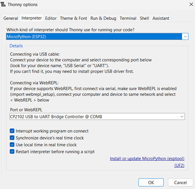

Google's Gemini assisted with the development of this script.
# Learning Objectives
**Knowledge and Understanding:**

- **Microcontroller Basics:** Students will have a basic understanding of microcontrollers, including their architecture, peripherals, and programming models.
- **Hardware Interfacing with MicroPython:** Students will understand how to interface with various hardware components (e.g., sensors, actuators, displays) using MicroPython libraries and APIs.
- **MicroPython Fundamentals:** Students will understand the core concepts of MicroPython, including its syntax, data types, control flow, and modules.
- **MicroPython for Embedded Systems:** Students will understand the unique aspects of using MicroPython in embedded systems, such as memory constraints, performance considerations, and hardware limitations. They can develop arguments for the use of C or Micropython.

**Skills and Abilities:**

- **MicroPython Programming:** Students will be able to write, debug, and optimize MicroPython code for embedded systems.
- **Hardware Interfacing with MicroPython:** Students will be able to interface with various hardware components (e.g., sensors, actuators, displays) using MicroPython libraries and APIs.
- **Real-Time Programming with MicroPython:** Students will be able to design and implement real-time applications using MicroPython, considering factors such as task scheduling, deadlines, and synchronization.
- **Debugging and Troubleshooting MicroPython Code:** Students will be able to identify and resolve issues in MicroPython code, using debugging tools and techniques.
- **Embedded System Design with MicroPython:** Students will be able to design embedded systems using MicroPython, considering factors such as hardware selection, software architecture, and power consumption.

# Introduction

**Embedded systems** are specialized computer systems **designed to perform specific tasks** within a larger system. Unlike general-purpose computers, they are often **smaller**, **less powerful**, and have **limited resources**. Embedded systems can be found in a wide range of devices, from smartphones and appliances to cars and industrial machinery.  

**Key Characteristics of Embedded Systems:**
- **Specialized Tasks:** Embedded systems are designed to perform specific tasks, such as controlling a motor, processing sensor data, or managing communication.
- **Limited Resources:** They often have limited processing power, memory, and storage compared to general-purpose computers.
- **Real-Time Requirements:** Many embedded systems must meet strict real-time constraints, meaning they must respond to events within a specific time frame.
- **Integration with Hardware:** Embedded systems are tightly integrated with hardware components, such as sensors, actuators, and communication interfaces.

**Examples of Embedded Systems:**
- **Consumer Electronics:** digital cameras, VR Headsets, coffee machine
- **Automotive:** Engine control units, anti-lock brake systems, infotainment systems
- **Industrial Automation:** Programmable logic controllers (PLCs), robotics, factory automation systems
- **Medical Devices:** Pacemakers, defibrillators, medical imaging equipment
- **Internet of Things (IoT):** Smart home devices, wearable technology, industrial IoT

**Programming Embedded Systems:**
Programming embedded systems requires a deep **understanding of hardware and software interactions**. Common programming languages for embedded systems include:
- **C:** A widely used language for embedded systems due to its efficiency and low-level control.
- **C++:** Object-oriented programming language that can be used for more complex embedded systems.
- **Assembly Language:** Provides direct control over hardware but is more complex to program.
- **Specialized Embedded Languages:** Some embedded systems use specialized languages like LabVIEW or PLC programming languages.

**Challenges in Embedded Systems Development:**
- **Resource Constraints:** Limited memory, processing power, and energy consumption can make development challenging.
- **Real-Time Requirements:** Ensuring that the system responds to events within strict time constraints can be difficult.
- **Hardware Integration:** Interfacing with various hardware components can be complex and requires a deep understanding of hardware principles.
- **Debugging and Testing:** Debugging embedded systems can be challenging due to limited debugging tools and the need for specialized hardware.

In this course, **we will explore** the **fundamentals of embedded systems** and the **general principles of programming for embedded devices**. We will learn how to **interface with hardware** components, **develop real-time applications**, and **optimize code for resource-constrained environments**.

# Getting started
## 1. Install the correct USB-Driver
As shown by [https://www.az-delivery.de/en/blogs/azdelivery-blog-fur-arduino-und-raspberry-pi/projekte-mit-micropython-und-dem-esp8266-esp32-teil-1](https://www.az-delivery.de/en/blogs/azdelivery-blog-fur-arduino-und-raspberry-pi/projekte-mit-micropython-und-dem-esp8266-esp32-teil-1), we need to download and install the correct USB driver, the [CP210x - Driver](https://www.silabs.com/developer-tools/usb-to-uart-bridge-vcp-drivers?tab=downloads). (For Windows download and install **CP210x Windows Drivers**.)

## 2. Install IDE
We continue by downloading and installing Thonny from [https://thonny.org/](https://thonny.org/). (For Windows 10 and 11 download and install **Installer with 64-bit Python 3.10**)

## 3. Flashing MicroPython
After opening Thonny, go to the right bottom corner of the window and select **configure interpreter**. (Make sure that the correct COM is selected.)


Next click on **install or update MicroPython**.



Now press and hold down the boot/flash button on the board and click install.


After the installation process has started you may release the button.
Now you may close the dialogs, and select the correct device, if it is not selected already.


If you see the error `13 - Access Denied`, make sure that no other extension, etc. tries to connect to the device. (e.g. VS Code pymakr)

# Embedded Systems
**"Embedded systems are a combination of hardware and software parts, as well as other components that we bring together into products such as a cell phone, a music player, a network router, or an aircraft guidance system." (Peckol, 2019, p. xxxvii)**

**Embedded systems** and **general-purpose computers** **share the core functionality of executing instructions and processing data**. However, they differ significantly in their design, purpose, and capabilities. **Embedded systems** are **optimized for specific tasks**, often with **limited resources** and **real-time constraints**. They are typically **smaller**, **less powerful**, and **more energy-efficient** than general-purpose computers. **General-purpose computers** are designed to be **versatile** and can handle a **wide range of tasks**. They are typically **larger**, **more powerful**, and have **more resources** than embedded systems. In essence, **embedded systems are specialized computers tailored for specific applications**, while **general-purpose computersare designed to be flexible and adaptable for various uses** .

## General-Purpose Computers vs. Microcontrollers
General-purpose computers and microcontrollers are both types of computing devices, but they serve different purposes and have distinct characteristics.

### General-Purpose Computers
- **Versatility:** Designed to perform a wide range of tasks, from word processing to gaming and scientific simulations.
- **Powerful Processors:** Equipped with powerful central processing units (CPUs) capable of handling complex computations.
- **Abundant Resources:** Have ample memory, storage, and peripherals for various applications.
- **Operating Systems:** Typically run operating systems like Windows, macOS, or Linux.

### Microcontrollers
- **Specialized Tasks:** Designed for specific, often embedded, applications like controlling appliances, sensors, or industrial equipment.
- **Limited Resources:** Have less processing power, memory, and storage compared to general-purpose computers.
- **Energy Efficiency:** Optimized for low power consumption, making them suitable for battery-powered devices.
- **Real-time Capabilities:** Often designed to meet strict real-time requirements, ensuring timely responses to events.
- **Microcontroller Units (MCUs):** The core component of a microcontroller, responsible for executing instructions.

### Key Differences

| Feature                | General-Purpose Computer | Microcontroller                |
| ---------------------- | ------------------------ | ------------------------------ |
| Purpose                | Versatile                | Specialized                    |
| Processing Power       | High                     | Lower                          |
| Resources              | Abundant                 | Limited                        |
| Operating System       | Yes                      | Often no, or a simplified RTOS |
| Energy Consumption     | Higher                   | Lower                          |
| Real-Time Capabilities | May have, but not always | Often designed for real-time   |

In summary, general-purpose computers are designed for versatility and power, while microcontrollers are optimized for specific tasks, energy efficiency, and real-time performance. The choice between the two depends on the specific requirements of the application. 

## C / C++ vs Micropython
### C
- **Compiled language:** Requires source code to be compiled into machine code before execution.
- **Low-level control:** Offers direct access to hardware and memory, providing fine-grained control over system resources.
- **Efficiency:** Known for its speed and efficiency, making it suitable for performance-critical applications.
- **Complexity:** Can be more complex to learn and use due to its lower-level nature and manual memory management.
- **Widely supported:** Supported by a vast ecosystem of tools, libraries, and compilers.

### MicroPython
- **Interpreted language:** Executes code directly from its source form, without requiring compilation.
- **High-level abstraction:** Provides a simplified programming experience with automatic memory management and a Python-like syntax.
- **Rapid development:** Enables faster prototyping and development cycles due to its interactive nature.
- **Limited performance:** May be slightly slower than C for computationally intensive tasks due to the overhead of interpretation.
- **Growing ecosystem:** While still developing, MicroPython has a growing community and ecosystem of libraries and tools.

### Key Differences

|Feature|C|MicroPython|
|---|---|---|
|Compilation|Required|Not required|
|Level of Control|Low-level|High-level|
|Efficiency|High|Lower|
|Complexity|Higher|Lower|
|Development Speed|Slower|Faster|

### Use Cases

#### C
- **Embedded systems:** limited resources and strict performance requirements.
- **Low level software:** Operating systems, device drivers, and firmware.
- **Performance-critical:** Performance-critical applications like scientific computing and game engines.
#### MicroPython
- **Rapid prototyping:** Prototyping, experimentation with embedded systems.
- **Education:** Educational and hobbyist projects.
- **IoT:** IoT devices and automation tasks.
- **Easier and faster development:** Applications where ease of development and rapid iteration are prioritized over maximum performance.

### Choosing the Right Language

The best language for your project depends on factors such as:

- **Performance requirements:** If your application demands maximum speed and efficiency, C might be the better choice.
- **Development time:** If rapid prototyping and iteration are important, MicroPython can be a good option.
- **Hardware constraints:** MicroPython's smaller footprint and lower memory requirements can be advantageous for resource-constrained devices.
- **Developer familiarity:** If you have experience with C, it might be easier to use for your project. However, MicroPython's Python-like syntax can be more accessible for those with a Python background.

Ultimately, the decision between C and MicroPython should be based on a careful evaluation of your project's specific needs and constraints.

>Embedded systems are specialized computers integrated into other devices to perform specific tasks. Unlike general-purpose computers, they are designed for efficiency and often operate with limited resources.
>
>Key characteristics include:
>- **Specialization:** Tailored for a single purpose.
>- **Resource Constraints:** Limited processing power, memory, and energy.
>- **Real-time Requirements:** Must respond to events quickly.
>
>Examples include:
>- **Consumer Electronics:** Smartphones, microwaves.
>- **Automotive:** Engine control units, airbags.
>- **Industrial Automation:** Robotics, factory control.
>
>Microcontrollers are the core of many embedded systems, offering features like:
>- **Processor Core:** Executes instructions.
>- **Memory:** Stores program code and data.
>- **I/O Peripherals:** Interact with sensors and actuators.
>
>Common programming languages include:
>- **C/C++:** Powerful and efficient, widely used.
>- **MicroPython:** Easier to learn, suitable for prototyping.
>
>Embedded systems are crucial in modern technology, enabling advancements in various fields.

# Python
"In MicroPython, `print()` is a built-in function that allows you to display information on the console or serial monitor. It's a crucial tool for debugging and understanding the behavior of your code." (Murugesh, Vasudevan, &#38; Pulari, 2024, 1.2 What is Python? section)

## Print
In Python (MicroPython), **`print()`** is a built-in function that allows you to **display information on the console** or serial monitor. It's a crucial tool for **debugging** and understanding the behavior of your code.

## Variables
To **create a variable in Python**, you simply **assign a value** to it using the equal sign (`=`). The **variable name goes on the left** side of the equal sign, and the **value goes on the right**.

### Data Types

Python has several built-in data types:

- **Numbers:**
    - `int`: Integers (e.g., 10, -5)
    - `float`: Floating-point numbers (e.g., 3.14, 2.5)
- **Strings:** Text enclosed in quotes (e.g., "Hello", 'World')
- **Boolean:** True or False values
- **Lists:** Ordered collections of items (e.g., [1, 2, 3])
- **Tuples:** Immutable ordered collections of items (e.g., (1, 2, 3))
- **Dictionaries:** Unordered collections of key-value pairs (e.g., {'name': 'Alice', 'age': 30})

You can **convert values between different data types** using built-in functions like **`int()`**, **`float()`**, **`str()`**, **`list()`**, etc.

## Lists
**Lists** are one of the most versatile data structures in Python. They are **ordered collections of items**, where each item can be of **any data type**. Lists are mutable, meaning you can change their elements after they are created.

### Creating Lists
To create a list, enclose a sequence of items within square brackets `[]`.
``` python
# Creating a list of integers
numbers = [5, 2, 3, 4, 1]

# Sorts the list of numbers ascending.
sorted_numbers = sorted(numnbers)

# Creating a list of strings
fruits = ["apple", "banana", "cherry"]

# Creating a list of mixed data types   1. codeverge.com codeverge.com
mixed_list = [10, "Hello", 3.14, True]
```
### Accessing List Elements
You can access individual elements of a list using their index, which starts from 0.
``` python
# Accessing the first element
first_number = numbers[0]  # Output: 1

# Accessing the last element
last_fruit = fruits[-1]  # Output: cherry
```

### Slicing Lists
You can extract a portion of a list using slicing.
``` python
# Creating a new list with all natural numbers in [1; 5]
numbers = [1,2,3,4,5]

# Extracting elements from index 1 to 3 (exclusive)
sublist = numbers[1:4]  # Output: [2, 3, 4]

# Extracting elements from the beginning to index 2 (exclusive)
first_two = numbers[:2]  # Output: [1, 2]

# Extracting elements from index 2 to the end
last_three = numbers[2:]  # Output: [3, 4, 5]
```

### Modifying Lists
You can modify existing elements in a list or add new elements.
``` python
# Changing an element
numbers[2] = 100

# Adding an element to the end
fruits.append("orange")

# Inserting an element at a specific index
numbers.insert(1, 20)
```

### Removing Elements
You can remove elements from a list using various methods.
``` python
# Removing an element by its value
fruits.remove("banana")

# Removing an element by its index
del numbers[3]

# Removing all elements from the list
numbers.clear()
```

### List Operations
Lists support various operations, such as:
- **Concatenation:** Joining two lists using the `+` operator.
- **Repetition:** Repeating a list using the `*` operator.
- **Membership testing:** Checking if an element is in the list using the `in` keyword.
- **Length:** Finding the number of elements in a list using the `len()` function.
- **Sum**: Finding the sum of the elements in a list using the `sum()` function.
- **Max. Element**: Finding the greatest element in a list using the `max()` function.
- **Min. Element**: Finding the smallest element in a list using the `min()` function.

### Nested Lists
Lists can contain other lists, creating nested structures.
``` python
matrix = [[1, 2, 3], [4, 5, 6], [7, 8, 9]]
```

## Loops
Loops are essential programming constructs that allow you to **repeatedly execute a block of code** until a certain condition is met. Python provides two main types of loops: `for` loops and `while` loops.

### for-Loops
`for` loops are used to **iterate over a sequence of values**, such as a list, tuple, or string.
``` python
# Iterating over a list
fruits = ["apple", "banana", "cherry"]
for fruit in fruits:
    print(fruit)

# Iterating over a range of numbers
for i in range(5):   1. github.com github.com
    print(i)
```
The `range()` function generates a sequence of numbers. You can specify the starting point, ending point (exclusive), and step size.

### while-Loops
`while` loops execute a block of code **as long as a specified condition** is true.
``` python
count = 0
while count < 5:
    print(count)
    count += 1
```

### break and continue Statements
- **break:** Exits the loop immediately, regardless of whether the condition is met.
- **continue:** Skips the current iteration and proceeds to the next one.
``` python
for i in range(10):
    if i == 5:
        break
    print(i)

for i in range(10):
    if i % 2 == 0:
        continue
    print(i)
```

### Nested Loops
You can have loops within loops, known as nested loops.
``` python
for row in range(3):
    for col in range(3):
        print(row, col)
```

### Common Use Cases 
- **Iterating:** Iterating over lists, tuples, and strings.
- **Repetitive:** Performing repetitive tasks.
- **Algorithms:** Implementing algorithms like searching and sorting.
- **Patterns and Shapes:** Creating patterns and shapes.

### Best Practices:
- **Consistent Indent:** Indent the code within the loop consistently.
- **Variable Names:** Use meaningful variable names.
- **while true:**: Avoid infinite loops by ensuring the loop condition eventually becomes false.
- **Avoid break and continue:** Consider using `break` and `continue` statements judiciously.

By understanding and effectively using loops, you can write more efficient and concise Python code.

## Functions
Functions are **reusable blocks of code** that **perform specific tasks**. They help you organize your code, make it more readable, and avoid code duplication.

### Defining Functions
To define a function in Python, you use the `def` keyword followed by the function name, parentheses `()`, and a colon `:`. The code block that defines the function's behavior is indented.
``` python
def greet(name):
    print("Hello, " + name + "!")

greet("Alice")  # Output: Hello, Alice!
```

### Parameters and Arguments
- **Parameters:** Variables defined within the parentheses of a function.
- **Arguments:** Values passed to a function when it's called.
``` python
def add(x, y):
    result = x + y
    return result

sum = add(3, 5)  # Output: 8
```

### Return Values
Functions can return values using the `return` statement. If a function doesn't have a `return` statement, it implicitly returns `None`.
``` python
def square(x):
    return x * x

result = square(4)  # Output: 16
```

### Default Arguments
You can provide default values for parameters. **If an argument isn't provided when the function is called, the default value is used**.
``` python
def greet(name, greeting="Hello"):
    print(greeting + ", " + name + "!")

greet("Bob")  # Output: Hello, Bob!
greet("Charlie", "Hi")  # Output: Hi, Charlie!
```

### Keyword Arguments
You can pass arguments to a function using keyword arguments, where the argument names are specified explicitly.
``` python
def greet(name, greeting="Hello"):
    print(greeting + ", " + name + "!")

greet(greeting="Hi", name="David")  # Output: Hi, David!
```

### Variable-Length Arguments
You can use `*args` to pass a variable number of positional arguments to a function.
``` python
def add(*numbers):
    result = 0
    for num in numbers:
        result += num
    return result

sum = add(1, 2, 3, 4)  # Output: 10
```

### Docstrings
**Good comments and function documentation are crucial for maintaining and improving software code.** They **enhance code readability**, making it easier for developers to  **understand thepurpose, logic, and implementation** of different parts of the code. This significantly **reduces debugging time**, facilitates code maintenance and updates, and **promotes better collaboration** among developers. Clear and concise documentation also helps in onboarding new team members and ensures that the codebase remains well-documented and easy to navigate, even after significant changes or updates.

Docstrings are strings that describe the purpose, parameters, and return value of a function. They are enclosed in triple quotes.
``` python
def greet(name):
    """Greets a person by name.

    Args:
        name: The name of the person to greet.
    """
    print("Hello, " + name + "!")
```

### Key Points
- **Code Organization and Reusability:** Functions promote code organization and reusability.
- **Pass Data:** Parameters and arguments allow you to pass data to functions.
- **Answer the call**: Return values enable functions to produce results.
- **Default Arguments:** Default arguments and keyword arguments provide flexibility.
- **Arbitrary Number of Arguments:** Variable-length arguments handle an arbitrary number of arguments.
- **Documentation:** Docstrings improve code readability and maintainability.

By effectively using functions, you can write more modular, efficient, and maintainable Python code.

## REPL: Read-Eval-Print Loop
A REPL (Read-Eval-Print Loop) is an interactive computing environment where you can **enter expressions** or statements, have them **evaluated**, and then see the **results printed**. It's a common tool for programming languages and is often used for testing code snippets, experimenting with language features, and debugging.

### How it works
1. **Read:** The REPL reads an input expression or statement from the user.
2. **Evaluate:** It evaluates the input, executing the code and calculating the result.
3. **Print:** The REPL prints the result of the evaluation to the console.
4. **Loop:** The process then repeats, allowing you to enter another expression or statement.

### Common uses of REPLs
- **Testing code snippets:** Quickly try out different code fragments and see the results.
- **Experimenting with language features:** Explore new language constructs or libraries.
- **Debugging:** Identify and fix errors in your code.
- **Interactive learning:** Learn a programming language or explore its capabilities.

### Examples of REPLs
- **Python:** Python's interactive shell
- **Node.Js:** JavaScript's Node.js REPL
- **Others:** Many other programming languages have their own REPLs.

REPLs are valuable tools for programmers of all levels, providing a convenient and interactive way to work with code.

## Time & Sleep
- **time.time():** Returns the current time in seconds since the epoch (January 1, 1970).
- **time.sleep(seconds):** Suspends the execution of the current thread for the specified number of seconds.
``` python
import time

# Get the current time
current_time = time.time()
print("Current time:", current_time)

# Pause execution for 5 seconds
time.sleep(5)

# Get the current time again
current_time_after_sleep = time.time()
print("Time after sleep:", current_time_after_sleep)
```

**Note:** The `time.sleep()` function can be used to **create delays**, **implement timers**, or control the **pace of execution** in your Python programs.

**Additional Considerations:**
- **DateTime for more precision:** For more precise timekeeping, you might consider using the `datetime` module.
- **Scheduling:** If you need to schedule tasks at specific times, explore libraries like `schedule` or `APScheduler`.

By effectively using the `time` module, you can manipulate time and control the flow of your Python applications.

## Tasks
Having built a strong foundation of theoretical knowledge, it's now time to apply these concepts to practical scenarios. You will be presented with specific coding tasks, each accompanied by a provided solution. While these solutions can be valuable references, it's crucial to avoid simply copying them. Instead, focus on understanding the underlying principles and logic behind each solution. This deep understanding will be essential for successfully tackling future tasks where solutions are not readily available.

#### Task 1. Moving Average
Implement a function that calculates the moving average of a given list of numbers. The function should take a list of numbers and the size of the moving average window as input and return a list of moving averages.

##### Theory
A moving average is a statistical calculation that helps **smooth out fluctuations** in a dataset. It involves calculating the average of a specific number of consecutive data points and updating it as new data points become available.

- **Window size:** The number of data points included in the calculation.
- **Calculation:**
    - For each new data point, add it to the window and remove the oldest data point.
    - Calculate the average of the current window.

##### Solution (Python)
``` python
def moving_average(values, window_size):
  """Calculates the moving average of a list of values.

  Args:
    values: A list of numbers.
    window_size: The size of the moving average window.

  Returns:
    A list of moving averages corresponding to each value in the input list.
  """

  if window_size <= 0:
    raise ValueError("Window size must be positive.")

  moving_averages = []
  window = []
  for value in values:
    window.append(value)
    if len(window) > window_size:
      window.pop(0)
    if len(window) == window_size:
      average = sum(window) / window_size
      moving_averages.append(average)
  return moving_averages
```

#### Task 2. Normalize from a Range
Implement a function that normalizes a given value to a range between 0 and 1. The function should take the value to be normalized, the minimum value of the original range, and the maximum value of the original range as input. The function should return the normalized value.

##### Theory
**Min-max scaling**, a common data **preprocessing technique**, aims to **normalize data by transforming it to a specific range**, typically between 0 and 1. Formally, this transformation is represented by the following equation.

``` tex
\hat{x} = \frac{x - x_{min}}{x_{max} - x_{min}}
```

Imagine you have a set of numbers, like **test scores**, that range from **very low to very high**. Min-max scaling is like **adjusting these scores** so they all fall **within a specific range**, for example, between 0 and 100.

``` tex
normalized_{value} = \frac{value - min_{value}}{max_{value} - min_{value}}
```

##### Solution (Python)
``` python
def normalize_to_range(value, min_value, max_value):
  """Normalizes a value from the specified range to a range between 0 and 1.

  Args:
    value: The value to normalize.
    min_value: The minimum value of the specified range.
    max_value: The maximum value of the specified range.

  Returns:
    The normalized value.
  """

  normalized_value = (value - min_value) / (max_value - min_value)
  return normalized_value
```

#### Task 3. Denormalize to a Range
Implement a Python function that denormalizes a value from a range between 0 and 1 to the specified original range. The function should take the normalized value, the minimum value of the original range, and the maximum value of the original range as input. The function should return the denormalized value.

##### Theory
Denormalization is the **reverse process of normalization**, where a scaled value is converted back to its original range.

To recover the **original value** of the variable from its normalized representation, we use the following denormalization formula.

```tex
x = \hat{x} (x_{max} - x_{min}) + x_{min}
```

Denormalization is like **reversing the scaling process**. We undo the adjustments made during normalization to get back to the original values.

``` tex
denormalized_{value} = normalized_{value} \times (max_{value} - min_{value}) + min_{value}
```

##### Solution (Python)
``` python
def denormalize_from_range(normalized_value, min_value, max_value):
  """Denormalizes a value to a specified range.

  Args:
    normalized_value: The normalized value.
    min_value: The minimum value of the original range.
    max_value: The maximum value of the original range.

  Returns:
    The denormalized value.
  """

  denormalized_value = normalized_value * (max_value - min_value) + min_value
  return denormalized_value
```

#### Task 4. Median
Implement a Python function that calculates the median of a given list of numbers. The function should handle both even and odd-sized lists and return `None` for empty lists.

##### Theory
The median of a set of numbers is the **middle value** when the numbers are **arranged in ascending order**. If there are an even number of values, the median is the average of the two middle values.  

- **Sorting:** The dataset must be sorted in ascending order.
- **Middle value:** For an odd number of elements, the median is the value at index `(n-1) / 2`, where `n` is the number of elements. For an even number of elements, the median is the average of the values at indices `n // 2 - 1` and `n // 2`.

##### Solution (Python)
``` python
def calculate_median(values):
  """Calculates the median of a list of values.

  Args:
    values: A list of numbers.

  Returns:
    The median of the values.
  """

  if not values:
    return None  # Handle empty lists

  sorted_values = sorted(values)
  n = len(sorted_values)
  if n % 2 == 0:
    median = (sorted_values[n // 2 - 1] + sorted_values[n // 2]) / 2
  else:
    median = sorted_values[(n    - 1) // 2]
  return median
```

>Python is a versatile language known for its readability and ease of use. Key features include:
>
>- **Clear Syntax:** Python's emphasis on readability makes it beginner-friendly and promotes maintainable code.
>- **Data Handling:** Variables store data, and various data types (integers, floats, strings, etc.) define how that data is handled.
>- **Control Flow:** Conditional statements (if, else, elif) and loops (for, while) enable decision-making and repetitive actions within programs.
>- **Functions:** Reusable blocks of code that improve organization, modularity, and code reusability.
>- **Data Structures:** Efficiently store and manipulate data using lists, dictionaries, and sets.
>- **Extensive Libraries:** A rich ecosystem of libraries provides pre-built functionality for a wide range of tasks.
>
>These core features empower Python developers to create a wide variety of applications, from simple scripts to complex software systems.

# Electronics
Electronics is the branch of science that **deals with the flow of electric current** and its application in various devices. It involves the study of **components**, **circuits**, and **systems** that use electricity to perform specific functions.

## Basic Electrical Quantities
- **Voltage (U):** The electrical potential difference between two points in a circuit, measured in volts (V).
- **Current (I):** The rate of flow of electric charge, measured in amperes (A).
- **Resistance (R):** The opposition to the flow of electric current, measured in ohms (Ω).

## Ohm's Law
Ohm's Law is a fundamental relationship between voltage, current, and resistance. It states:

``` tex
U = R * I
```

## Buttons
Buttons are simple mechanical switches that can be used to **control the flow of current** in a circuit. There are two main types of buttons, **normally open** and **normally closed**. They can be integrated in two basic configurations. [Pull-up vs. Pull-down Resistors](#Pull-up%20vs.%20Pull-down%20Resistors)

## Voltage Divider
A voltage divider is a **simple circuit that divides a voltage into two or more smaller voltages**. It consists of **two or more resistors connected in series**. The **voltage at the junction** of the resistors is **proportional to the ratio of their resistances**.


``` tex
\frac{U_2}{U_0} = \frac{R_2}{R_1 + R_2}
```

## Potentiometer
A potentiometer is a **variable resistor** that can be used to adjust the voltage in a circuit. It consists of a **resistive element with a sliding contact**. By moving the contact, you can **change the resistance between the contact and the ends of the element**, thereby adjusting the voltage.

For example the **ADC** of the esp32 supports a range of **0.1V to 0.95V**. This circuit uses a potentiometer to simulate different values. 


## Analog-to-Digital Converters (ADCs)
ADCs **convert analog signals** (e.g., from sensors) into **digital values**. This allows microcontrollers and computers to process and analyze analog data. (**12 bit, 0V - 1.1V**, **linear between 0.1V and 0.95V**)

## Digital-to-Analog Converters (DACs)
DACs **convert digital values into analog signals**. This is useful for controlling analog devices, such as motors or speakers.  (**8 bit, 0V - 3.3V**)

## PWM 
Pulse-width modulation (PWM) is a technique for encoding information in a signal by **varying the width of pulses** within a **fixed time period**.  

Essentially, it involves **rapidly switching a signal between two states** (typically high and low voltage) at a high frequency. The **"duty cycle"** of the signal, which is the **ratio of the "on" time** to the total period, determines the average output value.  

PWM is widely used in various applications, such as controlling motor speeds, dimming LEDs, and generating analog signals from digital sources.

## Light-Emitting Diodes (LEDs)
LEDs are **semiconductor devices that emit light** when a current flows through them. They are widely used in various applications, such as displays, indicators, and lighting. LEDs have a specific polarity and require a forward voltage to emit light.

**Dimming LEDs** involves controlling the intensity of the light they emit. This can be achieved through two primary methods: **Pulse-Width Modulation (PWM)** and **voltage control**.

### PWM (Pulse-Width Modulation)
- **Rapidly Switching:** PWM involves rapidly switching the LED on and off at a high frequency. The ratio of on time to off time determines the average brightness. A higher duty cycle (more on time) results in a brighter LED.
- **Advantages:** Highly efficient, precise control, and minimal power consumption.
- **Disadvantages:** May introduce noise or flicker in some applications.

### Voltage Control (DAC)
- **Varying the Voltage :** Directly varying the voltage supplied to the LED controls its brightness. Lower voltage results in lower brightness.
- **Advantages:** Simple implementation, no additional components required.
- **Disadvantages:** Less precise control, can be less efficient at lower voltages.

### Choosing the Right Method
- **Efficiency:** PWM is generally more efficient, especially at lower brightness levels.
- **Precision:** PWM offers more precise control over brightness.
- **Noise:** PWM may introduce noise, especially at lower frequencies.
- **Hardware:** The availability of PWM hardware on your microcontroller will influence your choice.

**In many cases, PWM is the preferred method** for dimming LEDs due to its efficiency and precision. However, voltage control can be a simpler option in some applications. Ultimately, the **best method depends on your specific requirements** and the capabilities of your hardware.
 
By understanding these fundamental concepts, you can build a strong foundation for your exploration of electronics and begin creating your own circuits and projects.

## ESP32 Pinout


## Task: Design a Voltage Splitter
**Design a voltage divider circuit** using a variable resistor to achieve an output voltage range of **0.1V to 0.95V from a 3.3V** source. The variable resistor has a resistance range of **1.8 ohms to 9.81 kilohms**.

**Calculate the value of the fixed resistor** required for this voltage divider circuit to achieve the desired output voltage range.

**Hint:** Consider the voltage divider equation and how the output voltage changes as the variable resistor value changes.

>Electronics is the branch of science that explores the flow of electric current and its applications in various devices. It encompasses the study of electronic components, circuits, and systems that utilize electricity to perform specific functions.
>
>Fundamental concepts include:
>- **Voltage, Current, and Resistance:** These are key electrical quantities that describe the flow of electricity. Ohm's Law defines the relationship between them.
>- **Circuit Components:** Understanding components like resistors, capacitors, and transistors is crucial for circuit design.
>- **Voltage Dividers:** These circuits divide a voltage into smaller voltages, essential for various applications.
>- **Potentiometers:** Variable resistors that allow for adjusting voltage levels.
>- **Analog-to-Digital Converters (ADCs):** Convert analog signals (like sensor readings) into digital values for processing by microcontrollers.
>- **Digital-to-Analog Converters (DACs):** Convert digital values back into analog signals for controlling devices like motors or speakers.
>- **Pulse-Width Modulation (PWM):** A technique for encoding information in a signal by varying the width of pulses, widely used in applications like dimming LEDs and controlling motor speeds.
>
>By understanding these core concepts, you can build a strong foundation for exploring the fascinating world of electronics and embark on your own circuit design and project development.

# MicroPython
The [MicroPython's Quick Reference for the ESP32](https://docs.micropython.org/en/latest/esp32/quickref.html) provides a solid foundation for getting started. The authors focus on expanding upon specific areas they believe warrant further explanation.

**Python** and **MicroPython** are both programming languages, but they serve **different purposes** and have **distinct characteristics**.

## Python vs MicroPython
### Python
- **General-purpose language:** Designed for a wide range of applications, from web development to data analysis and scientific computing.
- **Runs on various platforms:** Can be used on Windows, macOS, Linux, and other operating systems.
- **Extensive libraries and frameworks:** Offers a rich ecosystem of tools and modules for various tasks.
- **Interpreted language:** Code is executed line by line, making it slower than compiled languages.

### MicroPython
- **Embedded systems language:** Specifically designed for microcontrollers and small devices with limited resources.
- **Optimized for efficiency:** Strives to provide a Python-like experience while minimizing memory and processing power requirements.
- **Subset of Python:** Includes most of the core Python language features but may have limitations or variations.
- **Compiled to native machine code:** Improves performance compared to interpreted Python.

### Key Differences

| Feature      | Python          | MicroPython                   |
| ------------ | --------------- | ----------------------------- |
| Purpose      | General-purpose | Embedded systems              |
| Platforms    | Wide range      | Microcontrollers              |
| Libraries    | Extensive       | Limited                       |
| Execution    | Interpreted     | Compiled                      |
| Performance  | Slower          | Faster (for embedded systems) |
| Memory usage | Higher          | Lower                         |

## Sleep
When working with microcontrollers, the **`sleep` function is a crucial tool for managing power** consumption, **timing events**, and controlling the overall behavior of your device. Different microcontroller platforms and operating systems may **offer variations in the `sleep` function**, but the core functionality remains similar.

### Common Sleep Modes
Microcontrollers typically provide multiple sleep modes, each offering different levels of power savings and wake-up capabilities:
- **Idle Mode:** The processor is halted, but peripherals and clocks may continue to operate at a reduced frequency.
- **Power-Saving Mode:** The processor and some peripherals are powered down, while essential functions like interrupts and timers are maintained.
- **Deep Sleep Mode:** The microcontroller enters a low-power state, with only essential circuits powered. Wake-up typically requires an external interrupt or timer.

### Factors to Consider when Sleeping
When choosing a sleep mode, consider the following factors:
- **Power Consumption:** The deeper the sleep mode, the lower the power consumption.
- **Wake-up Time:** The time it takes for the microcontroller to resume normal operation after waking up from sleep.
- **Interrupt Sensitivity:** Some sleep modes may have limitations on interrupt sensitivity or responsiveness.
- **Timer Functionality:** The availability of timers to wake the microcontroller from sleep.
- **Peripheral Support:** Whether peripherals can continue to operate in certain sleep modes.

Take a look at the [documentation](https://docs.micropython.org/en/latest/esp8266/tutorial/powerctrl.html) if you want to learn more.

In summary, Python is a versatile language suitable for a variety of applications, while MicroPython is optimized for resource-constrained devices and provides a subset of Python's features. The choice between the two depends on the specific requirements of your project.

## Digital Input
**Digital I/O** refers to the **interaction between a microcontroller or computer and external devices** using discrete electrical signals. These **signals are typically represented** as either **high (1) or low (0) voltage levels**.  

- **Purpose:** Receives digital signals from external devices.  
- **Process:** The microcontroller monitors the voltage level at an input pin. If the voltage is high, it interprets it as a logical 1; if it's low, it interprets it as a logical 0.
- **Applications:** Reading the state of buttons, switches, sensors, or other digital devices.  

### Pull-up vs. Pull-down Resistors
When using digital input pins, it's often necessary to provide a default state to ensure that the input is **reliably read as either high or low**. This is achieved using pull-up or pull-down resistors.

- **Pull-up resistor:** Connects the input pin to the power supply (VCC). When no external signal is applied, the input pin will be pulled high. To create a low input, an external device must connect the pin to ground.
- **Pull-down resistor:** Connects the input pin to ground. When no external signal is applied, the input pin will be pulled low. To create a high input, an external device must connect the pin to the power supply.

The **choice between pull-up and pull-down** resistors **depends on the specific application** and the type of external device being used. For example, if a button is connected to an input pin, a pull-up resistor is typically used so that the input will be high when the button is not pressed. When the button is pressed, it connects the pin to ground, creating a low input.

#### Internal vs External
Internal and external pull-up/down resistors **refer to the location** of the resistor component in a circuit.  

- **Internal:** The resistor is integrated within the integrated circuit (IC) itself. This is a convenient option as it eliminates the need for external components, saving space and reducing manufacturing complexity.  
- **External:** The resistor is a separate component placed outside the IC. This provides greater flexibility in choosing the resistor value, which can be crucial for optimizing circuit performance and interfacing with external devices.

The choice between internal and external resistors depends on factors such as the specific application requirements, the available space on the circuit board, the desired resistor value, and the cost constraints.

#### Unsafe configurations
It is **crucial to consider the potential safety implications of seemingly simple circuit configurations**. **Analyzing potential failure modes** and implementing appropriate safety measures, such as redundancy and fail-safe mechanisms, fosters a deeper understanding of responsible engineering practices. 

Consider a **safety-critical system**, such as a **control for a dangerous industrial machine**. The machine should **only operate while a button is held down**, signaling the operator's awareness.

One might initially consider using a **normally open button with a pull-up resistor**. However, this configuration **presents a potential safety hazard**. A **faulty wire or a short circuit could erroneously pull the input low**, **falsely indicating** that the operator is aware and allowing the machine to continue operating even when the button is released.

A **safer approach** would be to use a **normally open button with a pull-down resistor**. In this configuration, the input is normally low. The button, when **pressed**, **connects** the input to a **high voltage source**, signaling the operator's awareness. This configuration **reduces the risk** of unintended machine operation **due to faulty wiring or accidental grounding**.

In this scenario, we face a **trade-off between system reliability and availability**. Is it more critical to ensure that **every intentional button press is accurately detected (high availability)** or to **minimize the risk of false positives**, where the system erroneously interprets a fault as an intentional button press (**high reliability**)

### Event-Driven Programming
In MicroPython, event-driven programming for digital inputs is typically **implemented using interrupts**. When a digital **input pin changes state, an interrupt is generated**, triggering a predefined interrupt service routine (ISR).

#### Interrupt-Driven I/O
Here's a MicroPython example demonstrating interrupt-driven I/O for a digital input pin:

``` python
import machine
import utime

# Define the interrupt service routine
def button_pressed(pin):
    print("Button pressed!")

# Create a digital input pin with an internal pull-up resistor
button_pin = machine.Pin(15, machine.Pin.IN, pull=machine.Pin.PULL_UP)

# Set the interrupt handler
button_pin.irq(trigger=machine.Pin.IRQ_FALLING, handler=button_pressed)

# Main loop (optional)
while True:
    # Perform other tasks while waiting for interrupts
    utime.sleep(0.1)
```

**Explanation**
1. **Import necessary modules:** `machine` for hardware interaction and `utime` for time-related functions.
2. **Define the ISR:** The `button_pressed` function is the ISR that will be executed when the button is pressed (falling edge).
3. **Create the input pin:** `machine.Pin(15, machine.Pin.IN, pull=machine.Pin.PULL_UP)` creates a digital input pin on GPIO 15 with an internal pull-up resistor.
4. **Set the interrupt handler:** `button_pin.irq(trigger=machine.Pin.IRQ_FALLING, handler=button_pressed)` configures the pin to generate an interrupt on a falling edge (when the button is pressed) and assigns the `button_pressed` function as the ISR.
5. **Main loop (optional):** The `while True` loop can be used to perform other tasks while waiting for interrupts.

### Polling
While **interrupt-driven I/O is generally preferred** for efficient event handling, polling can be used in certain scenarios.
``` python
import machine
import utime

button_pin = machine.Pin(15, machine.Pin.IN, pull=machine.Pin.PULL_UP)

while True:
    if button_pin.value() == 0:
        print("Button pressed!")
    utime.sleep(0.1)
```

In this example, the `while True` **loop continuously checks the button** pin's value. If it's low (button pressed), a message is printed. However, polling can be **less efficient** than interrupts, especially for frequent events.

### Choosing the Right Method
- **Interrupt-driven I/O:** Generally preferred for efficient event handling, especially when real-time responsiveness is critical.
- **Polling:** Can be used for less frequent events or when interrupts are not available or desired.

#### Additional Considerations
- **Debouncing:** To prevent false triggers due to contact bounce, consider using hardware or software debouncing techniques.
- **Multiple inputs:** For multiple digital inputs, you can create separate interrupt handlers for each pin or use a single ISR with logic to determine which pin triggered the interrupt.
- **Interrupt priorities:** If your application involves multiple interrupt sources, you may need to set interrupt priorities to ensure that critical events are handled promptly.

### Debouncing Hardware vs. Software
Debouncing is a technique used to **prevent false signals from being generated** when a mechanical switch or button is pressed or released. It involves **filtering out electrical noise** and **contact bounce** that can cause multiple momentary connections and disconnections.  

#### Hardware Debouncing
 Uses external components like capacitors or resistors to physically filter out noise.
- **Reliability:** Reliable, less prone to software-related issues.
- **Circuit Complexity:** Requires additional components, can increase circuit complexity.

Button without hardware debouncing


Button with hardware debouncing


#### Software Debouncing
Uses programming techniques within the microcontroller's firmware to filter out noise.
- **Simpler:** Simpler to implement, requires fewer components.
- **Less Reliable:** Can be less reliable, especially in noisy environments or with high-frequency signals.

#### Choosing the Right Method
The best debouncing method depends on several factors:
- **Desired reliability:** Hardware debouncing is generally more reliable.
- **Circuit complexity:** Software debouncing is simpler to implement.
- **Noise level:** Hardware debouncing is better suited for noisy environments.
- **Signal frequency:** Hardware debouncing can handle higher frequencies.

In many cases, a **combination of hardware and software debouncing** can provide the best results. For example, a simple RC (resistor-capacitor) circuit can be used for initial filtering, followed by software debouncing for further refinement.

## Digital Output
- **Sends digital signals** Sends digital signals to external devices.  
- **Set Voltage Level:** The microcontroller sets the voltage level at an output pin to either high or low, depending on the desired output.  
- **Applications:** Controlling LEDs, motors, relays, or other digital devices. 

### Example: Controlling an LED with MicroPython
Build the necessary circuit and blink a LED once.

(Oakley A., 2024)

``` python
import machine

# Create a digital output pin on GPIO pin 23
led_pin = machine.Pin(23, machine.Pin.OUT)

# Set the LED on
led_pin.value(1)

# Wait for 1 second
time.sleep(1)

# Set the LED off
led_pin.value(0)
```
**Explanation**
1. **Import the `machine` module:** This module provides functions for interacting with the microcontroller's hardware.  
2. **Create a digital output pin:** The `machine.Pin(25, machine.Pin.OUT)` line creates a digital output pin on GPIO pin 25.
3. **Set the LED on:** `led_pin.value(1)` sets the voltage level on the pin to high, turning the LED on.
4. **Wait for 1 second:** `time.sleep(1)` pauses the program for 1 second.
5. **Set the LED off:** `led_pin.value(0)` sets the voltage level on the pin to low, turning the LED off.

This code demonstrates the basic process of controlling a digital output device (an LED) using MicroPython. You can modify the GPIO pin number and the delay time to suit your specific requirements.

## PWM
PWM is a technique used to **control the average power delivered** to a load by **varying the width of the pulses** of a square wave signal. In other words, it involves **switching a load between fully on and fully off states at a high frequency**, while adjusting the proportion of time the load is on versus off.  

### How does PWM work?
1. **Square Wave Generation:** A square wave signal is generated with a fixed frequency and amplitude.
2. **Duty Cycle Adjustment:** The duty cycle of the square wave is varied. The duty cycle is the ratio of the "on" time of the pulse to the total period of the pulse.  
3. **Load Control:** The square wave signal is applied to a load, such as a motor or LED.
4. **Average Power Control:** The average power delivered to the load is determined by the duty cycle. A higher duty cycle means more time the load is on, resulting in higher average power.

### Benefits of PWM
- **Efficient Power Control:** PWM allows for precise control of power delivery to a load without wasting energy as heat.  
- **Smooth Control:** By using a high PWM frequency, the load can be controlled smoothly, avoiding flickering or noise.
- **Flexibility:** PWM can be used to control a wide range of loads, including motors, LEDs, heaters, and more.  
- **Simplicity:** PWM circuits are relatively simple to implement, making them widely used in various applications.

### Applications of PWM
- **Motor Control:** PWM is commonly used to control the speed and direction of DC motors.  
- **LED Brightness Control:** By varying the duty cycle of a PWM signal applied to an LED, its brightness can be adjusted smoothly.  
- **Audio Amplifiers:** PWM can be used to generate analog audio signals from digital data, providing a cost-effective and efficient solution.
- **Power Supplies:** PWM is used in switching power supplies to regulate output voltage and improve efficiency.  
- **Robotics:** PWM is used to control the movement of robotic actuators and joints.  

### Additional Considerations
- **PWM Frequency:** The choice of PWM frequency depends on the specific application. Higher frequencies can reduce noise and flickering, but they may also require faster switching components.  
- **Dead Time:** To prevent excessive current flow through switching components, a dead time (a period where both the "on" and "off" signals are low) is often introduced between the "on" and "off" states of the PWM signal.

In summary, PWM is a versatile and efficient technique for controlling the power delivered to a load. It has a wide range of applications and is an essential tool in many electronic systems.

### Example: Using PWM to dim a LED.
```python
import time
import machine # Set up the PWM pin (adjust to your desired pin)

pwm_pin = machine.Pin(13, machine.Pin.OUT) # Create a PWM object with a frequency of 1000 Hz 
pwm = machine.PWM(pwm_pin, freq=1000) # Set the duty cycle to 50% (adjust as needed) 

pwm.duty(512) # Wait for some time (adjust as needed), cycle is between 0 (all off) and 1023 (all on)

time.sleep(5) # Stop the PWM 

pwm.deinit()
```

## Analog Input and Output
**Analog I/O** involves the interaction between a microcontroller or computer and external devices using continuously varying electrical signals, rather than discrete high or low levels. These signals can represent physical quantities such as temperature, light intensity, voltage, or current.  
### Analog Input
- **Purpose:** Converts analog signals from external devices into digital values that can be processed by the microcontroller.  
- **Hardware:** Typically involves an **analog-to-digital converter (ADC)**. The ADC samples the analog signal at regular intervals and converts each sample into a digital value (e.g., a 10-bit value ranging from 0 to 1023).  
- **MicroPython:** MicroPython provides ADC functionality through the `machine.ADC` class.
### Analog Output
- **Purpose:** Generates analog signals to control external devices.  
- **Hardware:** Typically involves a **digital-to-analog converter (DAC)**. The DAC converts digital values into analog signals.  
- **MicroPython:** MicroPython provides DAC functionality through the `machine.DAC` class.

### Example: Reading a Temperature Sensor with MicroPython
``` python
import machine
import time

# Create an ADC object on pin 32
adc = machine.ADC(32)
dac = machine.DAC(25)

while True:
	# Read the ADC value
	value = adc.read_uv()

    # Convert the ADC value to voltage (assuming a 3.3V reference)
    voltage = value / 1000 / 1000 * 3.3

    print(voltage)
    
    #Set a raw analog value in the range 0-255, 50% now *(1.65V)
	dac.write(voltage / 3.3 * 255) 
	
    time.sleep(1)
```
In this example:
1. **Create an ADC object:** `machine.ADC(0)` creates an ADC object on pin A0.
2. **Read the ADC value:** `adc.read_uv()` reads the current value from the ADC in microvolts.
3. **Convert to voltage:** The ADC value is converted to a voltage using the reference voltage of 3.3V.
4. 3. **Convert to value:** The voltage value is converted to a DAC vlaue using the reference voltage of 3.3V.
5. **Print the voltage:** The calculated temperature is printed to the console.

**Note:** The specific conversion formulas and calibration factors will depend on the type of analog sensor and its characteristics.

**Additional Considerations:**
- **Noise:** Analog signals can be susceptible to noise. Filtering techniques can be used to reduce noise and improve the accuracy of measurements.  
- **Resolution:** The resolution of an ADC determines the number of distinct digital values that can be represented. A higher resolution ADC provides more precise measurements.  
- **Sampling rate:** The sampling rate of an ADC determines how frequently the analog signal is sampled. A higher sampling rate can capture faster-changing signals.  
- **Multiple channels:** Some microcontrollers have multiple ADC channels, allowing simultaneous measurements of multiple analog signals.

### Tasks
#### Task 1: Read the value of a potentiometer
Construct a voltage divider circuit on a breadboard. Utilize a potentiometer as the variable resistor, incorporating the previously calculated fixed resistor value.

Then write a MicroPython script, to read the voltage from an analog potentiometer connected to an ADC pin. The script should read the ADC value, convert it to a voltage value, print the voltage value to the console with a suitable label, and introduce a short delay between readings

##### Solution
``` python
import machine
import time 
# Create an ADC object on pin 
adc = machine.ADC(32) 
# Read the ADC value and convert it to voltage 
while True: 
	# Assuming a 3.3V reference voltage 
	value = adc.read_uv()
	voltage = value / 1000 / 1000 * 3.3 
	print("Potentiometer voltage:", voltage, "V") 
	time.sleep(0.1)
```

**Explanation**
1. **Import necessary modules:**
	- `machine`: This module provides access to hardware-related functions, including ADC operations.
	- `time`: This module is used for introducing delays and timing operations.
1. **Create an ADC object:**
	- `adc = machine.ADC(32)`: This line creates an ADC object on pin 32 of your microcontroller. The specific pin number may vary depending on your hardware setup.
3. **Read the ADC value and convert it to voltage:**
	- `value = adc.read_uv()`: This line reads the ADC value and stores it in the `value` variable. The `read_uv()` method returns the value in microvolts.
	- `voltage = value / 1000 / 1000 * 3.3`: This line converts the ADC value (in microvolts) to voltage in volts. The conversion factor `1000 / 1000` is used to divide the value by 1 million (since the ADC value is in microvolts), and then the result is multiplied by the reference voltage (3.3V in this case) to obtain the actual voltage.
4. **Print the voltage:**
`print("Potentiometer voltage:", voltage, "V")`: This line prints the calculated voltage to the console, along with a message indicating that it's the potentiometer voltage.
5. **Delay:**
	- `time.sleep(0.1)`: This line introduces a delay of 0.1 seconds before the next ADC reading and voltage calculation. This helps to avoid overwhelming the console with output and allows for a more readable display of the potentiometer voltage.

**Overall Functionality:**
The code continuously reads the ADC value from pin 32, converts it to voltage, and prints the voltage to the console. This can be used to measure the voltage output of a potentiometer connected to pin 32.

#### Task 2: Control the Brightness of an LED using PWM and DAC
Expand the circuit from Task 1 by incorporating two LEDs. Implement PWM control for the first LED, adjusting its brightness based on the output voltage of the potentiometer-based voltage divider. Utilize the ESP32's DAC (Digital-to-Analog Converter) to control the second LED.

##### Solution
``` python
import machine
import time

# Create an ADC object on pin A0
adc = machine.ADC(32)
# Create a DAC object on pin D1 (adjust pin number as needed) 
dac = machine.DAC(25)

# Create a PWM object on pin D1 (adjust pin number as needed)
pwm = machine.PWM(machine.Pin(26))

# Set the PWM frequency (adjust as needed)
pwm.freq(1000)  # 1kHz frequency

while True:
    # Read the ADC value and convert it to a PWM duty cycle
    value = adc.read_uv()
    scaled_value = int(value / 1000 / 1000 * 255)

    # Set the PWM duty cycle
    pwm.duty(scaled_value)
    dac.write(scaled_value)

    time.sleep(0.1)
```

The provided Python code combines the functionalities of controlling LED brightness using both PWM (Pulse Width Modulation) and DAC (Digital-to-Analog Converter) based on the output of a potentiometer connected to the ADC (Analog-to-Digital Converter).

**Explanation:**
1. **Import Modules:**
- `machine`: Provides access to hardware functionalities like ADC, DAC, and PWM.
- `time`: Enables sleep delays for pacing the output.
2. **Create Hardware Objects:**
- `adc = machine.ADC(32)`: Creates an ADC object on pin 32 (adjust this as needed based on your hardware).
- `dac = machine.DAC(25)`: Creates a DAC object on pin 25 (adjust this as needed based on your hardware). This line might be commented out depending on which method you choose (PWM or DAC).
- `pwm = machine.PWM(machine.Pin(26))`: Creates a PWM object on pin 26 (adjust this as needed based on your hardware).
3. **Set PWM Frequency:**
- `pwm.freq(1000)`: Sets the PWM frequency to 1 kHz. You can adjust this value to control the perceived flickering of the LED (higher frequencies are generally less noticeable).
4. **Enter the Infinite Loop:**
- `while True:`: The code continuously reads the potentiometer value and controls the LED brightness in the loop.
5. **Read ADC Value and Convert:**
	- `value = adc.read_uv()`: Reads the raw value from the ADC in microvolts.
	- `scaled_value = int(value / 1000 / 1000 * 255)`: Converts the microvolt value to a scaled value between 0 and 255 suited for controlling the LED brightness. Here's the breakdown:
    - `value / 1000 / 1000`: Divides the microvolt value by 1 million to convert it to volts.
    - `* 255`: Multiplies by 255 because the PWM and DAC typically use a range of 0 to 255 to represent the brightness level.
6. **Control LED Brightness:**
	- **PWM Method (if the `dac` line is commented out):**
    - `pwm.duty(scaled_value)`: Sets the PWM duty cycle based on the scaled value. A higher `scaled_value` results in a higher duty cycle (longer "on" time for the LED), leading to a brighter LED.
	- **DAC Method (if the `dac` line is uncommented and `pwm` line is commented out):**
    - `dac.write(scaled_value)`: Directly sets the analog voltage output of the DAC based on the scaled value. This translates to a more directly proportional control over the LED brightness compared to PWM (which uses a square wave signal).

**7. Delay:**
- `time.sleep(0.1)`: Introduces a delay of 0.1 seconds. This prevents overwhelming the console with output and allows for a smoother perceived brightness change.

**Choosing Between PWM and DAC:**
- **PWM:** Simpler to implement, widely available on most microcontrollers, and efficient. It's a good choice for basic LED brightness control.
- **DAC:** Provides more direct control over the analog output, resulting in potentially smoother brightness changes. However, DACs might be less widely available or require higher-end controllers.

In summary, this code gives you the flexibility to use either PWM or DAC for controlling the LED brightness based on a potentiometer input.

## I2C (Inter-Integrated Circuit) Protocol
**I2C (Inter-Integrated Circuit)** is a **simple**, **flexible**, and **widely used** **serial communication protocol** for **connecting multiple devices** on a single pair of wires. It is commonly used in embedded systems due to its low overhead and ease of implementation.

- **Bus Structure:** I2C requires only two wires: Serial Data (SDA) and Serial Clock (SCL). Devices on the bus use an open-drain output configuration on SDA, allowing multiple devices to share the same line without conflicting. Communication is synchronous, driven by the SCL clock signal.
- **Addressing:** Each device on the bus has a unique 7-bit address. The address is transmitted at the beginning of a communication cycle to identify the target device. The addressed device responds to the transmission, while other devices remain silent.
- **Data Transfer:** Data is transmitted in 8-bit bytes, with the least significant bit (LSB) transmitted first. The master device initiates data transfer by sending a start condition, followed by the slave address and a read or write bit. The slave device responds with an acknowledge bit, and then data is transferred between the master and slave. The master sends a stop condition to end the communication.
- **Clock Stretching:** Slaves can stretch the clock to synchronize with slower devices or to indicate busy status.
- **Multi-Master Capability:** Multiple devices can act as masters and initiate data transfers. Arbitration is used to resolve conflicts when multiple masters try to access the bus simultaneously.

I2C offers various modes (Standard, Fast, Fast Mode Plus) with different data transfer rates. It is commonly used in applications such as connecting sensors, actuators, display devices, memory, and other devices in embedded systems.

([Martinfred](https://commons.wikimedia.org/wiki/User:Martinfred "User:Martinfred"), 2019)

### Example: Controlling a 7-Segment Display with I2C
Many 7-segment displays are available with I2C interfaces. These displays typically have a fixed address on the I2C bus. 

**MicroPython Example:**
``` python
import machine
import time

# Create I2C bus object (adjust pins as needed)
i2c = machine.I2C(0, scl=machine.Pin(22), sda=machine.Pin(21))

# 7-segment display address (adjust as needed)
address = 0x70

# Function to write data to the 7-segment display
def write_data(data):
    i2c.writeto(address, bytes([data]))

# Example: Display the number 5
write_data(0x05)

# Wait for a while
time.sleep(1)

# Display the number 8
write_data(0x08)
```

**Explanation:**
1. **Import necessary modules:** `machine` for hardware access and `time` for delays.
2. **Create I2C bus object:** `machine.I2C(0, scl=machine.Pin(22), sda=machine.Pin(21))` creates an I2C bus object on pins 22 (SCL) and 21 (SDA). Adjust the pin numbers according to your hardware setup.
3. **Define 7-segment display address:** The `address` variable stores the I2C address of your 7-segment display.
4. **Define `write_data` function:** This function takes a byte of data as input and writes it to the 7-segment display using the `i2c.writeto` method.
5. **Display numbers:** The `write_data` function is called with the appropriate data values (0x05 for number 5 and 0x08 for number 8) to display the desired numbers on the 7-segment display.

**Additional Notes:**
- The specific data values for each digit on the 7-segment display may vary depending on the exact device. Refer to the datasheet for your display to determine the correct values.
- You can combine multiple data values to display more complex patterns or characters.
- Some 7-segment displays support additional features like brightness control or dot-point functionality, which can be accessed through specific I2C commands.

**Driver**
There are many different drivers available, to speed up the development. For example you can use this [Driver](https://github.com/mcauser/micropython-tm1637) for the 7 segment display. Some drivers are already built into MicroPython, such as the [DHT11 driver](https://docs.micropython.org/en/latest/esp8266/tutorial/dht.html). 

By following these steps and understanding the I2C protocol, you can effectively control 7-segment displays and other I2C devices in your MicroPython projects

>MicroPython is a lightweight implementation of Python designed for microcontrollers and embedded systems.
>
>- **Key Differences:** MicroPython is optimized for resource-constrained environments, while Python is a general-purpose language. MicroPython is a subset of Python, with a focus on efficiency and limited libraries.
>- **Digital Input:** MicroPython provides tools for reading digital signals from external devices, such as buttons and sensors.
>- **Pull-up/Pull-down Resistors:** These resistors provide a default state for digital input pins, ensuring reliable readings.
>- **Event-Driven Programming:** MicroPython supports interrupt-driven I/O, allowing for efficient response to external events.
>- **Digital Output:** MicroPython enables controlling digital devices like LEDs and motors by setting the voltage level on output pins.
>- **PWM (Pulse Width Modulation):** This technique controls the average power delivered to a load by varying the width of pulses in a square wave signal.
>- **Analog Input/Output:** MicroPython provides functionality for converting analog signals to digital values (ADC) and vice versa (DAC).
>- **I2C Communication:** MicroPython supports the I2C protocol for communicating with other devices on a two-wire bus.

# End of Script

**Thank you for joining me on this journey through MicroPython and embedded system development!** We've covered the fundamentals of MicroPython, explored its syntax and features, and delved into practical examples of interacting with hardware components.

**Now, it's time for you to take the reins and explore the endless possibilities that MicroPython offers.** With the knowledge you've gained, you can create your own unique embedded projects, from simple blinky LEDs to complex IoT devices.

**Remember:** The best way to learn is by doing. **Don't be afraid to experiment and try new things.** If you encounter challenges, don't hesitate to consult online resources, forums, or even reach out to the MicroPython community for help.

**Happy coding!**

# Bibliography
Alsabbagh, M. (2019). MicroPython Cookbook (1st ed.). Packt Publishing. Retrieved 12 September 2024 from https://www.perlego.com/book/969835 (Original work published 21 May 2019)

Beningo, J. (2020). MicroPython Projects (1st ed.). Packt Publishing. Retrieved 12 September 2024 from https://www.perlego.com/book/1443351 (Original work published 17 April 2020)

espressif (2024). ESP32-DevKitC V4. Retrieved 25 September 2024 from https://docs.espressif.com/projects/esp-dev-kits/en/latest/esp32/esp32-devkitc/user_guide.html

Martinfred (2019). I2C analyze.jpg. https://commons.wikimedia.org/wiki/File:I2C_analyze.jpg

Murugesh, TS., Vasudevan, S., &#38; Pulari, S. R. (2024). Python (1st ed.). CRC Press. Retrieved 12 September 2024 from https://www.perlego.com/book/4473886 (Original work published 7 August 2024)

Oakley A. (2018). Cjam-reaction-fritzing-led.png. https://commons.wikimedia.org/wiki/File:Cjam-reaction-fritzing-led.png

Peckol, J. (2019). Embedded Systems (2nd ed.). Wiley. Retrieved 12 September 2024 from https://www.perlego.com/book/991979 (Original work published 15 April 2019)
