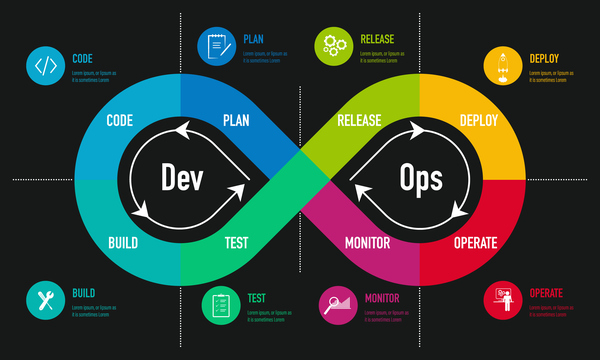
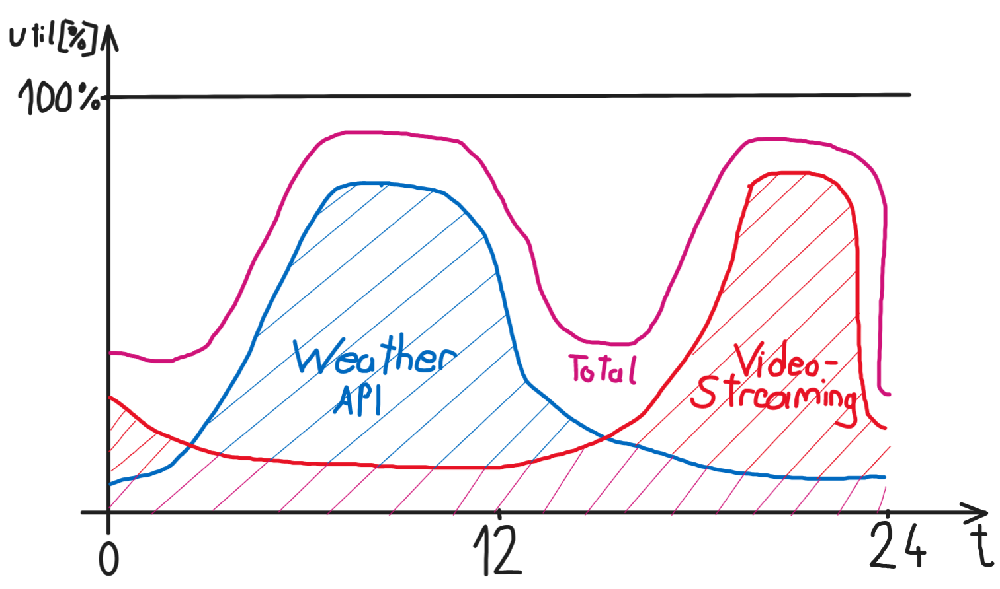
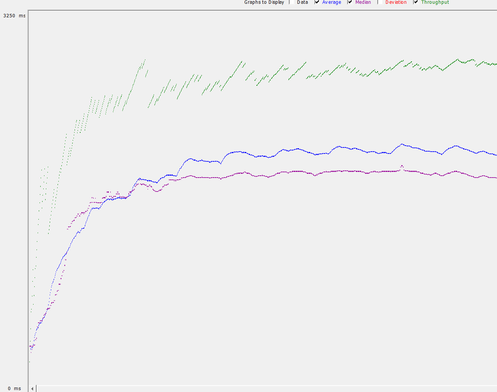
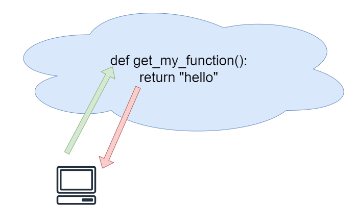
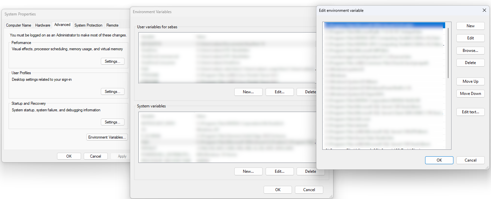

Google's Gemini assisted with the development of this script.
# Learning Objectives
## Knowledge and Understanding
- **Virtualization Techniques:** Students demonstrate a comprehensive understanding of various virtualization techniques, including virtual machines and containers. They can articulate their advantages and disadvantages in different scenarios.
- **Technical Solution Selection:** Students can critically evaluate different virtualization technologies to choose the most suitable solution for a given problem. They can develop persuasive arguments to justify their choice based on technical factors, performance requirements, and cost-effectiveness.
- **Container Creation and Management:** Students possess hands-on skills to create and manage containers using tools like Docker. They can build container images, run containers, and interact with them effectively.
- **Orchestration Tools:** Students are familiar with popular orchestration tools such as Kubernetes and Docker Compose. They can explain their functionalities, compare their strengths and weaknesses, and make informed decisions about their use in specific contexts.
- **Networking and Volumes:** Students have a solid grasp of networking concepts within containerized environments. They understand the role of volumes for persistent data storage and can configure networks and volumes appropriately.
- **Load Balancing:** Students comprehend the purpose of load balancing and can explain its benefits in improving application performance, scalability, and fault tolerance. They can identify scenarios where load balancing is essential and recommend suitable solutions.

## Skills and Abilities
- **Problem-Solving:** Students can apply their knowledge of virtualization and containerization to solve real-world problems and optimize application performance.
- **Technical Argumentation:** Students can effectively communicate technical concepts and justify their choices using sound reasoning and evidence.
- **Hands-On Experience:** Students have practical experience with containerization tools and can demonstrate their ability to create and manage containers.
- **Decision-Making:** Students can make informed decisions about the best virtualization technologies and orchestration tools for specific use cases.

# Introduction
**Virtualization has revolutionized the way we think about computing resources.** By creating virtual environments on physical hardware, we can efficiently allocate and manage resources, leading to improved scalability, flexibility, and cost-effectiveness. **DevOps, on the other hand, is a cultural shift that emphasizes collaboration between development and operations teams to automate and streamline the software delivery process.**

In this course, we will explore the fundamental concepts of virtualization, including **hypervisors, virtual machines, and containers**. By understanding these technologies and practices, you will be equipped to design, implement, and manage virtualized environments and streamline your software development and delivery pipelines.

Throughout the course, we will use practical examples and hands-on exercises to reinforce our learning. You will have the opportunity to experiment with **popular virtualization platforms**, gaining valuable experience that will prepare you for real-world applications.  Until now, we've primarily focused on developing applications on our local machines. While this is essential for prototyping and testing, the ultimate goal is to **deploy these applications to production environments** where they can be accessed by users. In this course, we'll explore the techniques and best practices involved in bringing your applications from development to production.

[](https://www.youtube.com/watch?v=NaR8WlLtPw0)

Check out this video for some inspirational tunes to boost your productivity.
[](https://www.youtube.com/watch?v=HlTBGgQgNL4) 

## Download Docker
Follow the instructions from the link and install Docker Desktop. [Docker Desktop](https://docs.docker.com/desktop/) **Start the Docker Desktop download** now and continue reading this section while you wait for the installation files to download.

After finishing the installation try to run the following command in the terminal to **verify that docker was installed correctly**.

```
docker --version
```

# DevOps
DevOps, a **cultural shift** that emphasizes **collaboration between development and operations teams**, has significantly benefited from the integration of virtualization technologies. Virtualization, by creating virtual environments on physical hardware, offers a flexible and efficient way to manage computing resources. 

This synergy between DevOps and virtualization has led to several advantages:
- **Improved resource allocation and utilization:** Virtualization allows for the dynamic creation and management of virtual machines, enabling organizations to allocate resources more efficiently based on demand. This flexibility is crucial in DevOps environments where rapid changes and scaling are common.
- **Faster application deployment and testing:** By leveraging virtualization, development teams can quickly create and provision virtual environments for testing and development purposes. This accelerates the application development lifecycle and enables more frequent deployments.
- **Enhanced infrastructure management:** Virtualization simplifies infrastructure management tasks by providing a centralized platform for controlling and monitoring virtual machines. This automation and standardization align well with DevOps principles, reducing manual errors and improving efficiency.
- **Improved disaster recovery and business continuity:** Virtualization can be used to create redundant virtual environments, providing a failover mechanism in case of hardware failures or other disruptions. This helps ensure business continuity and minimizes downtime.
- **Increased scalability:** Virtualization allows organizations to easily scale their infrastructure up or down to meet changing demands. This scalability is essential in DevOps environments where applications may experience fluctuations in traffic or usage.
- **Improved resource isolation:** Virtualization ensures that resources are isolated between different virtual machines, preventing one application from impacting the performance of others. This isolation is crucial in DevOps environments where multiple applications may be running concurrently on a single physical server.

Overall, the integration of virtualization and DevOps has **revolutionized the way organizations manage their IT environments**. By combining the flexibility and efficiency of virtualization with the collaborative and agile principles of DevOps, organizations can achieve **faster time-to-market**, **improved application quality**, and greater **operational efficiency**.

## Lifecycle
The DevOps lifecycle typically follows these key stages:

- **Plan:** This initial phase involves defining project goals, setting clear objectives, and outlining the development roadmap. Agile methodologies like Scrum or Kanban are often employed to facilitate planning and collaboration.
- **Code:** This stage focuses on software development, where developers write, review, and commit code to a version control system (e.g., Git).
- **Build:** Once code is committed, the build stage involves automatically compiling the code, assembling the necessary components, and creating deployable artifacts (e.g., containers).
- **Test:** Rigorous testing is crucial at this stage to ensure software quality and identify any defects early on. This includes unit tests, integration tests, and other automated testing procedures.
- **Release:** This stage involves preparing the software for deployment to a production environment, which may include creating release notes, obtaining approvals, and configuring release pipelines.
- **Deploy:** This stage involves the actual deployment of the software to the target environment, often through automated processes using tools like Ansible or Puppet.
- **Operate:** This phase involves managing the deployed software in the production environment, including monitoring performance, troubleshooting issues, and ensuring the application's availability and stability.
- **Monitor:** Continuous monitoring is essential to track application performance, identify potential problems, and gather data for improvement. This involves collecting and analyzing logs, monitoring system metrics, and using tools like Prometheus and Grafana.

This cyclical process emphasizes continuous improvement, with feedback from each stage informing and refining the subsequent ones.

**Key takeaways:**

- **Automation:** DevOps heavily relies on automation throughout the entire lifecycle to improve efficiency, reduce errors, and accelerate delivery.
- **Collaboration:** Effective communication and collaboration between development and operations teams are crucial for successful DevOps implementation.
- **Continuous Improvement:** The DevOps lifecycle is iterative, with continuous feedback loops enabling teams to learn and improve their processes over time.



## The Toolchain
The **DevOps** toolchain is a collection of tools and practices that **automate** and **streamline** the software development and delivery lifecycle. It fosters **collaboration** between **development** and **operations** teams, enabling them to work together seamlessly from planning and coding to testing, **deployment**, and **monitoring**.

Key components of a DevOps toolchain often include **version control systems** (like Git), **continuous integration/continuous delivery (CI/CD) pipelines** (using tools like Jenkins or GitLab CI), **containerization technologies** (like Docker), **infrastructure-as-code tools** (like Terraform), and **monitoring and logging systems** (like Prometheus and Grafana).

By **automating tasks** and improving **communication**, DevOps toolchains help organizations deliver software **faster**, more **reliably**, and with **higher quality**.

## CI/CD
A **continuous integration/delivery (CI/CD) server** typically **automates the process of building, testing, packaging, and deploying code**. When developers **commit new code** to the main branch of the repository, the **CI/CD server triggers a pipeline** that executes these tasks sequentially. The server first builds the code, then runs a comprehensive suite of tests, including unit, integration, and application security tests. Once the tests pass, the server packages the application into a deployable artifact. Finally, the **server deploys the artifact** to the desired environment, such as a development, staging, or production server. This automated workflow **streamlines the development process**, ensuring **consistent quality** and enabling **faster delivery** of the application.

One of the advantages of **containers** is their **resilience to disasters**. This is especially important in **agile methodologies**, which emphasize **iterative development**. Errors are a natural part of the process; we must anticipate them and design our systems to recover quickly:
[](https://www.youtube.com/watch?v=rK_7ozvm53o)

## Key Takeaways
> **DevOps** is a cultural shift that emphasizes collaboration between development and operations teams to streamline the software delivery process.
> 
> - **Key Principles:**
>     - **Automation:** Automating tasks throughout the entire lifecycle is crucial for efficiency, reduced errors, and faster delivery.
>     - **Collaboration:** Effective communication and collaboration between development and operations teams are essential for successful DevOps implementation.
> 	- **Continuous Improvement:** The DevOps lifecycle is iterative, with continuous feedback loops enabling teams to learn and improve their processes over time.
>
>- **Core Components:**
>    - **CI/CD Pipelines:** Automate the build, test, and deployment process, enabling faster and more frequent releases.
>    - **Containerization:** Technologies like Docker provide portability, scalability, and improved resource isolation.
>    - **Infrastructure-as-Code:** Tools like Terraform allow for the management of infrastructure as code, improving consistency and repeatability.
>
> - **Benefits:**
>    - **Faster Time-to-Market:** Streamlined processes and automation lead to quicker software delivery.
 >   - **Improved Application Quality:** Continuous testing and feedback loops help identify and address issues early on.
>    - **Increased Efficiency:** Automation and improved collaboration reduce manual effort and improve overall operational efficiency. 

# Virtualization
Virtualization is a technology that allows **multiple operating systems to run concurrently on a single physical machine**. This provides significant benefits such as **improved resource utilization**, **flexibility**, and **scalability**. There are **two primary approaches** to virtualization: **containers** and **virtual machines**.

## Virtual Machines (VMs)
A virtual machine is a **complete software emulation** of a physical computer. It includes a **virtual CPU**, **memory**, **storage**, and **network** interface. VMs are typically created using a **hypervisor**, which acts as a **layer between the physical hardware and the virtual machines**.

### Key characteristics of VMs
- **Full isolation:** Each VM has its own isolated environment, including its own operating system and applications.
- **Heavyweight:** VMs require more system resources compared to containers due to the emulation of the entire hardware stack.
- **Slower boot time:** VMs can take longer to start up compared to containers due to the need to load the entire guest operating system.

### Hypervisors: Bare-Metal vs. Software
**Hypervisors** are the **software that manage and control virtual machines**. They can be categorized into two main types: bare-metal and software.

#### Bare-Metal Hypervisors
Bare-metal hypervisors are **installed directly on the physical hardware**, bypassing the host operating system. This provides a more direct and efficient interaction with the underlying hardware, leading to **better performance and resource utilization**.

##### Examples of bare-metal hypervisors:
- **VMware ESXi**
- **Microsoft Hyper-V**
- **Red Hat KVM**
 
#### Hosted Hypervisors
Software hypervisors, also known as hosted hypervisors, **run on top of a host operating system**. This approach offers **greater flexibility** but can introduce additional **overhead**, potentially **impacting performance**.

##### Examples of software hypervisors:
- **Oracle VM VirtualBox**
- **Parallels Desktop**
- **QEMU**

#### Key differences between bare-metal and software hypervisors
|Feature|Bare-Metal Hypervisor|Software Hypervisor|
|---|---|---|
|Installation|Directly on physical hardware|On top of a host operating system|
|Performance|Generally better due to direct hardware access|Can be slightly slower due to the additional layer of abstraction|
|Flexibility|Less flexible, as it requires dedicated hardware|More flexible, as it can run on various host operating systems|
|Resource utilization|More efficient due to direct hardware access|May have slightly higher overhead|

In summary, **bare-metal hypervisors offer superior performance and resource utilization**, while **software hypervisors provide greater flexibility**. The choice between the two depends on factors such as performance requirements, hardware constraints, and desired level of flexibility.

## Containers
Containers are a **lighter-weight form of virtualization** that **shares the host operating system's kernel**. They **package applications and their dependencies into a single unit** that can be easily moved and deployed across different environments.

### Key characteristics of containers:
- **Shared kernel:** Containers share the host operating system's kernel, reducing overhead and improving performance.
- **Lightweight:** Containers are much smaller and require fewer resources than VMs.
- **Faster startup:** Containers can start up much more quickly than VMs due to the shared kernel and reduced overhead.
- **Portability:** Containers can be easily moved and deployed across different environments without modification.

**Virtual machines offer complete isolation and flexibility**, but they can be resource-intensive and slow to start up. **Containers are lightweight, fast, and portable**, but they may not provide the same level of isolation as VMs. The choice between VMs and containers depends on the specific requirements of your application, such as performance, isolation, and portability.


Inspired by Doug Jones (2016)

## Containerization
**Containerization** is a technology that **packages applications and their dependencies into a single, portable unit** called a container. This approach offers several benefits, including **improved portability**, **consistency**, **efficiency**, **isolation**, and **scalability**.

### Key Components of Containerization
- **Dockerfile:** A text document that defines the instructions for building a container image.
- **Container image:** A snapshot of the application and its dependencies, created from a Dockerfile.
- **Container:** A running instance of a container image.

### Popular Containerization Platforms
- **Docker:** The most widely used containerization platform.
- **Kubernetes:** A container orchestration platform for managing and scaling containerized applications.

By understanding the basics of containerization, you can leverage this technology to improve the development, deployment, and management of your applications.

## Orchestration
**Orchestration** is the process of automating the deployment, management, and scaling of containerized applications. It involves coordinating multiple containers, ensuring they work together seamlessly and providing a reliable and scalable platform for your applications.

### Key Benefits of Orchestration
- **Automation:** Orchestration tools automate many manual tasks, such as deploying containers, scaling applications, and managing resources.
- **Scalability:** Orchestrators can automatically scale applications up or down based on demand, ensuring optimal resource utilization.
- **High Availability:** Orchestration tools can help ensure that applications remain available even if individual containers fail.
- **Simplified Management:** Orchestrators provide a centralized platform for managing and monitoring containerized applications.
- **Disaster Recovery:** If all fails, orchestration helps to get back online.
- **Efficiency:** Optimal resource utilization is achieved by executing the appropriate tasks on the most suitable machines. 

[](https://www.youtube.com/watch?v=uUZdCNyIOQc)

### Popular Orchestration Tools
- **Kubernetes:** A widely-used open-source platform developed by Google. It offers a rich feature set for managing containerized applications, including service discovery, load balancing, and self-healing.
- **Docker Swarm:** A built-in orchestration tool provided by Docker. It is simpler to use than Kubernetes but offers fewer features.
- **Apache Mesos:** A distributed systems framework that can be used for both container and non-container workloads. It is highly scalable and flexible.

### Core Concepts of Orchestration
- **Clusters:** A group of physical or virtual machines that work together to run containerized applications.
- **Nodes:** Individual machines within a cluster.
- **Services:** A logical group of containers that perform a specific function.
- **Tasks:** Instances of a service that run on individual nodes.
- **Scheduling:** The process of assigning tasks to nodes based on various factors, such as resource availability and workload distribution.
- **Load Balancing:** Distributing traffic across multiple instances of a service to improve performance and reliability.
- **Service Discovery:** Automatically discovering and registering services within a cluster.

### Orchestration Workflow
1. **Application Deployment:** The orchestration tool deploys the application's containers to the cluster.
2. **Service Discovery:** The orchestration tool registers the services with a service discovery mechanism.
3. **Scheduling:** Tasks are scheduled and assigned to nodes based on available resources and workload.
4. **Load Balancing:** Traffic is distributed across multiple instances of a service to improve performance and reliability.
5. **Scaling:** The orchestration tool automatically scales applications up or down based on demand.
6. **Monitoring and Management:** The orchestration tool provides tools for monitoring the health of applications and managing resources.

By using an orchestration tool, you can simplify the management of your containerized applications and ensure that they are reliable, scalable, and highly available.

## Key Takeaways
>**Virtualization** allows running multiple operating systems or applications on a single machine. 
>
>**VMs (Virtual Machines)** emulate entire computers, while **containers** share the host OS kernel, making them more lightweight and efficient. 
>
>**Containerization** packages applications with dependencies, enabling portability and efficient resource use. 
>
>**Orchestration** tools like Kubernetes automate container management, scaling, and deployment. 

# Docker
Docker is an **open-source** platform that provides a **set of tools for building, shipping, and running applications** within containers. It utilizes containerization technology to package applications and their dependencies into lightweight, portable, and isolated units. Docker simplifies the development and deployment process by **ensuring consistent application behavior** across different environments, enabling efficient resource utilization, and facilitating rapid application scaling and deployment.

To work with docker we need to know the basic commands and what they do.

## Docker - Commands
- **docker run \[image]:** Starts a new container from a specified image.
- **docker ps:** Lists all running containers.
- **docker stop \[container_id]:** Stops a running container.
- **docker rm \[container_id]:** Removes a stopped container.
- **docker build  -t \<repositorie\>\/\<name\>:\<version\>:** Build an image from a Dockerfile. 

### Image Management:
- **docker image ls:** Lists all images on your system.
- **docker pull \[image]:** Pulls an image from a registry (like Docker Hub).
- **docker push \[image]:** Pushes an image to a registry.
- **docker build -t \[image_name] .:** Builds a new image from a Dockerfile in the current directory.
- **docker image prune -all:** Removes all unused images.

### Container Inspection and Management
- **docker exec -it \[container_id] \[command]:** Executes a command inside a running container.
- **docker inspect \[container_id]:** Provides detailed information about a container.
- **docker logs\[container_id]:** Shows logs generated by a container.

### Additional Commands
- **docker network ls:** Lists all networks.
- **docker network create \[network_name]:** Creates a new network.
- **docker network connect \[network_name] \[container_id]:** Connects a container to a network.

## Dockerfile-Syntax
A Dockerfile is a text document that **contains instructions for building a Docker image**. Here's a summary of the most commonly used commands:

### Base Image:
- **FROM \[image]:** Specifies the base image to use for the new image.

### Build-time Instructions:
- **COPY \[src] \[dest]:** Copies files from the host to the container.
- **ADD \[src] \[dest]:** Copies files from the host to the container, with automatic extraction for archives.
- **RUN \[command]:** Executes a command in the container.
- **WORKDIR \[path]:** Sets the working directory for subsequent commands.
- **ENV \[key=value]:** Sets environment variables.
- **ARG \[key=value]:** Defines arguments that can be passed when building the image.

### Multi-stage Builds:
- **FROM \[image] as \[stage_name]:** Creates a new build stage with a specified name.
- **COPY --from=\[stage_name] \[src] [dest]:** Copies files from a previous stage to the current stage.

### Exposing Ports
- **EXPOSE \[port]:** Exposes a port for networking.

### Entrypoint and CMD
- **ENTRYPOINT \["command"]:** Sets the default command to run when the container starts.
- **CMD \["command"]:** Sets the default command to run if no other command is specified.

### Volume Mounts
- **VOLUME \[path]:** Creates a volume mount point.

### User and Group
- **USER \[user]:** Sets the user to run commands as.

### Example: A Minecraft Server
Let's build a game server. This is a great way to experience firsthand how Docker can be used to create and manage complex applications.

```
#Choose the base-build.
FROM debian:latest

# Install OpenJDK-8 Inspired by: https://stackoverflow.com/questions/31196567/installing-java-in-docker-image

RUN apt-get update && \
  apt-get install wget -y && \
  wget https://download.oracle.com/java/21/latest/jdk-21_linux-x64_bin.deb && \
  dpkg -i jdk-21_linux-x64_bin.deb && \
  apt-get install -y ant && \
  apt-get clean;

# Set the working directory and copy the .jar file to the container.
WORKDIR /minecraft

ADD https://piston-data.mojang.com/v1/objects/59353fb40c36d304f2035d51e7d6e6baa98dc05c/server.jar ./server.jar

# Run the .jar, this will create a run.sh.
RUN java -jar server.jar --installServer

RUN touch ./run.sh
RUN echo '#!/bin/bash \n java -jar ./server.jar' > ./run.sh
RUN chmod +x ./run.sh

# Executing the run.sh will create some necessary files.
RUN ./run.sh

# Next it is necessary to accept the eula to start the server.
RUN echo 'eula=true' > ./eula.txt

# To connect to the server a port must be made accesible.
EXPOSE 25565

# Start the server.
ENTRYPOINT [ "./run.sh" ]
```

This code snippet essentially creates a **set of instructions for building a Docker image** that can run a Minecraft server. Let's break it down step by step:

1. **Choosing a Base Image:** The first line `FROM debian:latest` tells Docker to use the latest version of the "debian" image as the starting point for our Minecraft server image. This image provides a basic Linux operating system environment for our server to run on.
2. **Installing Java:** The next section (`RUN apt-get update...`) installs the necessary software to run Java applications. It does this by updating the list of available software packages, installing `wget` (a tool for downloading files), downloading the latest OpenJDK-8 installer, installing the downloaded package, installing the `ant` build tool (potentially needed by Minecraft), and finally cleaning up the downloaded files.
3. **Setting Up the Container Environment:** `WORKDIR /minecraft` sets the working directory inside the container to `/minecraft`. `ADD https://piston-data.mojang.com/v1/objects/... server.jar` downloads the Minecraft server jar file from the official Mojang website and places it in the `/minecraft` directory inside the container with the name `server.jar`.
4. **Preparing the Server Startup Script:** The next few lines (`RUN java -jar...`) are a bit more involved. They:
	- Run the Minecraft server jar file with the `--installServer` flag, which likely creates some initial configuration files needed for the server to run.
	- Create an empty file called `run.sh`.
	- Fill the `run.sh` file with a simple script that starts the Minecraft server jar file using the `java -jar` command.
	- Make the `run.sh` file executable, allowing it to be run as a program.
5. **Initializing the Server and Exposing the Port:**
	- `RUN ./run.sh` actually runs the `run.sh` script we just created, which likely initializes the server and creates some additional files needed for it to function.
	- `RUN echo 'eula=true' > ./eula.txt` writes `eula=true` to the file. This is an agreement that needs to be accepted to run the Minecraft server.
	- `EXPOSE 25565` tells Docker that the container will listen on port 25565, which is the default port used by Minecraft servers to communicate with clients.
6. **Starting the Server:** Finally, `ENTRYPOINT ["./run.sh"]` sets the default command to run when the container starts. In this case, it tells the container to run the `./run.sh` script, which in turn starts the Minecraft server.

In summary, this Dockerfile builds an image that can run a Minecraft server by installing Java, downloading the server files, creating a startup script, initializing the server, and finally starting it when the container is run.

#### Building the Image
The `docker build` command is used to **create a new Docker image from a Dockerfile**. In this case, we're using the following command:

```
docker build -t <repositorie>/minecraft_1_21_1:<version> .
```

`-t minecraft_1_21_1` specifies the **tag for the newly created image**. The tag may contain a namespace (similar to a username) followed by a repository name (like a project name) and a tag (like a version).

**Building the Image**
When you **execute this command**, Docker will:
1. **Read the Dockerfile:** It starts by reading the Dockerfile you've created.
2. **Execute Instructions:** Docker then executes the instructions defined in the Dockerfile, step by step. This includes downloading the base image, installing packages, copying files, and running commands.
3. **Create the Image:** Once all the instructions are executed successfully, Docker creates a new image and saves it to your local Docker repository.

**Verifying the Image:**
After the build completes, you can **list all your Docker images** using the following command:

``` Powershell
docker images
```

You should see the newly created image listed with its tag `minecraft_1_21_1`.

Note: If you encounter any errors during the build process, check the Dockerfile for any syntax errors or issues with the instructions. You might also need to adjust the commands or file paths based on your specific environment or requirements

To **create a new container and start it**, you can use the `docker run` command to launch the server.
```
docker run -p 25565:25565 se.stei/minecraft_1_21_1
```

You can **view the running container** by using this command.
```
docker container ls
```

#### Task: Webserver ASP.NET C\#
Now that we've built and run a Docker container from a file for a basic application, let's explore how to **integrate this approach into your development workflow**. We'll create a ASP.NET application that includes functionalities related to prime numbers:

- **Random Prime Number Generation:** An HTTP GET method will return a random prime number.
- **Primality Check:** A separate function will determine if a provided number is prime.
- **Relative Primality Check:** An additional function will check if two integers are relatively prime (share no common factors greater than 1).

To create a new ASP.NET Core Empty project with containerization enabled in Visual Studio, start by selecting the *Empty* template when creating a new project. Then, configure Docker support by choosing *Dockerfile Only* in the dialog. 


This will set up your project with a Dockerfile, allowing you to build and run your application in a containerized environment. Once created, you can write your Prime Number functionalities within the project structure. You can build the initial Docker image using Visual Studio's build options, and then run the application in a container using the `docker run` command.

By implementing these functionalities and utilizing Docker, you can **build, test, and run your ASP.NET Core application efficiently within a containerized environment**. This promotes faster iterations and consistency throughout the development process.

``` Program.cs

var builder = WebApplication.CreateBuilder(args);
var app = builder.Build();

app.MapGet("/", () => {
    //Find a random prime number.
});

app.MapGet("/isPrime/{number}", (int number) => {
    //Check if is prime.
});

app.MapGet("/isRelativePrime/{a}/{b}", (int a, int b) => {
    //Check if a and b have any common dividers.
});

app.Run();
```

Now that this is working, let's take a look at the **docker file that was created**.

```
# See https://aka.ms/customizecontainer to learn how to customize your debug container and how Visual Studio uses this Dockerfile to build your images for faster debugging.

# This stage is used when running from VS in fast mode (Default for Debug configuration)
FROM mcr.microsoft.com/dotnet/aspnet:8.0 AS base
USER app
WORKDIR /app
EXPOSE 8080
EXPOSE 8081


# This stage is used to build the service project
FROM mcr.microsoft.com/dotnet/sdk:8.0 AS build
ARG BUILD_CONFIGURATION=Release
WORKDIR /src
COPY ["TestWebServerContainer/TestWebServerContainer.csproj", "TestWebServerContainer/"]
RUN dotnet restore "./TestWebServerContainer/TestWebServerContainer.csproj"
COPY . .
WORKDIR "/src/TestWebServerContainer"
RUN dotnet build "./TestWebServerContainer.csproj" -c $BUILD_CONFIGURATION -o /app/build

# This stage is used to publish the service project to be copied to the final stage
FROM build AS publish
ARG BUILD_CONFIGURATION=Release
RUN dotnet publish "./TestWebServerContainer.csproj" -c $BUILD_CONFIGURATION -o /app/publish /p:UseAppHost=false

# This stage is used in production or when running from VS in regular mode (Default when not using the Debug configuration)
FROM base AS final
WORKDIR /app
COPY --from=publish /app/publish .
ENTRYPOINT ["dotnet", "TestWebServerContainer.dll"]
```

This script defines a multi-stage Dockerfile for building and running an ASP.NET Core Web API application. Here's a breakdown of each stage:

##### 1. Base Stage (Debug Mode)
- **`FROM mcr.microsoft.com/dotnet/aspnet:8.0 AS base`:** Uses the official Microsoft ASP.NET Core base image with version 8.0 as the foundation for the application. This image contains the necessary runtime libraries for .NET Core applications.
- **`USER app`:** Sets the user within the container to "app." This user account is typically used to run the application process.
- **`WORKDIR /app`:** Sets the working directory within the container to `/app`. This is where application files will be copied and executed.
- **`EXPOSE 8080`:** Exposes port 8080 within the container, allowing external communication on this port. This might be needed for debugging purposes.
- **`EXPOSE 8081`:** Similarly, exposes port 8081, potentially for additional functionality or another service.

*Note:* This stage is primarily used when running the application within Visual Studio in "fast mode" (the default for Debug configuration). It provides a pre-built base image for quick debugging.

##### 2. Build Stage
- **`FROM mcr.microsoft.com/dotnet/sdk:8.0 AS build`:** Uses the official Microsoft .NET Core SDK image with version 8.0 to build the application.
- **`ARG BUILD_CONFIGURATION=Release`:** Defines an argument named `BUILD_CONFIGURATION` with a default value of "Release." This can be overridden when building the image depending on your needs (e.g., "Debug").
- **`WORKDIR /src`:** Sets the working directory within this stage to `/src`.
- **`COPY`**: Copies the project file ("TestWebServerContainer.csproj") and its folder from your local machine to the `/src` directory within the container.
- **`RUN dotnet restore`:** Executes the `dotnet restore` command to download project dependencies.
- **`COPY`**: Copies all files from the current directory (where the Dockerfile resides) to the `/src` directory.
- **`WORKDIR /src/TestWebServerContainer`:** Changes the working directory to the specific project folder within the container.
- **`RUN dotnet build`:** Executes the `dotnet build` command to build the project using the specified build configuration (`$BUILD_CONFIGURATION`). The output is placed in the `/app/build` directory.

##### 3. Publish Stage
- **`FROM build AS publish`:** Creates a new stage based on the build stage.
- **`ARG BUILD_CONFIGURATION=Release`:** Similar to the previous stage, defines an argument for build configuration.
- **`RUN dotnet publish`:** Executes the `dotnet publish` command to publish the built application to the `/app/publish` directory within the container. The `-p:UseAppHost=false` parameter ensures a self-contained deployment without relying on a separate web server process.

##### 4. Final Stage (Production or Regular Mode)
-  **`FROM base AS final`:** Creates a final stage based on the base stage (the pre-configured .NET Core environment).
- `WORKDIR /app`: Sets the working directory within this stage to `/app`.
-  **`COPY --from=publish /app/publish .`:** Copies the published application files from the publish stage to the final stage's `/app` directory. This effectively combines the base image with your built and published application.
-  **`ENTRYPOINT ["dotnet", "TestWebServerContainer.dll"]`:** Defines the entry point for the container. This instructs the container to run the "dotnet" command with the argument "TestWebServerContainer.dll" when the container starts. This launches your ASP.NET Core Web API application.

#### Summary
This Dockerfile defines a **multi-stage build process** for an ASP.NET Core Web API application. It optimizes the image size by **separating build steps** and utilizes pre-built base images. The script also demonstrates the use of arguments to control the build configuration.

### Volumes & Bind Mounts
"Volumes are the preferred mechanism for persisting data generated by and used by Docker containers." (Docker, 2024a)

**Docker Volumes** and **Bind Mounts** are two mechanisms used to persist data within Docker containers. They provide different ways to share data between the container and the host system, or between multiple containers.

#### Docker Volumes
- **Purpose:** Volumes are specifically designed to persist data independently of the container's lifecycle. They exist as separate entities on the host filesystem and can be managed and shared across multiple containers.
- **Creation:** Volumes are created using the `docker volume create` command. For example:
```
docker volume create my-data-volume
```
- **Mounting:** Volumes are mounted to containers using the `-v` or `--volume` flag when running a container. For example, this mounts the "my-data-volume" to the `/app/data` directory within the container:
```
docker run -v my-data-volume:/app/data my-image
```
- **Persistence:** Data stored in volumes persists even after the container is stopped or deleted.

#### Bind Mounts
- **Purpose:** Bind mounts directly map a directory on the host system to a directory within the container. Changes made to the host directory are immediately reflected in the container, and vice versa.
- **Mounting:** Bind mounts are also specified using the `-v` or `--volume` flag. For example, this mounts the `/host/path` directory on the host system to the `/container/path` directory within the container:
```
docker run -v /host/path:/container/path my-image
```
- **Persistence:** Data changes made within the container's bind mount directory are directly reflected on the host system and persisted.

#### Bind Mounts VS Volumes
|Feature|Docker Volumes|Bind Mounts|
|---|---|---|
|Persistence|Independent of container|Directly linked to host|
|Management|Managed by Docker|Managed by host system|
|Sharing|Can be shared across multiple containers|Limited to one container at a time|
|Performance|Generally better performance|Can be slower due to direct file system access|

##### Choosing Between Volumes and Bind Mounts:
- **Use volumes** when you want to:
    - Persist data independently of the container's lifecycle.
    - Share data between multiple containers.
    - Manage data using Docker commands.
- **Use bind mounts** when you need:
    - Direct access to host system files.
    - To quickly debug or test changes to files.
    - To share large datasets that don't need to be managed separately.

By understanding the differences between volumes and bind mounts, you can choose the appropriate method for your specific use case and ensure proper data management within your Docker environment. 

For more information visit the [docker documentation](https://docs.docker.com/engine/storage/volumes/)  website.

#### Integrating NAS with Docker
You can integrate NAS with Docker to provide persistent storage for your containerized applications. Here's a general approach:

 **1. Configure NAS:**
    - Set up your NAS device according to the manufacturer's instructions.
    - Ensure it is accessible on your network.
    - Create a share or folder on the NAS that will be used by Docker.
**2. Mount the NAS Share in Docker:**
    - Use the `-v` or `--volume` flag when running a Docker container to mount the NAS share to a directory within the container.
    - For example:
        ```
        docker run -v nas_share:/app/data -p 80:80 my-image
        ```        
        This mounts the NAS share named "nas_share" to the `/app/data` directory within the container.

##### Benefits of Using NAS with Docker:
- **Centralized Storage:** NAS provides a central location for storing data, making it easier to manage and access.
- **Scalability:** NAS devices can be scaled to accommodate growing storage needs.
- **Performance:** NAS devices are often optimized for storage performance.
- **Data Persistence:** Data stored on NAS persists even if the container is stopped or deleted.

###### Additional Considerations
- **NAS Protocol:** Ensure your NAS device supports a protocol compatible with Docker (e.g., NFS, CIFS).
- **Permissions:** Set appropriate permissions on the NAS share to allow Docker containers to access and modify files.
- **Network Connectivity:** Verify that your Docker host has network connectivity to the NAS device.

#### Task: Use Volumes to make the Minecraft-World persistent. 
Modify the existing Minecraft server to enable persistent world storage using any of the mentioned techniques. Develop a comprehensive argument for the employment the chosen technique. This may involve making changes to the Dockerfile, container configuration, or other relevant components to ensure the Minecraft world data is saved independently of the container's lifecycle.

## Key Takeaways
> **Docker simplifies application development and deployment using containers**, which package applications with dependencies for **portability** and **isolation**.
> 
>  **Dockerfile:** Defines how to build a container image using instructions like `FROM`, `COPY`, `RUN`, `WORKDIR`, and `EXPOSE`.
>  
>  **Key Commands:**
>    - `docker run <image>:` Starts a new container from an image.
>     - `docker build -t <image_name> .:` Builds an image from a Dockerfile in the current directory.
>     - 
>  **Volumes** persist data independently of the container.
>  
>  **Benefits:** Consistent environments, improved efficiency, faster deployment, enabling microservices architectures.

# Docker-Compose
**Docker Compose** is a tool that allows you to **define and run multi-container Docker applications**. It simplifies the process of managing and scaling your applications by defining all the services and their dependencies in a single YAML file.  

## Key Features of Docker Compose
- **Service Definition:** Defines the services that make up your application, including the image to use, ports to expose, environment variables, and dependencies.
- **Networking:** Creates a private network for your application, allowing containers to communicate with each other.
- **Volumes:** Manages volumes for persistent data storage.
- **Secrets:** Stores sensitive information securely and makes it available to your containers.

## Using Docker Compose

1. **Create a Docker Compose file:** Create a YAML file named `docker-compose.yml` with the desired configuration.
2. **Run Docker Compose:** Use the `docker-compose up` command to start the defined services. For example:
```
docker-compose up -d
```
This will start the services in detached mode, allowing you to run other commands in the terminal.

### Benefits of Using Docker Compose
- **Simplified Configuration:** Defines your entire application in a single file.
- **Dependency Management:** Automatically manages dependencies between services.
- **Environment Isolation:** Creates a separate environment for your application.
- **Easier Deployment:** Can be used to deploy your application to different environments.

### Integration with Orchestration Tools
Docker Compose can be used in conjunction with larger orchestration tools like Kubernetes or Docker Swarm. These tools can provide additional features like service discovery, load balancing, and automatic scaling.

By using Docker Compose, you can simplify the management of your multi-container applications and make it easier to deploy and scale them across different environments.

## Commands
- **docker-compose up:** Starts all services defined in the Docker Compose file.
- **docker-compose down:** Stops and removes all containers and networks created by Docker Compose.
- **docker-compose build:** Builds the images defined in the Docker Compose file.
- **docker-compose run:** Runs a one-off command within a service container.
- **docker-compose exec:** Executes a command within a running container.
- **docker-compose ps:** Lists the running containers and their status.

## Docker-Compose Syntax
A Docker Compose YAML file defines the services, networks, volumes, and other components that make up your multi-container application. Here's a breakdown of the key structures and commands used in Docker Compose:

### Top-Level Structure
- **version:** Specifies the version of the Docker Compose specification used.
- **services:** Defines the individual services that make up your application.

### Service Definition
- **image:** Specifies the Docker image to use for the service.
- **build:** Specifies a context and Dockerfile to build the image locally.
- **ports:** Defines port mappings between the container and the host.
- **volumes:** Mounts volumes to the container.
- **environment:** Sets environment variables within the container.
- **depends_on:** Specifies dependencies between services.
- **networks:** Specifies the network(s) the service should be connected to.
- **restart:** Configures the restart policy for the service.
- **command:** Overrides the default command specified in the image.

### Networks
- **networks:** Defines custom networks for your application.
- **name:** Specifies the name of the network.
- **driver:** Specifies the driver to use for the network (e.g., `bridge`, `overlay`, `host`).

### Volumes
- **volumes:** Defines volumes to be used by your services.
- **name:** Specifies the name of the volume.
- **driver:** Specifies the driver to use for the volume (e.g., `local`, `nfs`).

### Network
Docker Compose allows you to define multiple networks within a single project. These networks provide a way to isolate containers and control communication between them.

#### Types of Networks (docker, 2024b)
- **bridge:** The default network driver. It creates a virtual network interface for containers connected to it. This network is suitable for most use cases.
- **host:** Containers connected to the host network share the host's network namespace. This can be useful for debugging or performance optimization, but it can also pose security risks.
- **none:** Containers connected to the none network have no network interface.
- **overlay:** A network driver designed for multi-host networking. It allows containers on different hosts to communicate with each other.
- **macvlan:** A network driver that assigns a real MAC address to containers, allowing them to join existing physical networks.

#### Benefits of Using Networks:
- **Isolation:** Networks provide isolation between containers, preventing them from interfering with each other.
- **Communication:** Containers connected to the same network can communicate with each other using their IP addresses.
- **External Access:** Containers connected to the `frontend` network can be accessed from the host system or the internet.
- **Internal Communication:** Containers connected to the `backend` network can only communicate with other containers on the same network.

## A Website with a Database

``` yaml
version: '3.7'

services:
  web:
    image: my-web-app:latest
    ports:
      - "8080:80"
    depends_on:
      - database
    networks:
      - frontend
      - backend

  database:
    image: postgres:latest
    environment:
      POSTGRES_USER: myuser
      POSTGRES_PASSWORD: mypassword
      POSTGRES_DB: mydatabase
    networks:
      - backend
      
networks:
  frontend:
    driver: bridge
  backend:
    driver: bridge
```

**Version:**  `version: '3.7'` specifies the version of the Docker Compose specification used. This version indicates that the script supports features introduced in Docker Compose 3.7.

**Services:** `services:` defines the individual services that make up the application.

#### Web Service
- **`web:`:** defines a service named "web."
- **`image: my-web-app:latest`:** Specifies the Docker image to use for this service. In this case, it's using the latest version of an image named "my-web-app."
- **`ports`:** defines the port mapping between the container and the host:
- **`"8080:80"`:** maps port 8080 on the host to port 80 within the container. This allows you to access the web application on port 8080 of your host machine.
- **`depends_on`:** specifies that the "web" service depends on the "database" service. This means that the "database" service must be started before the "web" service.

#### Database Service
- **`database`:** defines a service named "database."
- **`image: postgres:latest`:** Specifies the Docker image to use for the database. Here, it's using the latest version of the official PostgreSQL image.
- **`environment`:** defines environment variables that will be set within the database container:
- **`POSTGRES_USER: myuser`:** Sets the PostgreSQL user to "myuser."
- **`POSTGRES_PASSWORD: mypassword`:** Sets the PostgreSQL password to "mypassword."
- **`POSTGRES_DB: mydatabase`:** Sets the PostgreSQL database name to "mydatabase."

This Docker Compose script describes a **multi-container application** consisting of a **web application** and a **PostgreSQL database**. The "web" service depends on the "database" service, ensuring that the database is started before the web application. The environment variables for the database service provide the necessary credentials and database name for the PostgreSQL instance.

The `web` and `db` services are **connected to different networks**: `frontend` and `backend`. This allows the `web` service to access the database service on the `backend` network without exposing it to the internet.

## Key Takeaways
> **Docker Compose** simplifies managing multi-container Docker applications by defining services and their dependencies in a single **YAML file**.
>
>**Key Features:**
>    - **Service Definition:** Defines services, images, ports, volumes, and dependencies.
>    - **Networking:** Creates isolated networks for communication between containers.
>    - **Easy Deployment:** Starts and stops all services with a single command (`docker-compose up/down`).
>   
>**Benefits:**    
>    - **Simplified Configuration:** Centralizes application configuration.
>    - **Improved Workflow:** Streamlines development, testing, and deployment.

# Apache J Meter
**Apache JMeter** is a popular **open-source performance testing tool** designed to evaluate the performance of **web applications**, **APIs**, and other services. It **simulates a heavy load** on a server or group of servers to **measure its response time, throughput, and other performance metrics**.

## Key Features of JMeter
- **Functional Testing:** Can be used for functional testing in addition to performance testing.
- **Protocol Support:** Supports various protocols like HTTP, HTTPS, FTP, JDBC, SOAP, and JMS.
- **Distributed Testing:** Allows for distributed testing across multiple machines to simulate heavy loads.
- **Plugins:** Offers a rich ecosystem of plugins for extended functionality.
- **Reporting:** Generates detailed reports in various formats (HTML, CSV, XML).

## Common Use Cases
- **Load Testing:** Simulating heavy traffic to assess a system's performance under stress.
- **Stress Testing:** Pushing a system to its limits to identify bottlenecks.
- **Endurance Testing:** Evaluating a system's performance over a prolonged period.
- **Spike Testing:** Simulating sudden bursts of traffic to assess a system's responsiveness.

By using JMeter, you can identify performance issues, optimize your applications, and ensure that they can handle expected loads.

## Test Performance
1. **Download JMeter:** Head over to the official Apache JMeter website [https://jmeter.apache.org/download_jmeter.cgi](https://jmeter.apache.org/download_jmeter.cgi) and download the latest version.
2. **Launch JMeter:** Once downloaded, navigate to the `bin` folder of the extracted JMeter archive (e.g., `...\Downloads\apache-jmeter-5.6.3\bin`). Double-click the `jmeter.bat` file to launch the program.
3. **Create a Simple Test:**
    - Go to the "File" menu and select "Templates" followed by "Simple HTTP Request."
    - Click "Create" twice to add the template.
4. **Clean Up:**
    - Right-click on the newly added elements, "User Defined Variables" and "HTTP Header Manager," and choose "Remove" to remove them (these are not needed for this basic test).
5. **Configure the Test:**
    - Within the thread group settings, adjust the "Number of Threads" and "Number of Loops" to define how many simulated users and repetitions you want for the test (e.g., 100 threads and 10 loops will simulate 10,000 requests).
6. **Add Results Visualization:**
    - Right-click on the "Thread Group" again and select "Add" -> "Listener" -> "Graph Results." This will display a visual representation of the test results.
7. **Define the Request:**
    - Set the following parameters:
        - Protocol: `http` (or `https` if using a secure connection)
        - Server Name or IP: `localhost` (if testing on the same machine) or the actual IP address
        - Port Number: `8888` (or the port where your service is listening)
        - HTTP Method: `GET`
        - Path: `/` (or the specific path of the resource you want to test)
8. **Run the Test:**
    - Click the green "play" button on the toolbar to begin the test.
9. **Analyze Results:**
    - Observe the generated graph to analyze the performance metrics of your web service. You can also access detailed results in other available listeners like "View Results Tree" for a more comprehensive understanding. Consider capturing a screenshot or exporting the graph for documentation purposes.

## Key Takeaways
> **Apache JMeter** is an open-source performance testing tool used to **simulate heavy loads** on servers and **measure performance metrics** like response time and throughput.
>
>**Key Features:** Supports various protocols, distributed testing, and generates detailed reports.
>
>**Use Cases:** Load testing, stress testing, endurance testing, spike testing.
>
>**Basic Workflow:**
 >   1. Define test plan (number of users, requests).
>    2. Configure HTTP request (server, port, method, path).
>    3. Run the test.
>    4. Analyze results (graphs, logs).

# Setup a docker compose orchestration
Create a **highly available and scalable** ASP.NET **web application** using Docker Compose and **Nginx as a load balancer**. By leveraging Docker's containerization technology and Nginx's load-balancing capabilities, you'll build an application that can handle increased traffic and ensure high availability.

Set up a cluster of three nodes: one managing node and two working nodes. Conduct **performance testing** on the web server using Apache JMeter. Then, **expand the cluster by adding three more working nodes**, bringing the total to five. Repeat the performance testing using Apache JMeter. Document your findings and compare the performance metrics before and after scaling the cluster.

## ASP.NET load-balanced Webserver
Below is a solution for the task using only two nodes. Please expand the solution to include five nodes: one managing node and four working nodes. Then, conduct performance testing using Apache JMeter and document your findings.

 * Change the datatype of the ASP.NET applications functions to long, instead of int. 
* Change your random number generator to `long random = Math.Abs(Random.Shared.NextInt64((1L << 52)));`
* Rebuild the ASP.NET application using the `Release` configuration.
* Create a new folder containing two files, `docker-compose.yaml` and `ngnix.conf`.

``` nginx
upstream web_servers {
    server web1:8080;
    server web2:8080;
}

server {
    listen 80;

    location / {
        proxy_pass http://web_servers;
    }
}
```

``` yaml
version: '3.8'

services:
  nginx:
    image: nginx:alpine
    ports:
      - "8888:80"
    volumes:
      - <PATH>/ngnix.conf:/etc/nginx/conf.d/default.conf
    depends_on:
      - web1
      - web2
    networks:
      - frontend
      - backend

  web1:
    image: containertest001
    networks:
      - backend
    deploy:
      resources:
        limits:
          cpus: '1.0'
          memory: 100M

  web2:
    image: containertest001
    networks:
      - backend
    deploy:
      resources:
        limits:
          cpus: '1.0'
          memory: 100M

networks:
  frontend:
    driver: bridge
  backend:
    driver: bridge
```

#### Nginx Configuration (nginx.conf)
- **Upstream Block:**
    - Defines a group of servers, `web1` and `web2`, that Nginx can load balance between.
    - The `server` directive specifies the IP address or hostname of each server and the port it listens on.
    - The `weight` directive assigns equal weights (1) to both servers, indicating that requests should be distributed evenly.
- **Server Block:**
    - Configures Nginx to listen on port 80.
    - The `location /` block matches all incoming requests.
    - The `proxy_pass` directive forwards requests to the `web_servers` upstream group, enabling Nginx to act as a reverse proxy and distribute traffic across the two web servers.

#### Docker Compose File (docker-compose.yaml)
- **Version:** Specifies the Docker Compose version.
- **Services:**
    - **nginx:**
        - Uses the `nginx:alpine` image.
        - Exposes port 8888 on the host machine to port 80 within the container.
        - Mounts the `nginx.conf` file from the host to the container's `/etc/nginx/conf.d/default.conf` location.
        - Depends on the `web1` and `web2` services to ensure they start first.
        - Enables interactive mode (`tty: true`) for better debugging.
        - Connects to the `frontend` and `backend` networks.
    - **web1 and web2:**
        - Use the `containertest001` image (replace with your actual image).
        - Expose port 8080 within the container.
        - Connect to the `backend` network.
- **Networks:**
    - **frontend:** A bridge network for external access to the Nginx service.
    - **backend:** A bridge network for internal communication between Nginx and the web servers.

#### Overall Functionality:
1. **Docker Compose starts the containers:** The `docker-compose up` command launches the `nginx`, `web1`, and `web2` services.
2. **Nginx listens on port 8888:** Nginx starts listening on port 8888 on the host machine.
3. **Requests are forwarded to web servers:** When a request is received on port 8888, Nginx uses the `proxy_pass` directive to forward it to the `web_servers` upstream group.
4. **Load balancing:** Nginx distributes incoming requests between `web1` and `web2` based on their weights.
5. **Web servers handle requests:** The `web1` and `web2` containers handle the forwarded requests and process them according to their application logic.

#### Key Points
- **Nginx:** acts as a reverse proxy, load balancing traffic between multiple web servers.
- **Docker Compose:** simplifies the management of multiple containers and their dependencies.
- **The `frontend` and `backend` networks:** provide isolation and control over communication between containers.
- **The `tty: true` option:** allows for interactive access to the Nginx container for debugging.

This configuration provides a basic setup for **load balancing between two web servers using Nginx and Docker Compose**. You can customize it further by adding more web servers, changing the load balancing algorithm, or implementing additional features like SSL/TLS or caching.

* Use `docker compose up` within the correct folder to start the containers.
* Evaluate the performance of the web-application using [Apache JMeter](https://jmeter.apache.org/download_jmeter.cgi) 

* Use the following code, execute the same tests with 5 instances and document the results.
``` yaml
deploy:
    mode: replicated
    replicas: 5
```

## From Theory to Practice
To build on you gained theoretical knowledge choose out of the ten tasks and document your solution. Provide arguments for the choice of technology and why you implemented certain things the way you did.

#### 1. Create a Docker image for a simple web server.
The web server should serve a static HTML page with the text "Hello, World!", the file is copied from the host at build.

#### 2. Create a Docker Compose file for a simple web application
The Nginx web server should serve static HTML, JavaScript, and CSS files from a specified mounted directory.

#### 3. Create a Docker image for a Python application.
 The application should consist of a web server (e.g., Nginx) and a Python application. The web server should serve static files from a specified directory and 
 The Python application should handle dynamic requests and return a response.

``` python
 from flask import Flask, jsonify 
 
 app = Flask(__name__) 
 
 @app.route('/products', methods=['GET']) 
 def get_products(): 
	 products = [ {'id': 1, 'name': 'Product  A', 'price': 10.0}, 
	 {'id': 2, 'name': 'Product B', 'price': 20.0}, 
	 {'id': 3, 'name': 'Product C', 'price': 30.0} ] 
	return jsonify(products)

if __name__ == '__main__': 
	app.run(host='0.0.0.0', port=8081)
```

#### 4. Create a Docker Compose file for a database and application
The application should depend on a database (e.g., MySQL, PostgreSQL). The Docker Compose file should define both the database and application containers. The database should be initialized with sample data.

``` python
from flask import Flask, jsonify 
from pymongo import MongoClient 
app = Flask(__name__) 
client = MongoClient('mongodb://localhost:27017') 
db = client['mydatabase']  
products_collection = db['products'] 
@app.route('/products', methods=['GET']) 

def get_products(): 
	products = products_collection.find() 
	product_data = [ {'id': product['_id'], 'name': product['name'], 'price': product['price']} for product in products ] 
	return jsonify(product_data) if __name__ == '__main__': 
	
app.run(host='0.0.0.0', port=8081)
```

#### 5. Create a Docker Compose file for a load-balanced web application
The application should have multiple web server instances. A load balancer should distribute traffic among the web servers. The Docker Compose file should define the load balancer and web server containers.

#### 6. Create a Docker file for a multi-stage build
The application should have multiple build stages for optimization. Write one for an application of your choice.

#### 7. Docker Compose with a Custom Network
Create a Docker Compose file that defines a custom network. Connect multiple containers to the custom network, make sure backend services can not be reached from the host network. Ensure that the containers can communicate with each other using the network.

#### 8. Docker Compose with a Volume
Create a Docker Compose file that mounts a volume to a container. Use the volume to persist data across container restarts. You can use the Minecraft-Server. Provide arguments on why and how you chose to persist data.

#### 9. Intermediate: Docker Compose with Secrets Management
Create a Docker Compose file that uses [Secrets](https://docs.docker.com/engine/swarm/secrets/) management to store a SSL/TLS certificate. Use the certificate to enable Https on a webserver you built.

#### 10. Advanced: Docker Compose with a Monitoring Tool
Integrate Docker Compose with a monitoring tool (e.g., Prometheus, Grafana), to monitor the performance and health of your containers and services.
``` yaml
services: 
	prometheus: 
		image: prom/prometheus command: 
			-config.file=/etc/prometheus/prometheus.yml 
		volumes: - ./prometheus.yml:/etc/prometheus/prometheus.yml  
		ports: - "9090:9090" 
	grafana: 
		image: grafana/grafana 
		ports: - "3000:3000" 
		volumes: 
			- ./grafana.ini:/etc/grafana/provisioning/datasources/datasource.yaml  
			- ./dashboards:/var/lib/grafana/dashboards depends_on: - prometheus
```

``` yml
scrape_interval: 15s 
evaluation_interval: 15s 
scrape_configs: 
- job_name: 'node-exporter' 
  static_configs: 
	  - targets: ['localhost:9100']  
- job_name: 'app' 
  static_configs: 
	  - targets: ['app:8080']
```

``` yaml
apiVersion: 1 
datasources: 
	- name: Prometheus 
	  type: prometheus 
	  url: http://prometheus:9090 
	  access: pro
```

# Monolithic, Microservices & Serverless
## Monolithic Architecture
**Monolithic architecture** is a traditional approach to building software applications, where the entire application is developed as a single, unified **codebase**. In this architecture, all components such as the user interface, business logic, and data access layers are **tightly coupled** and **run as a single process**.  This approach can **simplify development**, particularly for **smaller applications**, because all functionality is contained in one place, making it easier to test, deploy, and manage at the start. 

However, as the application grows in complexity, monolithic architectures can become **difficult to scale and maintain**. Changes to one part of the system often require **redeploying the entire application**, which can lead to downtime and slow development cycles. Additionally, monolithic systems can suffer from **scalability issues**, as the entire system must scale, even if only one part of the application experiences increased demand. Monolithic applications have a more **tightly coupled** and **indivisible** nature.


## Microservices Architecture
**Microservices architecture** addresses the limitations of monolithic systems by breaking down applications into smaller, **independent services**, each **responsible for a specific piece of functionality**. These services communicate with each other using **lightweight protocols** such as HTTP or messaging queues. One of the main advantages of microservices is that each service can be **developed**, **deployed**, and **scaled independently**, allowing for greater flexibility and agility in development. Teams can **work on different services concurrently**, using different technologies, and release updates without affecting the entire application. This architecture also makes it easier to **scale specific services** that experience high demand without scaling the whole system. 

However, microservices **introduce complexity** in managing **distributed systems**, requiring robust **monitoring**, **orchestration**, and **communication** between services. Challenges such as **network latency**, **data consistency**, and **service discovery** need to be addressed in a microservices architecture.


## Serverless Architecture
**Serverless architecture** is a **cloud-based computing model** where the cloud provider automatically manages the infrastructure, allowing developers to focus solely on writing **code**. In a serverless system, developers create **functions** that are executed in response to **events**, such as HTTP requests or database updates. These functions are **stateless**, and the cloud provider **dynamically allocates resources as needed** to handle requests. Serverless architectures offer the benefit of **automatic scaling**, where resources are only consumed when needed, making it **cost-effective for applications with variable workloads**. Additionally, developers don’t need to worry about managing servers, patching, or infrastructure provisioning, which can significantly **reduce operational overhead**. 

However, serverless can ***introduce challenges** related to **cold starts** (initial latency when functions are triggered), **vendor lock-in**, and limitations in control over the underlying infrastructure. Despite these challenges, serverless architecture is **ideal for building highly scalable, event-driven applications**.


## Key Takeaways
> **Monolithic:** Simple for small projects, but difficult to scale and maintain as they grow.
> 
> **Microservices:** Flexible and scalable, but introduce complexity in managing distributed systems.
> 
> **Serverless:** Focus on code, automatic scaling, and reduced overhead, but has limitations like cold starts and vendor lock-in.

# Kubernetes
**Kubernetes** is a powerful **open-source** platform designed to **automate the deployment**, **scaling**, and **operation** of containerized applications. It provides a way to **manage clusters of computers**, often called nodes, as a single system. This allows developers to focus on writing applications rather than worrying about the underlying infrastructure.

## Key benefits of Kubernetes
- **Portability:** Applications can be easily moved across different environments, from development to production.
- **Scalability:** Kubernetes can automatically scale applications up or down based on demand.
- **Reliability:** It ensures high availability and fault tolerance for your applications.
- **Efficiency:** Kubernetes optimizes resource utilization, making the most of available hardware.
- **Ease of management:** It simplifies tasks like deployment, updates, and monitoring.

## Core components of Kubernetes
- **Pods:** The smallest unit of deployment in Kubernetes. A pod typically contains one or more containers that share the same network namespace.
- **Services:** Abstract network layer for pods, providing a stable way to access pods.
- **Replication Controllers:** Ensure that a specific number of pods are running at any given time.
- **Deployments:** Manage the deployment and scaling of applications.
- **Namespaces:** Isolate different applications or teams within a Kubernetes cluster.


(Wikimedia Commons, 2024)

By understanding these concepts, you can effectively leverage Kubernetes to build and manage modern, scalable applications.
[](https://www.youtube.com/watch?v=0w6kXdHXxAA)

## Deployments
**Deployments** are a core resource in Kubernetes that **manage replicated applications**. They provide a declarative way to **define the desired state of an application**, and Kubernetes automatically ensures that the actual state matches the desired state.

### Key Features of Deployments
- **Declarative Specification:** You define the desired state of your application using a YAML or JSON configuration file.
- **Automatic Scaling:** Kubernetes can automatically scale your application up or down based on demand.
- **Rolling Updates:** Deployments can be updated gradually, ensuring minimal downtime.
- **Canary Deployments:** A subset of pods can be updated first to test changes before rolling them out to the entire application.
- **Blue-Green Deployments:** Two identical environments can be created, with one serving traffic while the other is updated. Once the update is complete, traffic can be switched to the updated environment.

#### Basic Deployment Configuration
``` yaml
apiVersion: apps/v1
kind: Deployment
metadata:
  name: my-deployment
spec:
  replicas: 3
  selector:
    matchLabels:
      app: my-app
  template:
    metadata:
      labels:
        app: my-app
    spec:
      containers:
      - name: my-app   
        image: my-image:latest
        ports:
        - containerPort: 8080   
```

#### Explanation
- **apiVersion:** Specifies the API version of the Deployment resource.
- **kind:** The type of resource, which is a Deployment in this case.
- **metadata:** Contains metadata about the Deployment, such as its name.
- **spec:** Defines the desired state of the Deployment.
- **replicas:** The desired number of replicas (pods) for the Deployment.
- **selector:** A label selector used to match pods to the Deployment.
- **template:** Defines the template for the pods that will be created.
- **containers:** A list of containers to be included in the pods.
- **name:** The name of the container.
- **image:** The Docker image to use for the container.
- **ports:** A list of ports that the container exposes.

## Kubernetes Services
**Kubernetes Services** provide a stable **network layer for a set of Pods**. They abstract the details of how Pods are distributed across the cluster, making it easier to access and manage your applications.

### Key Features of Kubernetes Services
- **Abstract Network Layer:** Services hide the complexity of Pod IP addresses and network topology.
- **Load Balancing:** Services distribute traffic across Pods within the Service, ensuring that traffic is evenly distributed.
- **Service Discovery:** Services provide a stable DNS name or IP address for a set of Pods, making it easy for other services to discover and communicate with them.
- **Service Types:** Kubernetes supports different service types, including ClusterIP, NodePort, LoadBalancer, and ExternalName.

### ClusterIP Service
- The default service type.
- Creates a virtual IP address within the Kubernetes cluster.
- Can only be accessed from within the cluster.

### NodePort Service
- Exposes the service on a static port on all nodes in the cluster.
- Can be accessed from outside the cluster using the NodeIP:NodePort format.

### LoadBalancer Service
- Creates a load balancer in front of the service.
- Can be accessed from outside the cluster using the load balancer's IP address and port.
- Requires a cloud provider that supports load balancers.

### ExternalName Service
- Resolves to an external DNS name.
- Useful for accessing services outside of the cluster.

``` yaml
apiVersion: v1
kind: Service
metadata:
  name: my-service
spec:
  selector:
    app: my-app
  ports:
  - protocol: TCP
    port: 80
    targetPort: 8080
  type: LoadBalancer
```

**Explanation**
- **apiVersion:** Specifies the API version of the Service resource.
- **kind:** The type of resource, which is a Service in this case.
- **metadata:** Contains metadata about the Service, such as its name.
- **spec:** Defines the desired state of the Service.
- **selector:** A label selector used to match Pods to the Service.
- **ports:** A list of ports that the Service exposes.

### Accessing a Service
To access a Service from **within the cluster, you can use its DNS name or IP address**. To access a Service from **outside the cluster, you will need to use the appropriate IP address and port** based on the service type.

## Scaling in Kubernetes
**Scaling** is a fundamental aspect of Kubernetes, allowing applications to dynamically adjust their resource usage based on demand. The **Horizontal Pod Autoscaler (HPA)** is a powerful tool that automates the process of scaling Pods up or down based on metrics.

### How HPA Works
1. **Metric Selection:** The HPA monitors specific metrics to determine the scaling behavior. Common metrics include CPU utilization, memory usage, and custom metrics.
2. **Target Value:** You define a target value for the selected metric.
3. **Scaling Policy:** You specify the scaling policy, such as the minimum and maximum number of Pods.
4. **Scaling Algorithm:** The HPA uses an algorithm to determine when to scale up or down based on the metric value and target value.
``` yaml
apiVersion: autoscaling/v2beta2
kind: HorizontalPodAutoscaler
metadata:
  name: my-hpa
spec:
  scaleTargetRef:
    apiVersion: apps/v1
    kind: Deployment
    name: my-deployment   
  metrics:
  - type: Resource
    resource:
      name: cpu
      targetAverageUtilization: 70
  minReplicas: 2
  maxReplicas: 10
```

**Explanation:**
- **apiVersion:** Specifies the API version of the HPA resource.
- **kind:** The type of resource, which is a HorizontalPodAutoscaler in this case.
- **metadata:** Contains metadata about the HPA, such as its name.
- **spec:** Defines the desired state of the HPA.
- **scaleTargetRef:** References the Deployment that the HPA will scale.
- **metrics:** A list of metrics to monitor. In this example, the HPA will monitor CPU utilization.
- **targetAverageUtilization:** The target CPU utilization for the Deployment.
- **minReplicas:** The minimum number of replicas for the Deployment.
- **maxReplicas:** The maximum number of replicas for the Deployment.

#### Example - HPA 
``` yaml
apiVersion: apps/v1
kind: Deployment
metadata:
  name: my-app
spec:
  replicas: 3
  selector:
    matchLabels:
      app: my-app
  template:
    metadata:
      labels:
        app: my-app
    spec:
      containers:
      - name: my-app
        image: my-image:latest   
        ports:
        - containerPort: 8080
      resources:
        requests:   
          cpu: 500m
          memory: 1Gi
        limits:
          cpu: 1000m
          memory: 2Gi

apiVersion: v1
kind: Service
metadata:
  name: my-service
spec:
  type: LoadBalancer
  selector:
    app: my-app
  ports:
  - protocol: TCP
    port: 80
    targetPort: 8080   

apiVersion: autoscaling/v2beta2
kind: HorizontalPodAutoscaler
metadata:
  name: my-hpa
spec:
  scaleTargetRef:
    apiVersion: apps/v1
    kind: Deployment
    name: my-app   
  metrics:
  - type: Resource
    resource:
      name: cpu
      targetAverageUtilization:    70
  minReplicas: 2
  maxReplicas: 10
```

This configuration creates a Deployment with 3 replicas, a Service to expose the Deployment, and an HPA to scale the Deployment based on CPU utilization.

## Kind
### What is kind?
- **Local Kubernetes cluster:** kind is a tool designed to create local Kubernetes clusters on your machine, using Docker container "nodes."
- **Lightweight and portable:** It's a lightweight and portable solution, making it easy to set up and use for various development and testing scenarios.
- **CNCF certified:** kind is certified by the Cloud Native Computing Foundation (CNCF) as a conformant Kubernetes installer, ensuring compatibility and reliability.

### Key Features and Benefits
- **Multi-node clusters:** Create clusters with multiple nodes, including high-availability (HA) configurations, to simulate production environments.
- **Customizable configurations:** Tailor your clusters to specific needs by configuring various parameters like node size, network settings, and Kubernetes version.
- **Integration with existing tools:** Easily integrate kind with your existing development workflows and tools, such as IDEs, CI/CD pipelines, and testing frameworks.
- **Rapid development and testing:** Leverage kind to quickly develop, test, and iterate on Kubernetes applications without the overhead of managing a full-scale Kubernetes environment.
- **Learning and experimentation:** Use kind as a sandbox for learning Kubernetes concepts, experimenting with new features, and trying out different deployment strategies.

### When to Use kind
- **Local development:** Develop and test Kubernetes applications on your local machine without the need for a cloud-based environment.
- **CI/CD pipelines:** Integrate kind into your CI/CD pipelines to perform automated testing and validation of Kubernetes applications.
- **Learning and experimentation:** Explore Kubernetes concepts, try out new features, and experiment with different deployment strategies in a controlled environment.
- **Proof of concepts:** Quickly create proof of concepts and demos to showcase Kubernetes capabilities and benefits.

The following instructions are based on the *Quick Start* guide provided by the The Kubernetes Authors (2024).

### Installation
#### Kind & Kubectl (Windows)
To install [*kind*](https://kind.sigs.k8s.io/docs/user/quick-start/) on Windows, `ls` in the correct directory then use this commands in PowerShell to download the file. 
``` PowerShell
curl.exe -Lo kind-windows-amd64.exe https://kind.sigs.k8s.io/dl/v0.24.0/kind-windows-amd64
```
Make sure the directory you choose is listed in the Path variable of you System variable. To check that it is listed or add a new path to the system variable type *Edit System Environment Variables* into Windows-Search. Then navigate to `Environment Variables` -> `Select Path under System variables` -> `Edit` and make sure that the path your executable is located at, is listed.


Type `kind` in a new command window and check if the command is recognized, if so you have successfully installed *kind*.
``` PowerShell
kind creates and manages local Kubernetes clusters using Docker container 'nodes' ...
```
Now install  [kubectl](https://kubernetes.io/docs/tasks/tools/)

``` yaml
kind: Cluster
apiVersion: kind.x-k8s.io/v1alpha4

nodes:
  - role: control-plane
    extraPortMappings:
    
    - containerPort: 8888
      hostPort: 8888

  - role: worker
  - role: worker
  - role: worker
```

After saving this code to a file you can use `kind create cluster --config kind-example-config.yaml` to create you cluster. Using `kubectl cluster-info --context kind-kind` you can learn more about the cluster you just created.

Use `kind get clusters` to list the existing clusters, using `kind delete cluster --name my-cluster` will remove a given cluster from you pc.

**Kubernetes Dashboard (Windows)**
Let's now install the frontend, to enable us to work with something nicer than the console. So, run `winget install Helm.Helm` in PowerShell, Helm is package manager for Kubernetes.

Now according to The Kubernetes Authors (2024c) we need to run the following commands to install the frontend. Restart the terminal if the command is not recognized.
``` PowerShell
# Add kubernetes-dashboard repository
helm repo add kubernetes-dashboard https://kubernetes.github.io/dashboard/
# Deploy a Helm Release named "kubernetes-dashboard" using the kubernetes-dashboard chart
helm upgrade --install kubernetes-dashboard kubernetes-dashboard/kubernetes-dashboard --create-namespace --namespace kubernetes-dashboard
```

If this succeeds run `kubectl -n kubernetes-dashboard port-forward svc/kubernetes-dashboard-kong-proxy 8443:443` to make the dashboard accessible to the host. If this fails because of a pending pod, wait until the pod is ready to run the command.

Now you can  open the Dashboard at the given address and configure Kubernetes. The token that will be required for you to log in can be obtained by running `kubectl -n default create token default` in a console.

But before you can execute or upload a configuration you must grant the necessary rights, for our local deployment we will just allow any user to change anything. (DO NOT DO THIS IN PRODUCTION)  Run `kubectl create clusterrolebinding serviceaccounts-cluster-admin --clusterrole=cluster-admin --group=system:serviceaccounts` to grant all users access.

## Key Takeaways
> **Kubernetes** automates the deployment, scaling, and operation of containerized applications.
> **Key Features:** Portability, scalability, reliability, efficiency, and ease of management.
> **Core Components:** Pods, Services, Deployments, Namespaces.
> **Deployments:** Manage the desired state of applications, enabling features like rolling updates and canary deployments.
> **Services:** Provide a stable network layer for accessing Pods.
> **Scaling:** Kubernetes enables automatic scaling of applications based on demand using tools like the Horizontal Pod Autoscaler (HPA).
> **kind:** A tool for creating and managing local Kubernetes clusters, useful for development, testing, and learning.

# Monitoring
Monitoring is a **crucial aspect of managing containerized applications**. It involves **collecting**, **analyzing**, and **visualizing data** to gain insights into the performance, health, and resource utilization of your containers. Effective monitoring helps you **identify issues early**, optimize resource allocation, and ensure the reliability of your applications.

In a containerized environment, monitoring becomes even more important due to the dynamic nature of containers and the potential for rapid changes in workload. Key metrics to monitor include:
- **CPU usage:** Track the CPU consumption of your containers to identify bottlenecks and optimize resource allocation.
- **Memory usage:** Monitor memory consumption to prevent out-of-memory errors and ensure efficient resource utilization.
- **Network I/O:** Track network traffic to identify performance issues and optimize network configuration.
- **Disk I/O:** Monitor disk usage to prevent storage bottlenecks and ensure data is accessible.
- **Application-specific metrics:** Collect metrics relevant to your specific application, such as response times, error rates, and custom metrics.

Popular monitoring tools for containerized environments include:
- **Prometheus:** An open-source time series database and monitoring system.
- **Grafana:** A popular visualization tool for creating dashboards and alerts.
- **Jaeger:** A distributed tracing system for understanding request flow and performance bottlenecks.
- **Elasticsearch, Logstash, Kibana (ELK Stack):** A powerful logging and analytics platform.

By effectively monitoring your containerized applications, you can **proactively address issues**, **optimize performance**, and ensure the **reliability and availability** of your services. Most of the tools provide good install instructions on their websites.

## Webserver Cluster
Using the existing cluster, write the configuration to host you Webserver with automatic horizontal pod autoscaling and load balancing. Document the process of deploying the Webserver and test it using JMeter and document the result. Try different scaling strategies.

#### Solution
##### 1. Create the deployment
``` yaml
apiVersion: apps/v1
kind: Deployment
metadata:
  name: prime-test
spec:
  replicas: 3
  selector:
    matchLabels:
      app: prime-test
  template:
    metadata:
      labels:
        app: prime-test
    spec:
      containers:
      - name: prime-test
        image: sebastiansteininger/containertest001:latest
        ports:
        - containerPort: 8080
        resources:
          limits:
            cpu: 500m
          requests:
            cpu: 200m
```
##### 2. Create a LoadBalancer
Create a LoadBalancer to make the deployment available to requests outside the Kubernetes installation and distribute requests to the pods.

For this feature to work we either need an external cloud provider that does the load balancing or we need to install a local LoadBalancer. Download, unzip and install the local LoadBalancer. Then follow the [instructions](https://github.com/kubernetes-sigs/cloud-provider-kind?tab=readme-ov-file#install).
``` yaml
apiVersion: v1
kind: Service
metadata:
  name: prime-test
spec:
  selector:
    app: prime-test
  ports:
    - port: 8888
      protocol: TCP
      targetPort: 8080
  type: LoadBalancer
```
##### 3. Create a HorizontalPodAutoscaler
To be able to handle any demand thrown at us, let's us automatic scaling using a HPA. Then the amount of pods scales based on the demand.

But unfortunately kind is missing the metrics-server so we first need to install it using the command `kubectl apply -f https://raw.githubusercontent.com/SteiningerSebastian/SteiningerScripts/refs/heads/main/files/metricsserver.yaml`. Using `kubectl get deployments -n kube-system` you should find the metrics-server in the list. Before you may continue wait for the deployment to succeed.

``` yaml
apiVersion: autoscaling/v2
kind: HorizontalPodAutoscaler
metadata:
  name: prime-test
spec:
  scaleTargetRef:
    apiVersion: apps/v1
    kind: Deployment
    name: prime-test
  metrics:
    type: Resource
    resource:
      name: cpu
      target:
        type: Utilization
        averageUtilization: 60
  minReplicas: 1
  maxReplicas: 10
```

## From Theory to Practice
#### 1. Deploy a Simple Web Application
Create a Docker image for a application of your choice.  Configure a Deployment to run the application as pods and create a Service to expose the application to the outside world.

#### 2. Scale a Deployment
Configure the HorizontalPodAutoscaler (HPA) to increase or decrease the number of replicas in a Deployment automatically based on a metric. Monitor resource usage and adjust the configuration accordingly. Use Apache JMeter to test the performance of certain configurations.

#### 3. Set Up Basic Monitoring
Use built-in Kubernetes metrics to monitor resource usage. Use tools like `kubectl top` to view resource usage for pods. Consider using external monitoring solutions like Prometheus and Grafana for more advanced monitoring. Document your choice and provide an argument for your choice.

#### 4. Deploy a Microservices Application
Break down a complex application into smaller, independent microservices. Create Docker images for each microservice. Then define the relationships between microservices using a Docker Compose file or Kubernetes manifests. After Deploying the microservices to a Kubernetes cluster, configure service discovery, load balancing, and networking between microservices.

#### 5. Advanced: DevSecOps - Automate Container Deployment and Updates
Implement a CI/CD pipeline to automate the deployment of a containerized application to your Kubernetes cluster. Provide arguments for your choices and document the process and the resulting pipeline.

#### How to?
1. **Create a Dockerfile:** Define the build process for your application's Docker image.
2. **Set up a repository:** Create a repository on a platform like GitHub or GitLab to store your application's code.
3. **Configure a CI/CD pipeline:** Choose a CI/CD tool (e.g., Jenkins, GitLab CI/CD, CircleCI) and configure it to trigger a build on code changes.
4. **Define build stages:** In your CI/CD pipeline, define stages for building, testing, and deploying the Docker image.
5. **Build and push the image:** Configure the pipeline to build the Docker image using the Dockerfile and push it to a container registry (e.g., Docker Hub, a private registry).
6. **Update the Deployment:** Create a Kubernetes Deployment manifest that references the image. Use the `imagePullPolicy` field to specify when the image should be pulled (e.g., `Always`, `IfNotPresent`).
7. **Apply the Deployment:** Integrate the pipeline with Kubernetes to apply the updated Deployment manifest.
8. **Configure deployment strategies:** Consider using deployment strategies like `RollingUpdate` or `Recreate` to control how updates are applied to your application.
9. **Trigger the update:** by applying an updated deployment .yaml using `kubectl apply -f deployment.yaml`

## Key Takeaways
> **Crucial for containerized applications:** Enables proactive issue detection, performance optimization, and ensures reliability.
> 
> **Key Metrics:** CPU, memory, network I/O, disk I/O, application-specific metrics.
> 
> **Tools:** Prometheus, Grafana, Jaeger, ELK Stack.

# Capstone Project
Based on what you have learned, select an application you would like to deploy. This could be, for example, a web server with a front-end and back-end, a gaming server (if sufficiently complex), or any other application you can imagine.

After outlining your project idea, consult with your tutor or teacher to confirm that it is appropriate for completing the course. Your documentation should include a rationale for selecting this project and outline what you aim to achieve.

As you work on the project, document your progress, thoughts, and decisions, providing clear reasoning for your choices. At the end of the course, you will demonstrate what you have developed during the allotted time for the capstone project.

## ToDo
1. **Choose a project:** Select an application that aligns with your interests and course objectives. Consider factors like complexity, relevance, and feasibility. Some examples include a web server, gaming server, or IoT application.
2. **Document your project idea:** Outline your project goals, objectives, and expected outcomes. Explain why you chose this project and what you aim to achieve.
3. **Seek approval:** Consult with your instructor to confirm that your project is suitable for the course and to get guidance and feedback.
4. **Develop your application:** Break down your application into smaller components, create Dockerfiles for each component, and use a orchestration tool to define the relationships between them.
5. **Test and deploy:** Thoroughly test your application to ensure it functions as expected. Deploy it to a local or cloud environment.
6. **Document your progress:** Keep a detailed record of your development process, including your thoughts, choices, and any challenges you encounter.
7. **Prepare a presentation:** Create a presentation to showcase your project's features, functionality, and benefits. Explain your design choices and implementation techniques.
8. **Deliver your presentation:** Present your project during the designated time for the capstone project. Be prepared to answer questions from your instructor and classmates.

# Good By
As we conclude our journey through the realm of virtualization and containers, it's evident that these technologies have become indispensable tools in the modern DevOps landscape. Virtualization has revolutionized the way we manage infrastructure, allowing us to create isolated environments for different applications and services. Containers, on the other hand, have provided a lightweight, portable way to package and deploy applications.

The combination of virtualization and containers has empowered DevOps teams to achieve unprecedented levels of agility, efficiency, and scalability. By leveraging these technologies, organizations can accelerate development cycles, improve collaboration, and deliver high-quality software faster than ever before.

Virtualization and containers have played a crucial role in the rise of cloud computing and microservices architectures. They have enabled businesses to scale their applications seamlessly, reduce costs, and improve resilience. As technology continues to evolve, we can expect virtualization and containers to play an even more significant role in shaping the future of software development and delivery.

**Goodbye from your author, Sebastian, and Gemini, the AI assistant who helped craft this exploration in Virtualization in the context of DevOps.** We hope this book has provided you with valuable insights into virtualization and containers. Thank you for joining us on this interesting journey!

# Bibliography
Doug Jones, March 16, 2018, Containers vs. Virtual Machines (VMs): What's the Difference? https://www.netapp.com/blog/containers-vs-vms/

Docker, 11. September 2024a, Volumes https://docs.docker.com/engine/storage/volumes/

Docker, 18. September 2024b, Network https://docs.docker.com/engine/network/

Sharma, H. K., Kumar, A., Pant, S., &#38; Ram, M. (2024). DevOps: A Journey from Microservice to Cloud Based Containerization (1st ed.). River Publishers. Retrieved 25 September 2024 from https://www.perlego.com/book/4310455 (Original work published 23 January 2024)

The Kubernetes Authors, 20. September 2024a, Configuration. https://kind.sigs.k8s.io/docs/user/configuration/

The Kubernetes Authors, 20. September 2024c, Deploy and Access the Kubernetes Dashboard https://kubernetes.io/docs/tasks/access-application-cluster/web-ui-dashboard/

The Kubernetes Authors, 20. September 2024b, Quick Start. https://kind.sigs.k8s.io/docs/user/quick-start/

Wikimedia Commons, 19. September 2024, Kubernetes https://commons.wikimedia.org/wiki/File:Kubernetes.png