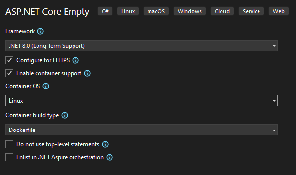

Google's Gemini assisted with the development of this script.

# Learning Objectives
**Knowledge and Understanding:**

- **Virtualization Techniques:** Students demonstrate a comprehensive understanding of various virtualization techniques, including virtual machines and containers. They can articulate their advantages and disadvantages in different scenarios.
- **Technical Solution Selection:** Students can critically evaluate different virtualization technologies to choose the most suitable solution for a given problem. They can develop persuasive arguments to justify their choice based on technical factors, performance requirements, and cost-effectiveness.
- **Container Creation and Management:** Students possess hands-on skills to create and manage containers using tools like Docker. They can build container images, run containers, and interact with them effectively.
- **Orchestration Tools:** Students are familiar with popular orchestration tools such as Kubernetes and Docker Compose. They can explain their functionalities, compare their strengths and weaknesses, and make informed decisions about their use in specific contexts.
- **Networking and Volumes:** Students have a solid grasp of networking concepts within containerized environments. They understand the role of volumes for persistent data storage and can configure networks and volumes appropriately.
- **Load Balancing:** Students comprehend the purpose of load balancing and can explain its benefits in improving application performance, scalability, and fault tolerance. They can identify scenarios where load balancing is essential and recommend suitable solutions.

**Skills and Abilities:**

- **Problem-Solving:** Students can apply their knowledge of virtualization and containerization to solve real-world problems and optimize application performance.
- **Technical Argumentation:** Students can effectively communicate technical concepts and justify their choices using sound reasoning and evidence.
- **Hands-On Experience:** Students have practical experience with containerization tools and can demonstrate their ability to create and manage containers.
- **Decision-Making:** Students can make informed decisions about the best virtualization technologies and orchestration tools for specific use cases.

# Introduction
Virtualization has revolutionized the way we think about computing resources. By creating virtual environments on physical hardware, we can efficiently allocate and manage resources, leading to improved scalability, flexibility, and cost-effectiveness. DevOps, on the other hand, is a cultural shift that emphasizes collaboration between development and operations teams to automate and streamline the software delivery process.

In this course, we will explore the fundamental concepts of virtualization, including hypervisors, virtual machines, and containers. By understanding these technologies and practices, you will be equipped to design, implement, and manage virtualized environments and streamline your software development and delivery pipelines.  

Throughout the course, we will use practical examples and hands-on exercises to reinforce our learning. You will have the opportunity to experiment with popular virtualization platforms, gaining valuable experience that will prepare you for real-world applications.
 
Until now, we've primarily focused on developing applications on our local machines. While this is essential for prototyping and testing, the ultimate goal is to deploy these applications to production environments where they can be accessed by users. In this course, we'll explore the techniques and best practices involved in bringing your applications from development to production.

[](https://www.youtube.com/watch?v=NaR8WlLtPw0)

If you have headphones and are corrently working alone on a task, you can listen to this, if you would like to.
[](https://www.youtube.com/watch?v=HlTBGgQgNL4) []

## Download Docker
Follow the instructions from the link and install Docker Desktop. [Docker Desktop](https://docs.docker.com/desktop/)

After finishing the installation try to run the following command in the terminal to verify that docker was installed correctly.

```
docker --version
```

# DevOps
DevOps, a cultural shift that emphasizes collaboration between development and operations teams, has significantly benefited from the integration of virtualization technologies. Virtualization, by creating virtual environments on physical hardware, offers a flexible and efficient way to manage computing resources. This synergy between DevOps and virtualization has led to several advantages:

**Improved resource allocation and utilization:** Virtualization allows for the dynamic creation and management of virtual machines, enabling organizations to allocate resources more efficiently based on demand. This flexibility is crucial in DevOps environments where rapid changes and scaling are common.

**Faster application deployment and testing:** By leveraging virtualization, development teams can quickly create and provision virtual environments for testing and development purposes. This accelerates the application development lifecycle and enables more frequent deployments.

**Enhanced infrastructure management:** Virtualization simplifies infrastructure management tasks by providing a centralized platform for controlling and monitoring virtual machines. This automation and standardization align well with DevOps principles, reducing manual errors and improving efficiency.

**Improved disaster recovery and business continuity:** Virtualization can be used to create redundant virtual environments, providing a failover mechanism in case of hardware failures or other disruptions. This helps ensure business continuity and minimizes downtime.

**Increased scalability:** Virtualization allows organizations to easily scale their infrastructure up or down to meet changing demands. This scalability is essential in DevOps environments where applications may experience fluctuations in traffic or usage.

**Improved resource isolation:** Virtualization ensures that resources are isolated between different virtual machines, preventing one application from impacting the performance of others. This isolation is crucial in DevOps environments where multiple applications may be running concurrently on a single physical server.

Overall, the integration of virtualization and DevOps has revolutionized the way organizations manage their IT environments. By combining the flexibility and efficiency of virtualization with the collaborative and agile principles of DevOps, organizations can achieve faster time-to-market, improved application quality, and greater operational efficiency.

# Virtualization

## Introduction to Virtualization: Containers vs. Virtual Machines

Virtualization is a technology that allows multiple operating systems to run concurrently on a single physical machine. This provides significant benefits such as improved resource utilization, flexibility, and scalability. There are two primary approaches to virtualization: containers and virtual machines.

### Virtual Machines (VMs)

A virtual machine is a complete software emulation of a physical computer. It includes a virtual CPU, memory, storage, and network interface. VMs are typically created using a hypervisor, which acts as a layer between the physical hardware and the virtual machines.

**Key characteristics of VMs:**

- **Full isolation:** Each VM has its own isolated environment, including its own operating system and applications.
- **Heavyweight:** VMs require more system resources compared to containers due to the emulation of the entire hardware stack.
- **Slower boot time:** VMs can take longer to start up compared to containers due to the need to load the entire guest operating system.

#### Hypervisors: Bare-Metal vs. Software

**Hypervisors** are the software that manage and control virtual machines. They can be categorized into two main types: bare-metal and software.

##### Bare-Metal Hypervisors

Bare-metal hypervisors are installed directly on the physical hardware, bypassing the host operating system. This provides a more direct and efficient interaction with the underlying hardware, leading to better performance and resource utilization.

**Examples of bare-metal hypervisors:**

- **VMware ESXi**
- **Microsoft Hyper-V**
- **Red Hat KVM**

##### Hosted Hypervisors

Software hypervisors, also known as hosted hypervisors, run on top of a host operating system. This approach offers greater flexibility but can introduce additional overhead, potentially impacting performance.

**Examples of software hypervisors:**

- **Oracle VM VirtualBox**
- **Parallels Desktop**
- **QEMU**

**Key differences between bare-metal and software hypervisors:**

|Feature|Bare-Metal Hypervisor|Software Hypervisor|
|---|---|---|
|Installation|Directly on physical hardware|On top of a host operating system|
|Performance|Generally better due to direct hardware access|Can be slightly slower due to the additional layer of abstraction|
|Flexibility|Less flexible, as it requires dedicated hardware|More flexible, as it can run on various host operating systems|
|Resource utilization|More efficient due to direct hardware access|May have slightly higher overhead|

In summary, bare-metal hypervisors offer superior performance and resource utilization, while software hypervisors provide greater flexibility. The choice between the two depends on factors such as performance requirements, hardware constraints, and desired level of flexibility.

### Containers

Containers are a lighter-weight form of virtualization that shares the host operating system's kernel. They package applications and their dependencies into a single unit that can be easily moved and deployed across different environments.

**Key characteristics of containers:**

- **Shared kernel:** Containers share the host operating system's kernel, reducing overhead and improving performance.
- **Lightweight:** Containers are much smaller and require fewer resources than VMs.
- **Faster startup:** Containers can start up much more quickly than VMs due to the shared kernel and reduced overhead.
- **Portability:** Containers can be easily moved and deployed across different environments without modification.

**In summary,** virtual machines offer complete isolation and flexibility, but they can be resource-intensive and slow to start up. Containers, on the other hand, are lightweight, fast, and portable, but they may not provide the same level of isolation as VMs. The choice between VMs and containers depends on the specific requirements of your application, such as performance, isolation, and portability.


Inspired by Doug Jones (2016)

## Containerization
**Containerization** is a technology that packages applications and their dependencies into a single, portable unit called a container. This approach offers several benefits, including improved portability, consistency, efficiency, isolation, and scalability.

**Key components of containerization:**

- **Dockerfile:** A text document that defines the instructions for building a container image.
- **Container image:** A snapshot of the application and its dependencies, created from a Dockerfile.
- **Container:** A running instance of a container image.

**Popular containerization platforms:**

- **Docker:** The most widely used containerization platform.
- **Kubernetes:** A container orchestration platform for managing and scaling containerized applications.

By understanding the basics of containerization, you can leverage this technology to improve the development, deployment, and management of your applications.

### Commands
To work with docker we need to know the basic commands and what they do.

**Basic Commands:**

- **docker run \[image]:** Starts a new container from a specified image.
- **docker ps:** Lists all running containers.
- **docker stop \[container_id]:** Stops a running container.
- **docker rm \[container_id]:** Removes a stopped container.  

**Image Management:**

- **docker image ls:** Lists all images on your system.
- **docker pull \[image]:** Pulls an image from a registry (like Docker Hub).
- **docker push \[image]:** Pushes an image to a registry.
- **docker build -t \[image_name] .:** Builds a new image from a Dockerfile in the current directory.
- **docker image prune -all:** Removes all unused images.

**Container Inspection and Management:**

- **docker exec -it \[container_id] \[command]:** Executes a command inside a running container.
- **docker inspect \[container_id]:** Provides detailed information about a container.
- **docker logs\[container_id]:** Shows logs generated by a container.

**Additional Commands:**

- **docker network ls:** Lists all networks.
- **docker network create \[network_name]:** Creates a new network.
- **docker network connect \[network_name] \[container_id]:** Connects a container to a network.

### Docker
#### Docker-File
##### Commands

A Dockerfile is a text document that contains instructions for building a Docker image. Here's a summary of the most commonly used commands:

**Base Image:**

- **FROM \[image]:** Specifies the base image to use for the new image.

**Build-time Instructions:**

- **COPY \[src] \[dest]:** Copies files from the host to the container.
- **ADD \[src] \[dest]:** Copies files from the host to the container, with automatic extraction for archives.
- **RUN \[command]:** Executes a command in the container.
- **WORKDIR \[path]:** Sets the working directory for subsequent commands.
- **ENV \[key=value]:** Sets environment variables.
- **ARG \[key=value]:** Defines arguments that can be passed when building the image.

**Multi-stage Builds:**

- **FROM \[image] as \[stage_name]:** Creates a new build stage with a specified name.
- **COPY --from=\[stage_name] \[src] [dest]:** Copies files from a previous stage to the current stage.

**Exposing Ports:**

- **EXPOSE \[port]:** Exposes a port for networking.

**Entrypoint and CMD:**

- **ENTRYPOINT \["command"]:** Sets the default command to run when the container starts.
- **CMD \["command"]:** Sets the default command to run if no other command is specified.

**Volume Mounts:**

- **VOLUME \[path]:** Creates a volume mount point.

**User and Group:**

- **USER \[user]:** Sets the user to run commands as.

##### Example 1: Minecraft Server
Let's build a game server. This is a great way to experience firsthand how Docker can be used to create and manage complex applications.

```
#Choose the base-build.
FROM debian:latest

# Install OpenJDK-8 Inspired by: https://stackoverflow.com/questions/31196567/installing-java-in-docker-image

RUN apt-get update && \
  apt-get install wget -y && \
  wget https://download.oracle.com/java/21/latest/jdk-21_linux-x64_bin.deb && \
  dpkg -i jdk-21_linux-x64_bin.deb && \
  apt-get install -y ant && \
  apt-get clean;

# Set the working directory and copy the .jar file to the container.
WORKDIR /minecraft

ADD https://piston-data.mojang.com/v1/objects/59353fb40c36d304f2035d51e7d6e6baa98dc05c/server.jar ./server.jar

# Run the .jar, this will create a run.sh.
RUN java -jar server.jar --installServer

RUN touch ./run.sh
RUN echo '#!/bin/bash \n java -jar ./server.jar' > ./run.sh
RUN chmod +x ./run.sh

# Executing the run.sh will create some necessary files.
RUN ./run.sh

# Next it is necessary to accept the eula to start the server.
RUN echo 'eula=true' > ./eula.txt

# To connect to the server a port must be made accesible.
EXPOSE 25565

# Start the server.
ENTRYPOINT [ "./run.sh" ]
```

This code snippet essentially creates a set of instructions for building a Docker image that can run a Minecraft server. Let's break it down step by step:

**1. Choosing a Base Image:**

- The first line `FROM debian:latest` tells Docker to use the latest version of the "debian" image as the starting point for our Minecraft server image. This image provides a basic Linux operating system environment for our server to run on.

**2. Installing Java:**

- The next section (`RUN apt-get update...`) installs the necessary software to run Java applications. It does this by updating the list of available software packages, installing `wget` (a tool for downloading files), downloading the latest OpenJDK-8 installer, installing the downloaded package, installing the `ant` build tool (potentially needed by Minecraft), and finally cleaning up the downloaded files.

**3. Setting Up the Container Environment:**

- `WORKDIR /minecraft` sets the working directory inside the container to `/minecraft`.
- `ADD https://piston-data.mojang.com/v1/objects/... server.jar` downloads the Minecraft server jar file from the official Mojang website and places it in the `/minecraft` directory inside the container with the name `server.jar`.

**4. Preparing the Server Startup Script:**

- The next few lines (`RUN java -jar...`) are a bit more involved. They:
    - Run the Minecraft server jar file with the `--installServer` flag, which likely creates some initial configuration files needed for the server to run.
    - Create an empty file called `run.sh`.
    - Fill the `run.sh` file with a simple script that starts the Minecraft server jar file using the `java -jar` command.
    - Make the `run.sh` file executable, allowing it to be run as a program.

**5. Initializing the Server and Exposing the Port:**

- `RUN ./run.sh` actually runs the `run.sh` script we just created, which likely initializes the server and creates some additional files needed for it to function.
- `RUN echo 'eula=true' > ./eula.txt` writes `eula=true` to the file. This is an agreement that needs to be accepted to run the Minecraft server.
- `EXPOSE 25565` tells Docker that the container will listen on port 25565, which is the default port used by Minecraft servers to communicate with clients.

**6. Starting the Server:**

- Finally, `ENTRYPOINT ["./run.sh"]` sets the default command to run when the container starts. In this case, it tells the container to run the `./run.sh` script, which in turn starts the Minecraft server.

In summary, this Dockerfile builds an image that can run a Minecraft server by installing Java, downloading the server files, creating a startup script, initializing the server, and finally starting it when the container is run.

**Understanding the `docker build` Command:**

The `docker build` command is used to create a new Docker image from a Dockerfile. In this case, we're using the following command:

```
docker build -t minecraft_1_21_1 .
```

- **`-t minecraft_1_21_1`:** This flag specifies the tag for the newly created image. The tag may contain a namespace (similar to a username) followed by a repository name (like a project name) and a tag (like a version).

**Building the Image:**

When you execute this command, Docker will:

1. **Read the Dockerfile:** It starts by reading the Dockerfile you've created.
2. **Execute Instructions:** Docker then executes the instructions defined in the Dockerfile, step by step. This includes downloading the base image, installing packages, copying files, and running commands.
3. **Create the Image:** Once all the instructions are executed successfully, Docker creates a new image and saves it to your local Docker repository.

**Verifying the Image:**

After the build completes, you can list all your Docker images using the following command:

Bash

```
docker images
```

You should see the newly created image listed with its tag `minecraft_1_21_1`.

**Note:** If you encounter any errors during the build process, check the Dockerfile for any syntax errors or issues with the instructions. You might also need to adjust the commands or file paths based on your specific environment or requirements

To create a new container and start it, you can use the `docker run` command to launch the server.
```
docker run -p 25565:25565 se.stei/minecraft_1_21_1
```

You can view the running container by using this command.
```
docker container ls
```

#### Kahoot
To check if you have successfully acquired the basic knowledge to work in this field, it's recommended to try the quiz.

[Kahoot](https://create.kahoot.it/share/lab-4bi-virtualization-and-containerization/39c78139-8b31-485b-8233-21ecb076e63a)

#### Task: Webserver ASP.NET C\#
Now that we've built and run a Docker container from a file for a basic application, let's explore how to integrate this approach into your development workflow. We'll create a ASP.NET application that includes functionalities related to prime numbers:

- **Random Prime Number Generation:** An HTTP GET method will return a random prime number.
- **Primality Check:** A separate function will determine if a provided number is prime.
- **Relative Primality Check:** An additional function will check if two integers are relatively prime (share no common factors greater than 1).

To create a new ASP.NET Core Empty project with containerization enabled in Visual Studio, start by selecting the **Empty** template when creating a new project. Then, configure Docker support by choosing **Dockerfile Only** in the dialog. 


This will set up your project with a Dockerfile, allowing you to build and run your application in a containerized environment. Once created, you can write your Prime Number functionalities within the project structure. You can build the initial Docker image using Visual Studio's build options, and then run the application in a container using the `docker run` command.

By implementing these functionalities and utilizing Docker, you can build, test, and run your ASP.NET Core application efficiently within a containerized environment. This promotes faster iterations and consistency throughout the development process.

``` Program.cs

var builder = WebApplication.CreateBuilder(args);
var app = builder.Build();

app.MapGet("/", () => {
    //Find a random prime number.
});

app.MapGet("/isPrime/{number}", (int number) => {
    //Check if is prime.
});

app.MapGet("/isRelativePrime/{a}/{b}", (int a, int b) => {
    //Check if a and b have any common dividers.
});

app.Run();
```

Now that this is working, let's take a look at the docker file that was created.

```
# See https://aka.ms/customizecontainer to learn how to customize your debug container and how Visual Studio uses this Dockerfile to build your images for faster debugging.

# This stage is used when running from VS in fast mode (Default for Debug configuration)
FROM mcr.microsoft.com/dotnet/aspnet:8.0 AS base
USER app
WORKDIR /app
EXPOSE 8080
EXPOSE 8081


# This stage is used to build the service project
FROM mcr.microsoft.com/dotnet/sdk:8.0 AS build
ARG BUILD_CONFIGURATION=Release
WORKDIR /src
COPY ["TestWebServerContainer/TestWebServerContainer.csproj", "TestWebServerContainer/"]
RUN dotnet restore "./TestWebServerContainer/TestWebServerContainer.csproj"
COPY . .
WORKDIR "/src/TestWebServerContainer"
RUN dotnet build "./TestWebServerContainer.csproj" -c $BUILD_CONFIGURATION -o /app/build

# This stage is used to publish the service project to be copied to the final stage
FROM build AS publish
ARG BUILD_CONFIGURATION=Release
RUN dotnet publish "./TestWebServerContainer.csproj" -c $BUILD_CONFIGURATION -o /app/publish /p:UseAppHost=false

# This stage is used in production or when running from VS in regular mode (Default when not using the Debug configuration)
FROM base AS final
WORKDIR /app
COPY --from=publish /app/publish .
ENTRYPOINT ["dotnet", "TestWebServerContainer.dll"]
```

This script defines a multi-stage Dockerfile for building and running an ASP.NET Core Web API application. Here's a breakdown of each stage:

**1. Base Stage (Debug Mode):**

- `FROM mcr.microsoft.com/dotnet/aspnet:8.0 AS base`: Uses the official Microsoft ASP.NET Core base image with version 8.0 as the foundation for the application. This image contains the necessary runtime libraries for .NET Core applications.
- `USER app`: Sets the user within the container to "app." This user account is typically used to run the application process.
- `WORKDIR /app`: Sets the working directory within the container to `/app`. This is where application files will be copied and executed.
- `EXPOSE 8080`: Exposes port 8080 within the container, allowing external communication on this port. This might be needed for debugging purposes.
- `EXPOSE 8081`: Similarly, exposes port 8081, potentially for additional functionality or another service.

**Note:** This stage is primarily used when running the application within Visual Studio in "fast mode" (the default for Debug configuration). It provides a pre-built base image for quick debugging.

**2. Build Stage:**

- `FROM mcr.microsoft.com/dotnet/sdk:8.0 AS build`: Uses the official Microsoft .NET Core SDK image with version 8.0 to build the application.
- `ARG BUILD_CONFIGURATION=Release`: Defines an argument named `BUILD_CONFIGURATION` with a default value of "Release." This can be overridden when building the image depending on your needs (e.g., "Debug").
- `WORKDIR /src`: Sets the working directory within this stage to `/src`.
- `COPY`: Copies the project file ("TestWebServerContainer.csproj") and its folder from your local machine to the `/src` directory within the container.
- `RUN dotnet restore`: Executes the `dotnet restore` command to download project dependencies.
- `COPY`: Copies all files from the current directory (where the Dockerfile resides) to the `/src` directory.
- `WORKDIR /src/TestWebServerContainer`: Changes the working directory to the specific project folder within the container.
- `RUN dotnet build`: Executes the `dotnet build` command to build the project using the specified build configuration (`$BUILD_CONFIGURATION`). The output is placed in the `/app/build` directory.

**3. Publish Stage:**

- `FROM build AS publish`: Creates a new stage based on the build stage.
- `ARG BUILD_CONFIGURATION=Release`: Similar to the previous stage, defines an argument for build configuration.
- `RUN dotnet publish`: Executes the `dotnet publish` command to publish the built application to the `/app/publish` directory within the container. The `-p:UseAppHost=false` parameter ensures a self-contained deployment without relying on a separate web server process.

**4. Final Stage (Production or Regular Mode):**

- `FROM base AS final`: Creates a final stage based on the base stage (the pre-configured .NET Core environment).
- `WORKDIR /app`: Sets the working directory within this stage to `/app`.
- `COPY --from=publish /app/publish .`: Copies the published application files from the publish stage to the final stage's `/app` directory. This effectively combines the base image with your built and published application.
- `ENTRYPOINT ["dotnet", "TestWebServerContainer.dll"]`: Defines the entry point for the container. This instructs the container to run the "dotnet" command with the argument "TestWebServerContainer.dll" when the container starts. This launches your ASP.NET Core Web API application.

**Summary:**

This Dockerfile defines a multi-stage build process for an ASP.NET Core Web API application. It optimizes the image size by separating build steps and utilizes pre-built base images. The script also demonstrates the use of arguments to control the build configuration.
#### Volumes & Bind Mounts
"Volumes are the preferred mechanism for persisting data generated by and used by Docker containers." (Docker, 2024a)

**Docker Volumes** and **Bind Mounts** are two mechanisms used to persist data within Docker containers. They provide different ways to share data between the container and the host system, or between multiple containers.

##### Docker Volumes

- **Purpose:** Volumes are specifically designed to persist data independently of the container's lifecycle. They exist as separate entities on the host filesystem and can be managed and shared across multiple containers.
- **Creation:** Volumes are created using the `docker volume create` command. For example:
```
docker volume create my-data-volume
```
- **Mounting:** Volumes are mounted to containers using the `-v` or `--volume` flag when running a container. For example, this mounts the "my-data-volume" to the `/app/data` directory within the container:
```
docker run -v my-data-volume:/app/data my-image
```
- **Persistence:** Data stored in volumes persists even after the container is stopped or deleted.

##### Bind Mounts

- **Purpose:** Bind mounts directly map a directory on the host system to a directory within the container. Changes made to the host directory are immediately reflected in the container, and vice versa.
- **Mounting:** Bind mounts are also specified using the `-v` or `--volume` flag. For example, this mounts the `/host/path` directory on the host system to the `/container/path` directory within the container:
```
docker run -v /host/path:/container/path my-image
```
- **Persistence:** Data changes made within the container's bind mount directory are directly reflected on the host system and persisted.

**Key Differences:**

|Feature|Docker Volumes|Bind Mounts|
|---|---|---|
|Persistence|Independent of container|Directly linked to host|
|Management|Managed by Docker|Managed by host system|
|Sharing|Can be shared across multiple containers|Limited to one container at a time|
|Performance|Generally better performance|Can be slower due to direct file system access|

**Choosing Between Volumes and Bind Mounts:**

- **Use volumes** when you want to:
    - Persist data independently of the container's lifecycle.
    - Share data between multiple containers.
    - Manage data using Docker commands.
- **Use bind mounts** when you need:
    - Direct access to host system files.
    - To quickly debug or test changes to files.
    - To share large datasets that don't need to be managed separately.

By understanding the differences between volumes and bind mounts, you can choose the appropriate method for your specific use case and ensure proper data management within your Docker environment. 

For more information visit the [docker documentation](https://docs.docker.com/engine/storage/volumes/)  website.
##### Integrating NAS with Docker

You can integrate NAS with Docker to provide persistent storage for your containerized applications. Here's a general approach:

1. **Configure NAS:**
    - Set up your NAS device according to the manufacturer's instructions.
    - Ensure it is accessible on your network.
    - Create a share or folder on the NAS that will be used by Docker.
2. **Mount the NAS Share in Docker:**
    - Use the `-v` or `--volume` flag when running a Docker container to mount the NAS share to a directory within the container.
    - For example:
        ```
        docker run -v nas_share:/app/data -p 80:80 my-image
        ```        
        This mounts the NAS share named "nas_share" to the `/app/data` directory within the container.

**Benefits of Using NAS with Docker:**

- **Centralized Storage:** NAS provides a central location for storing data, making it easier to manage and access.
- **Scalability:** NAS devices can be scaled to accommodate growing storage needs.
- **Performance:** NAS devices are often optimized for storage performance.
- **Data Persistence:** Data stored on NAS persists even if the container is stopped or deleted.

**Additional Considerations:**

- **NAS Protocol:** Ensure your NAS device supports a protocol compatible with Docker (e.g., NFS, CIFS).
- **Permissions:** Set appropriate permissions on the NAS share to allow Docker containers to access and modify files.
- **Network Connectivity:** Verify that your Docker host has network connectivity to the NAS device.
##### Task: Use Volumes to make the Minecraft-World persistent. 
Modify the existing Minecraft server to enable persistent world storage using any of the mentioned techniques. Develop a comprehensive argument for the employment the chosen technique. This may involve making changes to the Dockerfile, container configuration, or other relevant components to ensure the Minecraft world data is saved independently of the container's lifecycle.
### Orchestration
**Orchestration** is the process of automating the deployment, management, and scaling of containerized applications. It involves coordinating multiple containers, ensuring they work together seamlessly and providing a reliable and scalable platform for your applications.

**Key Benefits of Orchestration:**

- **Automation:** Orchestration tools automate many manual tasks, such as deploying containers, scaling applications, and managing resources.
- **Scalability:** Orchestrators can automatically scale applications up or down based on demand, ensuring optimal resource utilization.
- **High Availability:** Orchestration tools can help ensure that applications remain available even if individual containers fail.
- **Simplified Management:** Orchestrators provide a centralized platform for managing and monitoring containerized applications.

**Popular Orchestration Tools:**

- **Kubernetes:** A widely-used open-source platform developed by Google. It offers a rich feature set for managing containerized applications, including service discovery, load balancing, and self-healing.
- **Docker Swarm:** A built-in orchestration tool provided by Docker. It is simpler to use than Kubernetes but offers fewer features.
- **Apache Mesos:** A distributed systems framework that can be used for both container and non-container workloads. It is highly scalable and flexible.

**Core Concepts of Orchestration:**

- **Clusters:** A group of physical or virtual machines that work together to run containerized applications.
- **Nodes:** Individual machines within a cluster.
- **Services:** A logical group of containers that perform a specific function.
- **Tasks:** Instances of a service that run on individual nodes.
- **Scheduling:** The process of assigning tasks to nodes based on various factors, such as resource availability and workload distribution.
- **Load Balancing:** Distributing traffic across multiple instances of a service to improve performance and reliability.
- **Service Discovery:** Automatically discovering and registering services within a cluster.

**Orchestration Workflow:**

1. **Application Deployment:** The orchestration tool deploys the application's containers to the cluster.
2. **Service Discovery:** The orchestration tool registers the services with a service discovery mechanism.
3. **Scheduling:** Tasks are scheduled and assigned to nodes based on available resources and workload.
4. **Load Balancing:** Traffic is distributed across multiple instances of a service to improve performance and reliability.
5. **Scaling:** The orchestration tool automatically scales applications up or down based on demand.
6. **Monitoring and Management:** The orchestration tool provides tools for monitoring the health of applications and managing resources.

By using an orchestration tool, you can simplify the management of your containerized applications and ensure that they are reliable, scalable, and highly available.
#### Docker-Compose

**Docker Compose** is a tool that allows you to define and run multi-container Docker applications. It simplifies the process of managing and scaling your applications by defining all the services and their dependencies in a single YAML file.  

**Key Features of Docker Compose:**

- **Service Definition:** Defines the services that make up your application, including the image to use, ports to expose, environment variables, and dependencies.
- **Networking:** Creates a private network for your application, allowing containers to communicate with each other.
- **Volumes:** Manages volumes for persistent data storage.
- **Secrets:** Stores sensitive information securely and makes it available to your containers.

**Example Docker Compose File:**

```
version: '3.7'

services:
  web:
    image: my-web-app:latest
    ports:
      - "8080:80"
    depends_on:
      - database

  database:
    image: postgres:latest
    environment:
      POSTGRES_USER: myuser
      POSTGRES_PASSWORD: mypassword
      POSTGRES_DB: mydatabase
```

**Version:**

- `version: '3.7'` specifies the version of the Docker Compose specification used. This version indicates that the script supports features introduced in Docker Compose 3.7.

**Services:**

- `services:` defines the individual services that make up the application.

**Web Service:**

- `web:` defines a service named "web."
    - `image: my-web-app:latest`: Specifies the Docker image to use for this service. In this case, it's using the latest version of an image named "my-web-app."
    - `ports:` defines the port mapping between the container and the host:
        - `"8080:80"` maps port 8080 on the host to port 80 within the container. This allows you to access the web application on port 8080 of your host machine.
    - `depends_on:` specifies that the "web" service depends on the "database" service. This means that the "database" service must be started before the "web" service.

**Database Service:**

- `database:` defines a service named "database."
    - `image: postgres:latest`: Specifies the Docker image to use for the database. Here, it's using the latest version of the official PostgreSQL image.
    - `environment:` defines environment variables that will be set within the database container:
        - `POSTGRES_USER: myuser`: Sets the PostgreSQL user to "myuser."
        - `POSTGRES_PASSWORD: mypassword`: Sets the PostgreSQL password to "mypassword."
        - `POSTGRES_DB: mydatabase`: Sets the PostgreSQL database name to "mydatabase."

This Docker Compose script describes a multi-container application consisting of a web application and a PostgreSQL database. The "web" service depends on the "database" service, ensuring that the database is started before the web application. The environment variables for the database service provide the necessary credentials and database name for the PostgreSQL instance.

**Using Docker Compose:**

1. **Create a Docker Compose file:** Create a YAML file named `docker-compose.yml` with the desired configuration.
2. **Run Docker Compose:** Use the `docker-compose up` command to start the defined services. For example:
    ```
    docker-compose up -d
    ```
    This will start the services in detached mode, allowing you to run other commands in the terminal.

**Benefits of Using Docker Compose:**

- **Simplified Configuration:** Defines your entire application in a single file.
- **Dependency Management:** Automatically manages dependencies between services.
- **Environment Isolation:** Creates a separate environment for your application.
- **Easier Deployment:** Can be used to deploy your application to different environments.

**Integration with Orchestration Tools:**

Docker Compose can be used in conjunction with larger orchestration tools like Kubernetes or Docker Swarm. These tools can provide additional features like service discovery, load balancing, and automatic scaling.

By using Docker Compose, you can simplify the management of your multi-container applications and make it easier to deploy and scale them across different environments.
##### Commands

A Docker Compose YAML file defines the services, networks, volumes, and other components that make up your multi-container application. Here's a breakdown of the key structures and commands used in Docker Compose:

**Top-Level Structure:**

- **version:** Specifies the version of the Docker Compose specification used.
- **services:** Defines the individual services that make up your application.

**Service Definition:**

- **image:** Specifies the Docker image to use for the service.
- **build:** Specifies a context and Dockerfile to build the image locally.
- **ports:** Defines port mappings between the container and the host.
- **volumes:** Mounts volumes to the container.
- **environment:** Sets environment variables within the container.
- **depends_on:** Specifies dependencies between services.
- **networks:** Specifies the network(s) the service should be connected to.
- **restart:** Configures the restart policy for the service.
- **command:** Overrides the default command specified in the image.

**Networks:**

- **networks:** Defines custom networks for your application.
- **name:** Specifies the name of the network.
- **driver:** Specifies the driver to use for the network (e.g., `bridge`, `overlay`, `host`).

**Volumes:**

- **volumes:** Defines volumes to be used by your services.
- **name:** Specifies the name of the volume.
- **driver:** Specifies the driver to use for the volume (e.g., `local`, `nfs`).

**Commands:**

- **docker-compose up:** Starts all services defined in the Docker Compose file.
- **docker-compose down:** Stops and removes all containers and networks created by Docker Compose.
- **docker-compose build:** Builds the images defined in the Docker Compose file.
- **docker-compose run:** Runs a one-off command within a service container.
- **docker-compose exec:** Executes a command within a running container.
- **docker-compose ps:** Lists the running containers and their status.
#### Kubernets
...

# Bibliography
Doug Jones, March 16, 2018, Containers vs. Virtual Machines (VMs): What's the Difference? https://www.netapp.com/blog/containers-vs-vms/
Docker, 11. September 2024a, Volumes https://docs.docker.com/engine/storage/volumes/